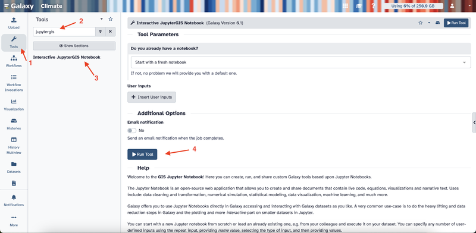
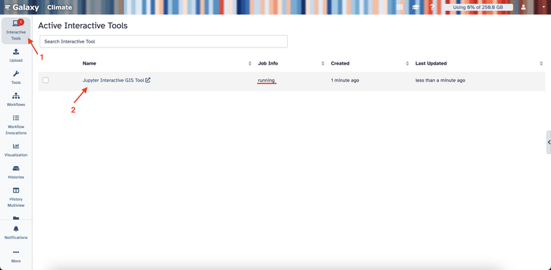
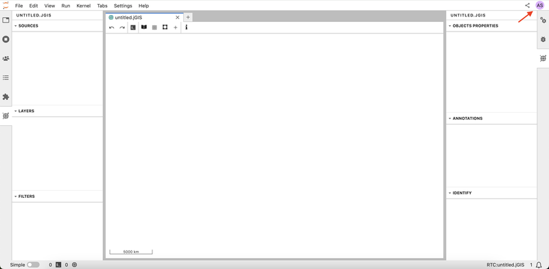
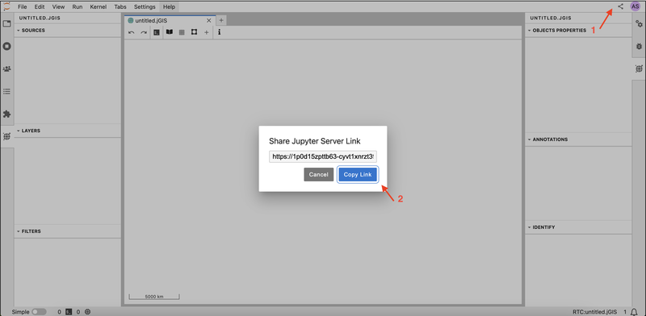
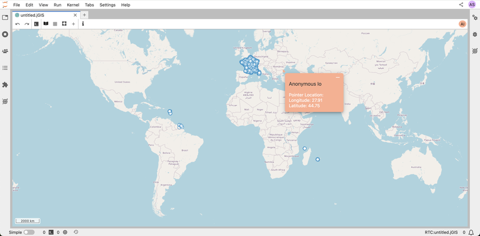
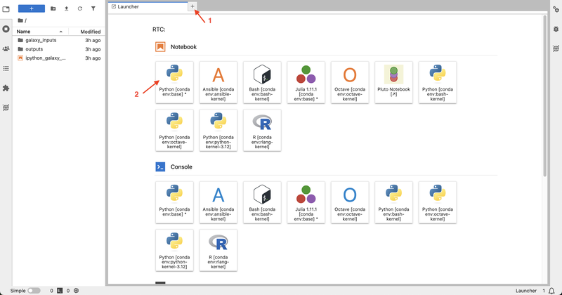
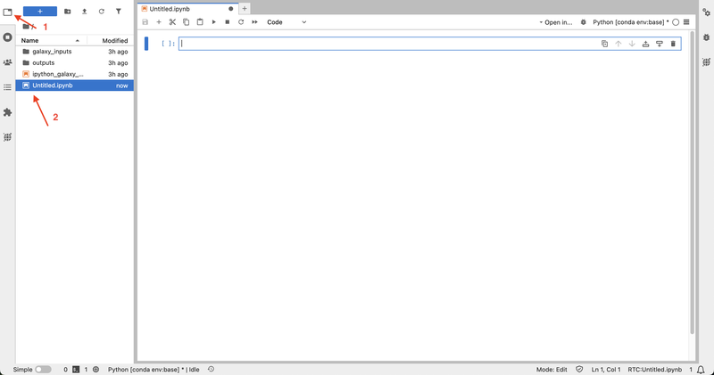

Welcome to the JupyterGIS collaborative features tutorial. JupyterGIS enables the seamless sharing of notebooks and GIS files, allowing teams—including GIS specialists, data analysts,
and other experts—to collaborate on spatial projects in a shared environment. This guide will provide the tools and steps needed to collaborate effectively,
using features like real-time editing, cursor tracking, follow mode, and annotations.

### Motivation
Collaboration is at the heart of effective GIS projects. Teams often include members with diverse backgrounds, skills, and areas of expertise. Without robust collaborative tools,
it can become challenging to share insights, make real-time decisions, and maintain consistency across project workflows. JupyterGIS simplifies collaboration by providing
real-time editing, annotations, and interactive features that allow teams to seamlessly integrate their work.


> <agenda-title></agenda-title>
>
> In this tutorial, we will learn about:
>
> 1. Launching Your Collaborative Session
> 2. Real-Time Collaboration on a GIS File
> 3. Tracking Collaborators with Cursors
> 4. Using Follow Mode
> 5. Adding Annotations and Comments
> 6. Collaborating on Notebooks (Optional)
> {:toc}
{: .agenda}


> <tip-title>Simulating Multi-User Environments</tip-title>
>
> The JupyterGIS collaborative training material is designed to help users explore geospatial workflows in a collaborative Jupyter environment. This training is intended to be used in
> pairs or small teams, even when following a self-paced approach. To simulate real-time collaboration, we recommend using an additional browser window or an anonymous session to represent
> another user. This setup allows participants to better understand multi-user interactions, shared geospatial analysis, and version control within Jupyter-based environments.
{: .tip}


# Launching Your Collaborative Session

In this section, we will learn how to launch a collaborative session in JupyterGIS and invite collaborators to join. This section of the tutorial is required to be completed by only one user (the lead user) in the session.

> <hands-on-title>Starting a Collaborative Session</hands-on-title>
>
> 1. Open your browser and navigate to [https://climate.usegalaxy.eu/](https://climate.usegalaxy.eu/), then log in or register for an account if you haven't already, to access the JupyterGIS platform.
> 2. On the left sidebar, click **Tools**.
> 3. In the search box, type **JupyterGIS**.
> 4. Click **Interactive JupyterGIS Notebook** and then click the **Run Tool** button.
>     
> 5. Click on **Interactive Tools** on the left sidebar.
> 6. Wait a few minutes until the job status changes to “running.”
> 7. Click on the **Jupyter Interactive GIS Tool** link that appears to open JupyterLab.
>     
> 8. Scroll down to the **Other** section and click **GIS File** to open a blank canvas for your project
>     
> 9. Notice that you are given an anonymous username, which you can see in the upper right corner. Every user in the project will be assigned an anonymous username.
>     
> 10. Click on the **Share** button in your interface in the upper right corner, then click on the **Copy Link** button to invite collaborators to your session.
>     
> 11. When your colleagues join using the link, their usernames appear in the top right corner. This lets you know exactly who is working on the document. There are two more collaborators in the session in the example below.
>     
{: .hands_on}

---

# Real-Time Collaboration on a GIS File

In this section, we will explore how to collaborate on a GIS file in real time. The remaining sections of the tutorial are required to be completed by both the lead and the collaborating users in the session.

When you make changes to your GIS file such as adding a new layer, or updating the layer appearance, the changes are reflected for all collaborators in your session in real time.


> <hands-on-title>Adding and Editing Layers</hands-on-title>
>
> 1. As the lead user, open the layer browser and select **OpenStreetMap.Mapnik**. Notice that all users in the session can see the new layer in real time.
> 2. Ask one of the collaborators to add the Libraries in France shapefile layer using the add shapefile layer menu by clicking **+** → **New Vector Layer** → **New Shapefile Layer** → pasting the provided URL.
>     ```https://public.opendatasoft.com/api/explore/v2.1/catalog/datasets/osm-france-library/exports/shp```
>     <iframe width="560" height="315" src="https://www.youtube.com/embed/3FbvYg3G9Gk?si=CsppZltaUIoSWFeH" title="YouTube video player" frameborder="0" allow="accelerometer; autoplay; clipboard-write; encrypted-media; gyroscope; picture-in-picture; web-share" referrerpolicy="strict-origin-when-cross-origin" allowfullscreen></iframe>
{: .hands_on}

> <question-title>Adding a New Layer</question-title>
> 
> 1. As the lead user, add the World Administrative Boundaries layer using the add shapefile layer menu.
>     ```https://public.opendatasoft.com/api/explore/v2.1/catalog/datasets/world-administrative-boundaries/exports/shp```
> 2. Change the fill color to yellow.
> 3. Ask one of the collaborators to set the opacity to 0.2.
>
> > <solution-title></solution-title>
> >
> > - You can add the layer by clicking **+** → **New Vector Layer** → **New Shapefile Layer** → pasting the provided URL.
> > - To change the fill color, click on the layer in the left sidebar, then select **Edit Symbology** and choose yellow for the fill color. You can check the [Getting Started with JupyterGIS](https://jupytergis.readthedocs.io/en/latest/user_guide/tutorials/01-intro/index.html) tutorial for more details on how to customize the layer appearance.
> > - To set the opacity to 0.2, the collaborating user can click on the layer in the left sidebar, then adjust the opacity slider to 0.2 on the right sidebar, then click **Ok**.
> {: .solution}
{: .question}

# Tracking Collaborators with Cursors
Each user's cursor appears on the document in the same color as their icon. This feature makes it easy to see what your teammates are focused on.



> <hands-on-title>Tracking Collaborators with Cursors</hands-on-title>
>
> 1. Ask one of the collaborators to move their cursor around the document.
> 2. Spot their cursor to find out where on the map they are working.
{: .hands_on}

---

# Using Follow Mode
Follow mode allows you to track another user’s activity in the document in real time. When enabled, you’ll see their actions as they navigate and edit. This feature is ideal for live demonstrations, interactive sessions, and collaborative meetings, as it lets you quickly align your view with a teammate’s actions and provide immediate feedback.

> <hands-on-title>Activating Follow Mode</hands-on-title>
>
> 1. Click on a collaborator's user icon in the upper right corner to activate the follow mode. Observe that the document will then have a frame in their assigned color.
> 2. Ask the followed user to pan and zoom the map. Notice that your screen will follow their movements in real time.
> 3. Click on the user icon again to exit follow mode.
>     <iframe width="560" height="315" src="https://www.youtube.com/embed/-WzV1rcPlEw?si=usi8MbzoIBoXfHwm" title="YouTube video player" frameborder="0" allow="accelerometer; autoplay; clipboard-write; encrypted-media; gyroscope; picture-in-picture; web-share" referrerpolicy="strict-origin-when-cross-origin" allowfullscreen></iframe>
{: .hands_on}
---

> <question-title>Using Follow Mode</question-title>
>
> - When you activate follow mode, what color appears around the document frame?
> - Ask one of the collaborators to activate follow mode on you.
> - What color do they see?
> 
> > <solution-title></solution-title>
> > 
> > - The color of the frame is the same as the color of the user icon. This indicates the user whose activity is being followed.
> {: .solution}
{: .question}

# Adding Annotations and Comments
Annotations and comments let you add notes directly on your GIS file, which makes it easier for your team to track important details, provide context, ask questions, or share insights.

> <hands-on-title>Adding Annotations and Comments</hands-on-title>
>
> 1. Right-click anywhere on your GIS file to open the context menu, then select **Add Annotation** from the menu to create an annotation. All collaborators can see the new annotation in real time.
> 2. Click on the created annotation and type a comment.
> 3. Ask one of the collaborators to open the right sidebar to view all annotations and comments in the document, and click on the middle button to locate the annotation.
> 4. Click on the user icon again to exit follow mode.
>     <iframe width="560" height="315" src="https://www.youtube.com/embed/QqscEokpWIA?si=ZUEU4k6gPkVgqRuN" title="YouTube video player" frameborder="0" allow="accelerometer; autoplay; clipboard-write; encrypted-media; gyroscope; picture-in-picture; web-share" referrerpolicy="strict-origin-when-cross-origin" allowfullscreen></iframe>
{: .hands_on}

---

# Collaborating on Notebooks (Optional)
Real-time collaboration in notebooks is a powerful tool for teams working on code together. It enables multiple users to write, edit, and run code simultaneously. This feature is ideal for live coding sessions, debugging, and data analysis projects.

> <tip-title>Prerequisite</tip-title>
>
> This section requires basic Python programming knowledge. If you are not familiar with Python, we recommend completing the [Introduction to Python](https://training.galaxyproject.org/training-material/topics/data-science/tutorials/python-basics/tutorial.html) tutorial first.
{: .tip}

> <hands-on-title>Real-Time Code Collaboration</hands-on-title>
>
> 1. Click on the **+** icon to open the Launcher, then select the Python kernel under **Notebook** to create a notebook. Once a notebook is created, it is automatically accessible to all collaborators—no additional sharing is needed.
>     
> 2. Ask one of the collaborators to open the newly created notebook by clicking on the explorer button in the left sidebar, then locating and clicking on the notebook. Anyone in the session can open, edit, and run the notebooks.
>     
> 3. As you write or execute code, every change is visible to your team instantly. Create a new code cell and write the following code. Notice that all collaborators can see the code in real time.
>    ```python
>    from jupytergis import GISDocument
>    doc = GISDocument('untitled.jGIS')
>    doc
>    ```
> 4. Rename the "Custom Shapefile Layer" to "libraries" in the GIS file. 
> 5. Find the layer ID of the libraries layer.
>    ```python
>    layers = doc.layers
>    libraries_layer_id = None
>    for layer_id, data in layers.items():
>        if data.get("name", "").lower() == "libraries":
>            libraries_layer_id = layer_id
>            break
>    ```
> 6. Ask one of the collaborators to filter all libraries that have wheelchair access. They can do this by running the following code:
>    ```python
>    doc.add_filter(libraries_layer_id, 'all', 'wheelchair', '==', 'yes')
>    ```
> <iframe width="560" height="315" src="https://www.youtube.com/embed/H5Pkg5zOSwA?si=DK9nSSMpV5nRK-BZ" title="YouTube video player" frameborder="0" allow="accelerometer; autoplay; clipboard-write; encrypted-media; gyroscope; picture-in-picture; web-share" referrerpolicy="strict-origin-when-cross-origin" allowfullscreen></iframe>
{: .hands_on}

> <question-title></question-title>
>
> - Create a new notebook and load your GIS document.
> - In the GIS file, add a new layer with the following URL:
>    ```https://public.opendatasoft.com/api/explore/v2.1/catalog/datasets/openaq/exports/geojson```
> - Ask one of the collaborators to open the notebook, write the code to remove the air quality layer of the GIS file and run the code cell.
> 
> > <solution-title></solution-title>
> >
> > - Create a new notebook from the JupyterLab launcher (select Python kernel).
> > - Load your GIS document using the following Python code:
> >   ```python
> >   from jupytergis import GISDocument
> >   doc = GISDocument("untitled.jGIS")
> >   ```
> > - Add the air quality layer by clicking **+** → **New Vector Layer** → **Add GeoJSON Layer** → pasting the provided URL.
> > - The collaborator can add and execute the following code to list all layers:
> >   ```python
> >   doc.layers
> >   ```
> > - Then they can find the air quality layer ID (the layer with the name Custom GeoJSON Layer) and remove it using:
> >   ```python
> >   air_quality_layer_id = "your_layer_id"
> >   doc.remove_layer(air_quality_layer_id)
> >   ````
> > 
> {: .solution}
{: .question}
---

Congratulations! You have completed the Collaboration Features of JupyerGIS tutorial. You now have the knowledge and tools to collaborate effectively with your team on GIS files and notebooks.

If you'd like to explore more of JupyterGIS' functionality, please view our
[JupyterGIS announcement blog post](https://blog.jupyter.org/real-time-collaboration-and-collaborative-editing-for-gis-workflows-with-jupyter-and-qgis-d25dbe2832a6)
for video demos of more features.
