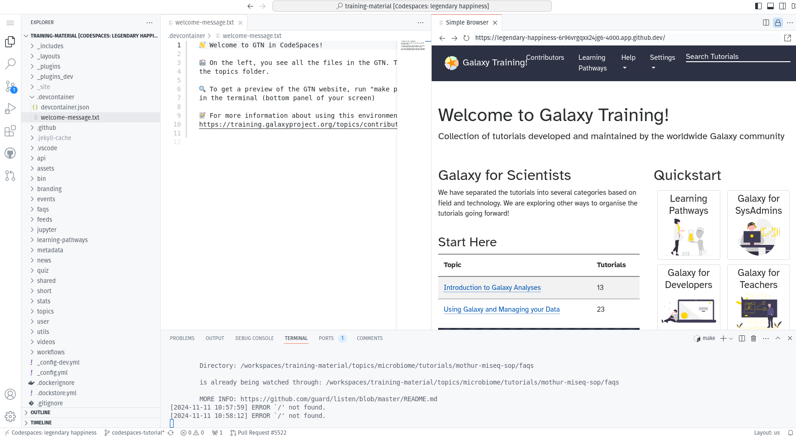
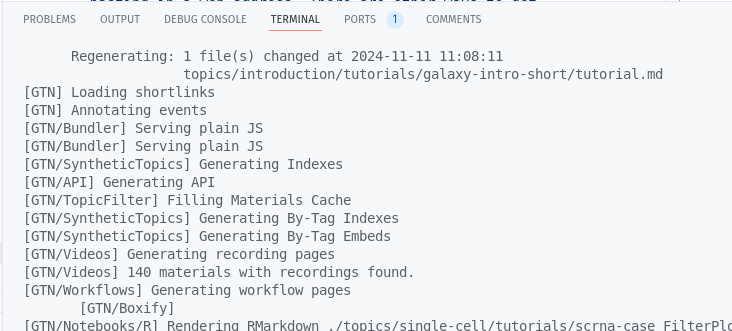
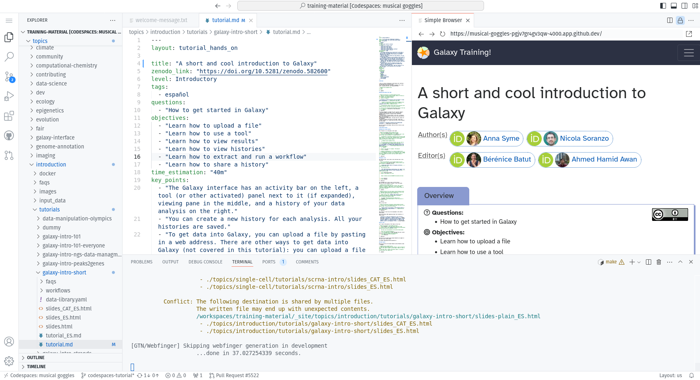
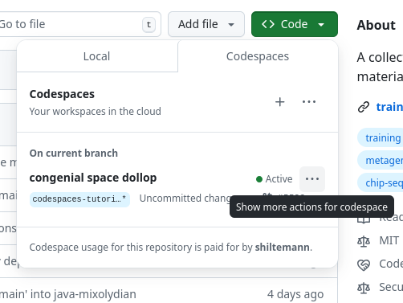

If you are working on training materials, you will likely want to preview your changes as you go! You have a few options on how to do this.



<div class="Codespaces" markdown="1">

If you are working on your own training materials and want preview them online without installing anything on your computer, you can do this using GitHub CodeSpaces! Everybody gets 60 free hours of CodeSpaces per month.


# Launching CodeSpaces


> <hands-on-title>Setting up Codespaces</hands-on-title>
>
> 1. **Create a fork** of the [GTN GitHub repository](https://github.com/galaxyproject/training-material)
>
>    
>
> 2. Already have a fork of the GTN? Make sure it is up to date.
>
>    
>
>    
>
> 2. **Navigate to your fork** of the GTN
>
> 3. Click on the green **Code** button
>
> 4. At the top, switch to the **CodeSpaces** tab
>    
>
> 5. Click on **Create codespace on main**
>    - Note: if you switch to a specific branch in GitHub first, you can create a codespace for that branch
>
> 6. This will setup a [Visual Studio Code](https://code.visualstudio.com/) environment for you
>    - It may take a couple minutes to finish setting everything up
>    - In this environment you can also build the GTN website to preview your changes
>    - When everything is ready, you should see something like this:
>
>    
{: .hands_on}

# The VScode environment

Let's have a closer look at your CodeSpaces window:

- **Left:** Here you see all the files in the GTN repository
- **Top:** This is the main window where you can view and edit files
- **Bottom:** Terminal window. Here you can type commands (e.g. to build the website preview) and read output and error messages.


# Build and preview the GTN website

Before we start making any changes, let's build the website and get a live preview.

> <hands-on-title>Setting up GitPod</hands-on-title>
>
> 1. In the terminal window (bottom), type the following command:
>    `make preview`
>
>    - This will take 2-3 minutes to complete
>
>    
>
> 3. When the build process is finished, a preview window will automatically open (at the top right)
>    - The preview will show the GTN 404 (codespace doesnt know what to show)
>    - Just click on **Return to homepage**.
>
>    > <tip-title>Window not opening? </tip-title>
>    > If the preview window doesn't open for you, or if you close it and want to reopen it, you can always do so as follows:
>    > 1. Go to the **Ports** tab of the bottom panel
>    >
>    >    
>    >
>    > 2. Hover over the link in the **Forwarded Address** column, 3 icons should appear
>    >
>    >    
>    >
>    > 3. Click on:
>    >    - The **world/globe icon** to open the GTN preview in a new window, or
>    >    - Or, click on the **window icon** to the right of the globe icon to preview the GTN in a tab inside the codespaces environment
>    {: .tip}
>
> 4. If you opened the GTN preview inside the codespace, your window will now look something like this:
>
>    
>
>    > <tip-title>Not opening?</tip-title>
>    > 
>    > Some browsers block popups by default, you may need to allow CodeSpaces to show popups in your browser.
>    {: .tip}
>
{: .hands_on}


# Editing Training Materials on CodeSpaces

Now that you have the codespace environment working and we have a live preview up, let's make some changes to the GTN materials and get an instant preview.


**Scenario:** You have spotted a typo in one of the tutorials, and would like to fix this and see the resulting GTN webpage.


> <hands-on-title>Make and view changes</hands-on-title>
>
> 1. In the preview of the GTN website, open the following tutorial:
>    - Topic: "Introduction to Galaxy Analyses" topic
>    - Tutorial: "A Short Introduction to Galaxy""
>    - We will edit this tutorial and watch the live preview window for the effects
>
>
> 2. On the file browser on the left, open the following file:
>
>    ```
>    topics/introduction/tutorials/galaxy-intro-short/tutorial.md
>    ```
>
> 3. Change the title of the tutorial
>    - **From:** "A Short Introduction to Galaxy"
>    - **To:** "A Short and Cool Introduction to Galaxy"
>
>    
>
> 4. Save the file
>    - **CTRL+S** to save the file
>    - You should immediately see a message in the terminal saying "regenerating". CodeSpaces has detected your changes and is rebuilding the website.
>
>    
>
> 5. Move to the top right panel where the GTN is previewed and refresh the website
>    -  Refresh button in front of the address bar of the preview panel
>    - You can also open the preview in it's own brower tab, using the  button at the top-right corner of the preview window. Then you can reload the page the regular way (e.g. <kbd>F5</kbd> or <kbd>ctrl + r</kbd> or the reload button in the browser)
>
>    > <tip-title> Reload not working? </tip-title>
>    > It is possible that this reload button gives you the 404 again, in that case there are 2 solutions
>    > 1. Right-click in the preview panel, and choose
>    >    - Chrome: "Reload Frame"
>    >    - Firefox: "This Frame -> Reload Frame"
>    > 2. Open the preview in it's own browser tab
>    >    - Click the  button at the top-right corner of the preview window
>    {: .tip}
>
> 6. You should see the change you made:
>
>    
>
{: .hands_on}


In this way you can edit files in the text editor, and see the effects in the website preview.


# Saving your changes back to GitHub

When you have finished your changes, it all looks good in the preview, you want to save your changes back to GitHub so that you can either continue later, or make a Pull Request to the GTN to contribute your changes.


> <hands-on-title>Comitting changes</hands-on-title>
> Before you can commit your changes you have to create a branch. You have two options to preform this task:
>  1. **Option 1: via the terminal**
>    - Hit <kbd>ctrl+c</kbd> if your preview was still running to stop it
>    - Create a new branch, commit your changes, push changes:
>
>    ```bash
>    git checkout -b fix-title
>    git commit -m "update tutorial title" topics/introduction/tutorials/galaxy-intro-short/tutorial.md
>    git push origin fix-title
>    ```
>
> 2. **Option 2: via the web interface**
>    - Create a new branch:
>      -  On the bottom-left, click on the branch logo (probably labelled "main")
>         
>      - Enter `fix-title` as the name for your new branch (at top of window)
>         
>      - Choose "+ Create new branch..." from the dropdown
>    - Commit changes:
>      - On the left menu, click on the "changed files" tab
>        
>      - You should see your changed file (`tutorial.md`)
>      - Click on the "+" icon next to the file we edited to *stage changes*
>        
>      - Enter a commit message (top of window)
>      - Hit the checkmark icon below the massage to commit the changes
>   - Publish changes
>     - Click the cloud button at bottom left to publish your changes
>       
>
{: .hands_on}

Next, we will see these changes to on your branch/fork. We will do this from outside of our codespace.

> <hands-on-title>Pushing changes to GitHub</hands-on-title>
>
> 1. In your browser (outside of codespaces), navigate to the [GTN GitHub page](https://github.com/galaxyproject/training-material)
> 2. GitHub will helpfully show you any recent branches you've pushed to your fork
>    - Click the **Compare & pull request** button to create a PR for your changes
>    
{: .hands_on}


# Closing your CodeSpace

Everybody gets 60 hours per month for free on CodeSpaces. Your codespace will automatically shut down after 30 minutes of inactivity,
but it is always a good idea to close your CodeSpace when you are finished with it, to conserve your quotum.


> <hands-on-title>Shutting down your CodeSpace</hands-on-title>
>
> 1. Return to the [GTN GitHub page](https://github.com/galaxyproject/training-material)
>
> 2. Click on the green **Code** button again
>
> 3. Under the Codespaces tab, you should see your running codespace
>
>    
>
> 4. Click on the 3-dots menu to the right of your (randomly generated) codespace name
>
> 5. In this menu you can quit your codespace in two ways:
>    - **Stop codespace**: your changes will be kept and you can restart the codespace later
>    - **Delete** your codespace. Any changes you did not commit and push to GitHub are lost.
>      
>
>    - In this menu you can also resume a stopped codespace by simply clicking **Open in Browswer**
>
{: .hands_on}


Congrats! You learned how to contribute to the GTN by using the CodeSpaces environment!

</div>

<div class="Gitpod" markdown="1">


If you are working on your own training materials and want preview them online without installing anything on your computer, you can do this using GitPod!


# Setting up Gitpod


> <hands-on-title>Setting up GitPod</hands-on-title>
>
> 1. **Create a fork** of the [GTN GitHub repository](https://github.com/galaxyproject/training-material)
>
>    
>
> 2. Already have a fork of the GTN? Make sure it is up to date.
>
>    
>
>    
>
> 3. **Open** your browser and navigate to [gitpod.io/login](https://gitpod.io/login)
>    - Note: don't leave the `/login` part of the URL off, it will lead you to a different flavour of GitPod. We are using Gitpod classic
> 4. **Log in** with GitHub
>    {: width="25%"}
> 5. Click on **Configure your own repository** under the Workspaces menu
>    
> 6. Under **Select a repository** choose your fork, e.g. `https://github.com/shiltemann/training-material`
>    
> 7. Click **continue**
>    - This will create an enviroment where you can make changes to the GTN and preview them
>    - **Note:** It can take quite some time to start up the first time (15-30 minutes)
>    - We can make future starts a lot faster using **prebuilds** (see tip box below), you can configure this now while you wait
>
>    
>
>    > <tip-title> Enabling Prebuilds for your GitPod workspace </tip-title>
>    > Prebuilds can speed up the launch of your GitPod workspace after the first time. When this is enabled,
>    > starting a workspace will check if there is a previous build to reuse. This should bring startup times
>    > down to 3-5 minutes.
>    >
>    > **Enable Prebuilds**
>    > 1. On the GitPod website, click on your name in the top left of the screen
>    > 2. Select **Repositories**
>    > 3. Add your fork as a repository
>    > 4. On the left, click **Prebuild settings**
>    > 5. Click the slider in front of **Prebuilds are disabled** to toggle the setting
>    > 6. Set **Branch Filter** to **Default Branch**
>    >
>    > 
>    >
>    > **Run a prebuild now**
>    > 1. In GitPod, click on your name in the top left of the screen
>    > 2. Select **Prebuilds**
>    > 3. Click **Run a Prebuild**
>    > 4. **Select a Repository**: your fork
>    > 5. Click **Run Prebuild**
>    >    - This will also take a bit of time to complete
>    >    - In the future, it will automatically refresh this prebuild every 20 commits, so you only have to do this once
>    >
>    >
>    > **Note:** Prebuilds expire if you haven't used them in 7 days, so if you have taken a longer
>    > break from GTN you might have to wait longer again the first time. But otherwise it should
>    > bring the launch time down to around 3-5 minutes.
>    {: .tip}
>
> 8. Once the setup is finished, you should see a page something like this:
>    
>
>    > <tip-title>Make this even easier with the GitPod browser extension!</tip-title>
>    >  1. To make this even easier, you can install the GitPod browser extension
>    >     - [Firefox](https://addons.mozilla.org/en-GB/firefox/addon/gitpod/)
>    >     - [Chrome or Edge](https://chrome.google.com/webstore/detail/gitpod-always-ready-to-co/dodmmooeoklaejobgleioelladacbeki)
>    >  2. Now it is just a single click to open any GitHub repository in GitPod
>    >     
>    {: .tip}
>
{: .hands_on}

# The GitPod Workspace

Let's have a closer look at the GitPod workspace:

- **Left:** Here you see all the files in the GTN repository
- **Top:** This is the main window where you can view and edit files
- **Bottom:** Terminal window. Here you can type commands (e.g. to build the website preview) and read output and error messages.


# Build and preview the GTN website

Before we start making any changes, let's build the website and get a live preview.

> <hands-on-title>Setting up GitPod</hands-on-title>
>
> 1. In the terminal window (bottom), type the following command:
>    `make serve-gitpod`
>
>    
>
> 2. The first time you run this command, it will install some dependencies, so it may take a little bit of time (a few minutes)
>    - Next times will be a lot faster! (~30 seconds)
>
> 3. When the build process is finished, the terminal will show you a link, and a window should popup with a preview on the right.
>    - You may have to click the "Try Again" button if the preview was generated before the site building completed
>
>      
>
>    - Click on the link in the terminal to see the GTN in full-screen: `Server address: http://127.0.0.1:4000/training-material/`
>
>    
>
>    > <tip-title>Not opening?</tip-title>
>    > 
>    > Some browsers block popups by default, you may need to allow GitPod to show popups in order to click links.
>    {: .tip}
>
> 4. This will take you to a preview of the GTN website
>    - **Note:** It will take you the 404 page because GitPod doesn't know the location of the GTN homepage, but from here you can just click the homepage button.
>
{: .hands_on}


# Editing Training Materials on GitPod

Now that you have the GitPod environment working and we have a live preview up, let's make some changes to the GTN materials and get an instant preview.


**Scenario:** You have spotted a typo in one of the tutorials, and would like to fix this and see the resulting GTN webpage.


> <hands-on-title>Make and view changes</hands-on-title>
>
> 1. In the preview of the GTN website, open the following tutorial:
>    - Topic: "Introduction to Galaxy Analyses" topic
>    - Tutorial: "A Short Introduction to Galaxy""
>    - We will edit this tutorial and watch the live preview window for the effects
>
>
> 2. On the file browser on the left, open the following file:
>
>    ```
>    topics/introduction/tutorials/galaxy-intro-short/tutorial.md
>    ```
>
>    > <tip-title>Finding files faster?</tip-title>
>    > You can use the key combination <kbd>ctrl-p</kbd> to launch the file search dialog and simply enter the text `topics/introduction/tutorials/galaxy-intro-short/tutorial.md`
>    {: .tip}
>
> 3. Change the title of the tutorial
>    - **From:** "A Short Introduction to Galaxy"
>    - **To:** "A Short and Cool Introduction to Galaxy"
>
>    
>
>    - You should immediately see a message in the terminal saying "regenerating". GitPod has detected your changes and is rebuilding the website.
>
>    
>
> 4. Move to the top right panel where the GTN is previewed and refresh the frame
>    -  Refresh button in front of the address bar of the preview panel
>    - You can also open the preview in it's own brower tab, using the  button at the top-right corner of the preview window. Then you can reload the page the regular way (e.g. <kbd>F5</kbd> or <kbd>ctrl + r</kbd> or the reload button in the browser)
>
> 5. You should see the change you made:
>    
>
{: .hands_on}


In this way you can edit files in the text editor, and see the effects in the website preview.


# Saving your changes back to GitHub

When you have finished your changes, it all looks good in the preview, you want to save your changes back to GitHub so that you can either continue later, or make a Pull Request to the GTN to contribute your changes.

> <hands-on-title>Save changes</hands-on-title>
>
> 1. **Option 1: via the terminal**
>    - Hit <kbd>ctrl+c</kbd> if your preview was still running to stop it
>    - Create a new branch, commit your changes, push changes:
>
>    ```bash
>    git checkout -b fix-title
>    git commit -m "update tutorial title" topics/introduction/tutorials/galaxy-intro-short/tutorial.md
>    git push origin fix-title
>    ```
>
> 2. **Option 2: via the web interface**
>    - Create a new branch:
>      -  On the bottom-left, click on the branch logo (probably labelled "main")
>         
>      - Enter `fix-title` as the name for your new branch (at top of window)
>      - Choose "+ Create new branch..." from the dropdown
>    - Commit changes:
>      - On the left menu, click on the "changed files" tab
>        
>      - Click on the "+" icon next to the file we edited to *stage changes*
>        
>      - Hit the checkmark icon at the top to commit the changes
>      - Enter a commit message (top of window)
>   - Publish changes
>     - Click the cloud button at bottom left to publish your changes
>       
>
>
> 3. Your changes are now saved to your fork, and you can make a PR via the GitHub interface.
>    - If you used option 1 and want to do that right away, you can click on the link in the terminal:
>      
>
> > <tip-title>GitPod Permissions</tip-title>
> > If this is your first time using GitPod, you may need to grant permissions to let GitPod push to your GitHub fork
> > 
> > This will take you through a process to authorize GitPod, and set permissions
> > 
> > If it doesn't take you to GitPod's permission page because your browser blocks popups, you can set them [on this page](https://gitpod.io/integrations).
> {: .tip}
{: .hands_on}


# Closing your GitPod Workspace

Everybody gets 50 hours per month for free on GitPod, so it is wise to close your GitPod workspace when you are finished with it, to conserve your quotum.

> <hands-on-title>Shutting down your GitPod workspace</hands-on-title>
>
> 1. Click on the menu button at the top left corner of the screen
>    - Choose "Gitpod: Stop Workspace"
>
>    
>
{: .hands_on}

</div>

<div class="Command-line" markdown="1">

If you want to run the entire GTN material website locally or test your new training material you can do this!

Currently, the website is generated from the metadata and the tutorials using Jekyll, a simple static site builder.
We can use Jekyll to run a server to check if the tutorial is correctly added and rendered.


# Installation of the requirements

The first step is to install the needed tools inside a conda environment. A conda environment is a directory that contains a specific collection of packages. For example here to run the website, we need ruby, pandas, requests, etc. By creating a conda environment and installing the needed tools there, we do not affect your main installation.

This step has to be done once.

We also need to make sure that a couple of other utilities and build requirements are present: **git**, **curl** & **make**. The easiest way to install these is with your package manager of choice - i.e. yum, apt, brew etc.

> <hands-on-title>Install the requirements</hands-on-title>
>
> 1. Open a Terminal
> 2. Use your package manager to install `git`, `curl` and `make`
>
>    - For Debian/Ubuntu: `sudo apt update && sudo apt install git curl make`
>    - For Fedora/CentOs/RedHat: `sudo yum install git curl make`
>
> 3. (If not done yet) Clone the training material GitHub repository: `git clone https://github.com/galaxyproject/training-material.git`
> 4. Navigate to the `training-material/` folder with `cd`
> 5. Set up the conda environment
>
>     It will install some needed tools (ruby, nodejs, etc) in a protected environment, without interfering with the existing tools or versions.
>
>     1. Install conda (if not already installed): `make install-conda`
>     2. (You may need to exit the terminal and re-open for conda to be recognised. Navigate back to the same place.)
>     3. Create the `galaxy_training_material` conda environment: `make create-env`
>
> 6. Install Jekyll and related modules into the conda environment: `make install`
{: .hands_on}

> <details-title>Troubleshooting `libxml2` errors</details-title>
> If you encounter an error about libxml2 on Linux, please try to install `libxml2-dev` (executing `sudo apt install libxml2-dev`) if on Debian/Ubuntu or `libxml2-devel` (executing `sudo yum install libxml2-devel`) if on Fedora/RedHat/CentOS, and re-run `make install` .
{: .details}


# Checking the website generation

Once Jekyll and its modules are installed in our conda environment, we can check the generation of the website locally:

> <hands-on-title>Checking the website generation locally</hands-on-title>
>
> 1. Run a local Jekyll server with `make serve-quick`
> 2. Visualize at [http://localhost:4000/training-material/ ](http://localhost:4000/training-material/)
> 3. Edit one of the tutorials:
>    - For example, open `topics/introduction/tutorials/galaxy-intro-peaks2genes/tutorial.md` in a text editor of your choice.
>    - Make some changes to the *Introduction* paragraph, and save the file.
>    - Refresh the tutorial page in your browser until you can see the changes you made.
>        - this may take a little bit of time; in the terminal you can monitor when the regeneration is complete
>
{: .hands_on}

With `make serve-quick`, a local Jekyll server will run in background. It will check the changes and regenerate the website accordingly. You may need to reload the page to see the changes (and sometimes to wait 1-2 minutes).


> <tip-title></tip-title>
>
> 1. Use `make serve` instead of `make serve-quick` to get all plugins, but also configure the post, host and pass additional flags. This however can be quite slow.
>
> 2. Need to speed up the cloning step? You coud fetch only the latest commit of the main branch:
>
>    ```
>    $ git clone {{ site.github_repository }}.git --depth 1 --branch main
>    ```
>
> 3. Running on a VM or remote machine?
>
>    If you are not running this on your local machine, but e.g. on a VM, you may need to configure a webserver to serve the website.
>
>    Below is an example NGINX configuration (e.g. in `/etc/nginx/sites-enabled/default`)
>
>    ```
>    location /training-material/ {
>      root /home/ubuntu/training-material/_site/;
>    }
>    ```
>
>    Change the `root` path above to wherever you cloned the training material folder
>
{: .tip}


# Stopping the server

Once you are done, you can stop the server and clean your repository.

> <hands-on-title>Stopping the server</hands-on-title>
>
> 1. Stop the server with <kbd>CTRL</kbd>-<kbd>C</kbd>
> 2. Clean the repository: `make clean`
>
{: .hands_on}

# Conclusion

</div>
