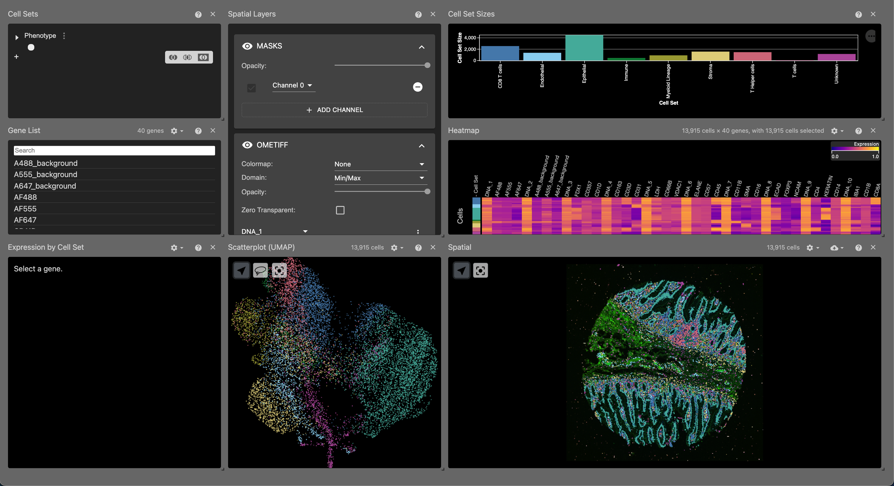
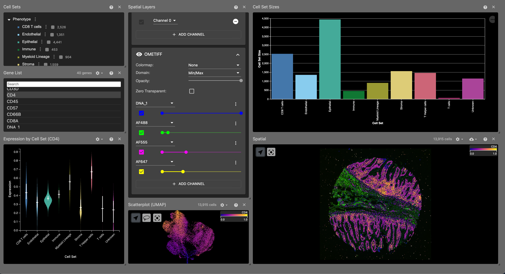
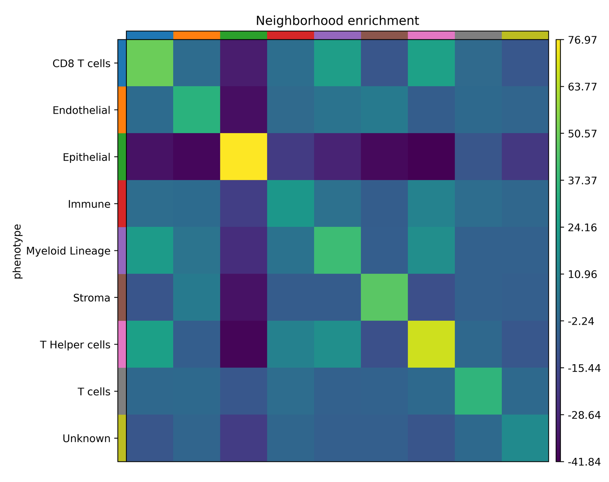
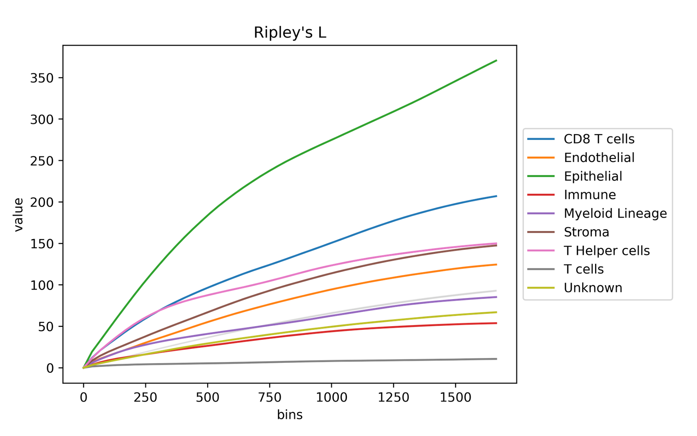
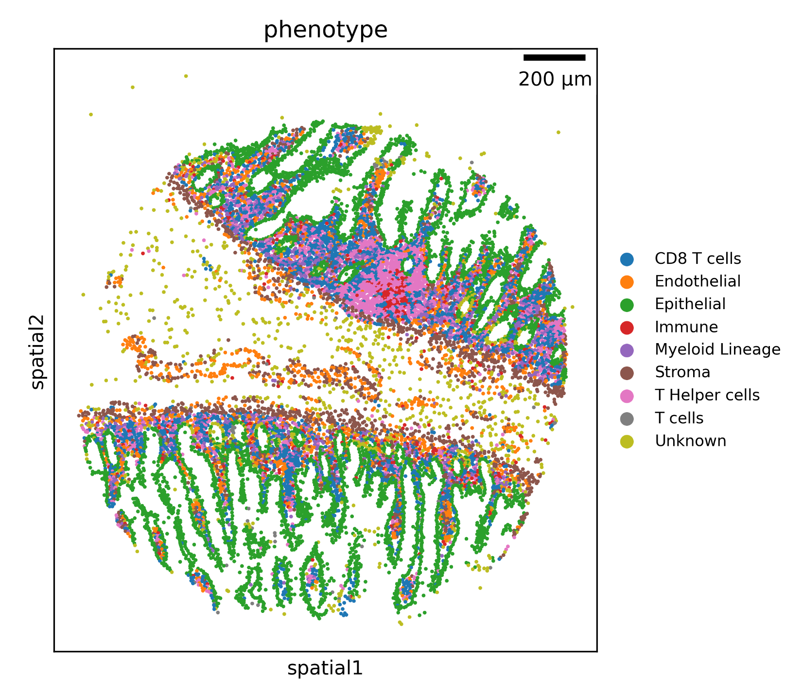

Multiplex tissue images are large, multi-channel images that contain intensity data for numerous biomarkers. The methods for generating multiplex tissue images are diverse, and each method can require specialized knowledge for downstream processing and analysis. The MCMICRO () pipeline was developed to process multiplex images into single-cell data, and to have the range of tools to accommodate for different imaging methods. The tools used in the MCMICRO pipeline, in addition to tools for single-cell analysis, spatial analysis, and interactive visualization are available in Galaxy to facilitate comprehensive and accessible analyses of multiplex tissue images. The MCMICRO tools available in Galaxy are capable of processing Whole Slide Images (WSI) and Tissue Microarrays (TMA). WSIs are images in which a tissue section from a single sample occupies the entire microscope slide; whereas, TMAs multiplex smaller cores from multiple samples onto a single slide. This tutorial will demonstrate how to use the Galaxy multiplex imaging tools to process and analyze publicly available TMA test data provided by MCMICRO (Figure 1); however, **the majority of the steps in this tutorial are the same for both TMAs and WSIs and notes are made throughout the tutorial where processing of these two imaging types diverge.**

Find a full [example history here.](https://cancer.usegalaxy.org/u/watsocam/h/answer-key-history-gtnexemplar002tmaworkflowfeb2025)

, CD163 (yellow), CD3D (blue), CD31 (red), VDAC1 (green), and Keratin (orange). This image is being viewed using Avivator, an interactive tool that allows the user to selectively view channels and adjust channel intensities.")


> <agenda-title></agenda-title>
>
> In this tutorial, we will cover:
>
> 1. TOC
> {:toc}
>
{: .agenda}


# Get data

Multiplex tissue images come in a variety of forms and file-types depending on the modality or platform used. For this tutorial, the Exemplar-002 data was imaged using Cyclic Immunofluorescence (CycIF) with a RareCyte slide scanner. Many of the steps in this workflow have platform-specific parameters, and the hands-on sections will show the best parameters for CycIF RareCyte images; however, notes will be made where critical differences may occur depending on the modality or platform throughout the tutorial.

> <hands-on-title> Data import to history </hands-on-title>
>
> 1. Create a new history for this tutorial
>
>    
>
> 2. Import the files from [Zenodo]({{ page.zenodo_link }}) or from
>    the shared data library (`GTN - Material` -> `{{page.topic_name}}`
>     -> `{{page.title}}`):
>    ```
>    https://zenodo.org/record/7622545/files/markers.csv
>    https://zenodo.org/record/7622545/files/exemplar_002_phenotypes.csv
>    https://zenodo.org/record/7622545/files/exemplar-002-cycle-01.ome.tiff
>    https://zenodo.org/record/7622545/files/exemplar-002-cycle-02.ome.tiff
>    https://zenodo.org/record/7622545/files/exemplar-002-cycle-03.ome.tiff
>    https://zenodo.org/record/7622545/files/exemplar-002-cycle-04.ome.tiff
>    https://zenodo.org/record/7622545/files/exemplar-002-cycle-05.ome.tiff
>    https://zenodo.org/record/7622545/files/exemplar-002-cycle-06.ome.tiff
>    https://zenodo.org/record/7622545/files/exemplar-002-cycle-07.ome.tiff
>    https://zenodo.org/record/7622545/files/exemplar-002-cycle-08.ome.tiff
>    https://zenodo.org/record/7622545/files/exemplar-002-cycle-09.ome.tiff
>    https://zenodo.org/record/7622545/files/exemplar-002-cycle-10.ome.tiff
>    ```
>    
>
> 3. Group the datasets into [collections](). Make a collection of the OME-TIFF, ordering the files by cycle number.
>
{: .hands_on}

> <warning-title>**Imaging platform differences**</warning-title>
>
> The Exemplar-002 raw images are in *ome.tiff* format; however, commonly seen raw file-types are *ome.tiff*, *tiff*, *czi*, and *svs*. If your input images are not *ome.tiff* or *tiff*, you may have to edit the dataset attributes in Galaxy to allow tools to recognize them as viable inputs.
>
{: .warning}

Alternatively, the raw files for each round (10 in total) of the Exemplar-002 data are available on [cancer.usegalaxy.org](https://cancer.usegalaxy.org) under **Data Libraries** (Figure 2). Import the raw files into a new history as a **list collection**.


# Tile illumination correction with **BaSiC Illumination**

Commonly, raw MTI data will consist of one image per round of imaging. These individual round images are frequently captured in tiles, and there can be slight variations in how each tile was illuminated across the course of imaging. Prior to tile stitching and image registration, the tiles have to undergo illumination correction with **BaSiC Illumination** () to account for this. Unlike many of the other tools in this workflow, BaSiC has no extra parameters to think about: Just input the collection of raw images and press *go*!

Two new list collections will appear in the history upon completion:

  - BaSiC Illumination on Collection `X`: FFP (flat-field)
  - BaSiC Illumination on Collection `X`: DFP (deep-field)

> <hands-on-title> Illumination correction </hands-on-title>
>
> 1.  with the following parameters:
>
>    -  *"Raw Cycle Images: "*: List collection of raw images
>
{: .hands_on}


# Stitching and registration with **ASHLAR**

After illumination is corrected across round tiles, the tiles must be stitched together, and subsequently, each round mosaic must be registered together into a single pyramidal OME-TIFF file. **ASHLAR** () from MCMICRO provides both of these functions.

> <comment-title>Naming image channels using a marker metadata file</comment-title>
>
> **ASHLAR** optionally reads a marker metadata file to name the channels in the output OME-TIFF image. This marker file will also be used in later steps. Make sure that the marker file is comma-separated and has the `marker_names` as the third column (Figure 3).
>
> 
>
{: .comment}

> <hands-on-title>: Image stitching and registration </hands-on-title>
>
> 1.  with the following parameters:
>
>    -  *"Raw Images"*: List collection of raw images
>    -  *"Deep Field Profile Images"*: List collection of DFP images produced by **BaSiC Illumination**
>    -  *"Flat Field Profile Images"*: List collection of FFP images produced by **BaSiC Illumination**
>    - *"Rename channels in OME-XML metadata"*: `Yes`
>        -  *"Markers File"*: Comma-separated markers file with marker_names in third column
>
{: .hands_on}

> <warning-title>**Imaging platform differences**</warning-title>
>
> ASHLAR, among other tools in the MCMICRO and Galaxy-ME pre-processing tools have some parameters that are specific to the
> imaging patform used. By default, ASHLAR is oriented to work with images from RareCyte scanners. AxioScan scanners render images
> in a different orientation. Because of this, when using ASHLAR on AxioScan images, it is important to select the **Flip Y-Axis**
> parameter to *Yes*
>
> ASHLAR will work for most imaging modalities; however, certain modalities require different tools to be registered. For example,
> multiplex immunohistochemistry (mIHC) images must use an aligner that registers each moving image to a reference Hematoxylin image.
> For this, Galaxy-ME includes the alternative registration tool .
>
{: .warning}


# TMA dearray with **UNetCoreograph**

Many downstream processing and analysis steps require each individual core from the TMA to be in a separate image file. To accomplish this from our registered ome.tiff image, we can use **UNetCoreograph** to detect and crop each core into separate files.

UNetCoreograph will output images (used for downstream steps), masks, and a preview image (Figure 4.).


> <hands-on-title> TMA dearray </hands-on-title>
>
> 1.  with the following parameters:
>
>    -  *"Registered TIFF"*: The output of **ASHLAR** (registered, pyramidal OME-TIFF file)
>
>    > <comment-title>What about Whole Slide Images?</comment-title>
>    >
>    > Whole slide images do not need to be dearrayed, so in most cases, this step can be skipped; however, UNetCoreograph has the *"Tissue"* option, which when selected, can act to separate the whole tissue from the background in a whole slide image which can be useful. In this case, it is important to toggle the *"Downsample factor"* as this often needs to be higher when extracting whole tissues.
>    {: .comment}
>
{: .hands_on}


# Perform segmentation of multiplexed tissue data with **Mesmer**

Nuclear and/or cellular segmentation is the basis for all downstream single-cell analyses. Different segmentation tools work highly variably depending on the imaging modality or platform used. Because of this, Galaxy-ME has incorporated several segmentation tools so users may find the tool that works optimally for their data.

Available segmentation tools in Galaxy-ME:

  - Mesmer ()
  - UnMicst and s3segmenter ()
  - Cellpose ()

In this tutorial, we use **Mesmer** because it tends to perform generally well on a diverse range of image types, and can be parameterized to suite different modalities. 

> <comment-title>Important detail: Running images in batches</comment-title>
>
> Now that each image has been split into individual core images, downstream tools must be run on the images separately. Luckily, Galaxy makes this easy by including the option to run each tool in batch across a collection of inputs. Next to the input for the tool, select  (**Dataset collection**) as the input type, and pass the collection output by UNetCoreograph as input. If these tools are being used for a single WSI, this can be ignored and the tools can be run on single files individually. If users are processing multiple WSIs simultaneously, the steps would be identical to the TMA case, storing images in collections and running tools in batches. 
>
{: .comment}

> <hands-on-title> Nuclear segmentation </hands-on-title>
>
> 1.  with the following parameters:
>    -  *"Image containing all the marker(s) "*: Collection output of UNetCoreograph (images)
>    - *"The numerical indices of the channel(s) for the nuclear markers"*: `0`
>    - *"Resolution of the image in microns-per-pixel"*: `0.65`
>    - *"Compartment for segmentation prediction:"*: `Nuclear`
>
>    > <comment-title>np.squeeze</comment-title>
>    >
>    > Make sure the **np.squeeze** parameter is set to `Yes` to make the output compatible with next steps.
>    > This is the default behavoir. 
>    {: .comment}
>
{: .hands_on}

> <warning-title>Imaging platform differences: Image resolution**</warning-title>
>
> A crucial parameter for Mesmer and other segmentation tools is the **Image resolution**. This is reported in microns/pixel, and can vary depending on the imaging platform used and the settings at image acquisition. Mesmer accepts the resolution in microns/pixel; however, if using UnMICST, the resolution must be reported as a ratio of the resolution of UnMICST's training images (0.65). For example, when using UnMICST, if your images were captured at a resolution of 0.65, then the UnMICST value would be 1, but if your images were captured at 0.325 microns/pixel, then the value you would enter for UnMICST would be 0.5.
>
{: .warning}


# Calculate single-cell features with **Quantification**

After generating a segmentation mask, the mask and the original registered image can be used to extract mean intensities for each marker in the panel, spatial coordinates, and morphological features for every cell. This step is performed by MCMICRO's **Quantification** module.

Once again, as this is a TMA, we will be running this in batch mode for every core image and its segmentation mask.

The quantification step will produce a CSV cell feature table for every image in the batch.

> <hands-on-title> Quantification </hands-on-title>
>
> 1.  with the following parameters:
>
>    -  *"Registered TIFF "*: Collection output of UNetCoreograph (images)
>    -  *"Primary Cell Mask "*: Collection output of Mesmer (or other segmentation tool)
>    -  *"Additional Cell Masks "*: `Nothing Selected` (Other tools may produce multiple mask types)
>    -  *"Marker channels"*: Comma-separated markers file with marker_names in third column
>
>    > <comment-title>Mask metrics and Intensity metrics</comment-title>
>    >
>    > Leaving the *"mask metrics"* and *"intensity metrics"* blank will by default run all available metrics
>    >
>    {: .comment}
>
{: .hands_on}


# Convert McMicro Output to Anndata

Anndata () is a Python package and file format schema for working with annotated data matrices that has gained popularity in the single-cell analysis community. Many downstream analysis tools, including Scimap (), Scanpy (), and Squidpy () are built around anndata format files (h5ad). This tool splits the marker intensity data into a separate dataframe (`X`), and places all observational data (spatial coordinates, morphological features, etc.) in the cell feature table into a separate dataframe (`obs`) that shares the same indices as `X`. In downstream analyses, new categorical variables, such as phenotype assignments for each cell, are stored in the `obs` dataframe.

Learn more about this file format at the [anndata documentation](https://anndata.readthedocs.io/en/latest/index.html).

> <hands-on-title> Conver to Anndata </hands-on-title>
>
> 1.  with the following parameters:
>
>    -  *"Select the input image or images"*: Collection output of Quantification (cellMaskQuant)
>    - In *"Advanced Options"*:
>        - *"Whether to remove the DNA channels from the final output"*: `No`
>        - *"Whether to use unique name for cells/rows"*: `No`
>
>    > <warning-title>Important parameter: Unique names for cells/rows</warning-title>
>    >
>    > Setting *"Whether to use unique name for cells/rows"* to `No` to ensures that downstream interactive visualizations will be able to map observational features to the mask CellIDs.
>    {: .warning}
>
{: .hands_on}

> <comment-title>Connection to Scanpy and other Galaxy tool suites</comment-title>
>
> Conversion to Anndata format allows users to feed their MTI datasets into a broad array of single-cell analysis tools that have been developed by the Galaxy community. For example, the Python package  is available as a Galaxy tool suite and is extremely useful for filtering, feature scaling and normalization, dimensionality reduction, community detection, and many other downstream analysis tasks. 
>
{: .comment}

# Scimap: Single Cell Phenotyping

There are several ways to classify cells available in Galaxy-ME. Unsupervised approaches, such as Leiden clustering, can be performed on all cells and phenotypes can be manually annotated based on marker expression patterns observed by the user. Alternatively, the R-based tool  can be used to perform a spatially-aware hierarchical cell phenotyping (). These approaches can take a fair amount of trial-and-error, so here we will demonstrate automated phenotyping based on thresholds of specific lineage markers using the Scimap Python package (). Scimap phenotyping can either be provided a table of manual gate values for each marker of interest (which can be determined using the **GateFinder** tool in Galaxy-ME), or by default, Scimap will fit a Gaussian Mixture Model (GMM) to the intensity distribution for each marker to determine positive and negative populations for that marker. The marker intensity values are rescaled between (0,1) with 0.5 being the cut-off between negative and positive populations. Scimap uses a 'Phenotype workflow' to guide the classification of cells (Figure 5.). For more on how to construct a Scimap workflow, see the [Scimap documentation](https://scimap-doc.readthedocs.io/en/latest/tutorials/scimap-tutorial-cell-phenotyping/).


> <hands-on-title> Single Cell Phenotyping with Scimap </hands-on-title>
>
> 1.  with the following parameters:
>
>    -  *"Select the input anndata"*: Output of **Convert MCMICRO output to Anndata**
>    - *"Whether to log the data prior to rescaling"*: `True`
>    -  *"Select the dataset containing manual gate information"*: (Optional) manually determined gates in CSV format. Gates will be determined automatically using a GMM for each marker if this file is not provided
>    -  *"Select the dataset containing gating workflow"*: `exemplar_002_phenotypes.csv`, CSV phenotype workflow (Figure 5.)
>
>    > <comment-title>Limitations of GMM automated phenotyping</comment-title>
>    >
>    > When manual gates are not provided, Scimap fits a 2-component Gaussian Mixture Model (GMM) to determine a threshold between positive and negative cells. This automated gating can work well when markers are highly abundant within the tissue, and the data shows a bimodal distribution; **however**, this is usually not the case, and it is recommended to provide manual gates which can be found using 
>    >
>    {: .comment}
>
{: .hands_on}


# Interactive visualization of multiplex tissue images

Visual analysis is an important part of multiplex tissue imaging workflows. Galaxy-ME has several tools that make interactive visualization easy, and can be used at various stages of analysis.

## Converting UNetCoreograph images to OME-TIFF using the **Convert image** tool

UNetCoreograph outputs each individual core image in `tiff` format. Interactive visualization tools, such as **Vitessce** and **Avivator** require the images to be in `OME-TIFF` format to be viewed. Galaxy-ME includes a conversion tool that can accomodate this, along with many other useful conversion functions.

> <hands-on-title> Convert image </hands-on-title>
>
> 1.  with the following parameters:
>    -   *"Input Image"*: `UNetCoreograph Images`
>    - *"Output data type"*: `OME TIFF`
>    - *"Tile image"*: `Tile image`
>    - *"Pyramid image"*: `Generate Pyramid`
>
{: .hands_on}


## Rename OME-TIFF Channels

Some tools can cause the channel names in an OME-TIFF image to be lost. To fix this, or to change the channel names to whatever the user prefers, the **Rename OME-TIFF Channels** tool can be invoked using a markers file similar to the one used in previous steps.

> <hands-on-title> Rename channels </hands-on-title>
>
> 1.  with the following parameters:
>
>    -  *"Input image in OME-tiff format"*: `Convert image`
>    - *"Format of input image"*: `ome.tiff`
>    -  *"Channel metadata CSV"*: `markers.csv`, Comma-separated markers file with marker_names in third column
>
{: .hands_on}


## Initial visualization with **Avivator**

For any `OME-TIFF` image in a Galaxy-ME history, there will be an option to view the image using **Avivator**. This is a great way to perform an initial inspection of an image for QC purposes before continuing with downstream steps. The **Avivator** window can be launched by clicking the  **Dataset visualization** icon under an expanded dataset, which will open a page with visualization options. From here, click the **Display at Avivator link** (Figure 6.)


Clicking the link will open a new window with the Avivator interactive dashboard. Here, users can select channels to view, adjust the channel contrast and colors for viewing, and zoom in to inspect the image (Figure 7.). 


> <tip-title>Accessing Avivator on older Galaxy instances</tip-title>
>
> Some Galaxy instances that are running older versions of Galaxy will have the **Display at Avivator** link directly in the expanded dataset view (Figure 8.). 
>
> 
>
>
{: .tip}

## Generating an interactive visualization dashboard with **Vitessce**

**Vitessce** is a powerful visualization tool that creates interactive dashboards (Figure 9.) to look at a multiplex `OME-TIFF` images in conjunction with data generated during analysis and stored in an anndata file. The segmentation mask can be overlaid onto the image to qualitatively assess segmentation performance, and visually explore cell-type annotations and marker intensities. The different visualization components are linked by cell index, so users can analyze the image, UMAP representations, heatmaps, and marker intensity violin plots for comprehensive data exploration. 



> <hands-on-title> Vitessce visualization </hands-on-title>
>
> 1.  with the following parameters:
>
>    -  *"Select the OME Tiff image"*: OME-TIFF image to be viewed (or collection of files to run in batch)
>    -  *"Select masks for the OME Tiff image (Optional)"*: Output of Mesmer (or other segmentation tool)
>    - *"Whether to do phenotyping"*: `Yes`
>        - *"Select the anndata contaning phenotyping info"*: `Single Cell Phenotyping`, an anndata file that includes includes cell phenotype annotations.
>        - *"Select an embedding algorithm for scatterplot"*: `UMAP`
>        - *"Input phenotyping keys"*: `Multiple choices`
>            - *"Select the key(s)"*: `phenotype`
>
{: .hands_on}

> <tip-title>Customizing the Vitessce dashboard during use</tip-title>
>
> When running a Vitessce dashboard, the components may look squished and difficult to use. Individual components can be expanded using a handle at the bottom right corner of each component. Additionally, components can be removed to make room for others by clicking the 'X' in the upper right corner of each component. Once the dashboard is closed, it will return to its original state and all original components will be restored when opened again. 
>
> 
>
>
{: .tip}

# Next steps: Compositional and spatial analyses

Galaxy-ME includes additional tools from **Scimap** and tools from the **Squidpy** package () that can be used to perform a variety of downstream analyses. For example, once phenotypes have been assigned to individual cells, **Squidpy** has several methods for understanding the spatial organization of the tissue. Using **Squidpy**, a spatial neighborhood graph is first generated, from which the organization of specific phenotype groups and their interactions can be quantified.

> <hands-on-title> Spatial analysis with Squidpy </hands-on-title>
>
> 1.  generate a spatial neighborhood graph with the following parameters:
>
>    -  *"Select the input anndata"*: Anndata file containing phenotype information (or other variable of interest)
>    - *"Select an analysis"*: `Spatial neighbors -- Create a graph from spatial coordinates`
>
> 2.  compute and plot a neighborhood enrichment analysis with the following parameters:
>
>    -  *"Select the input anndata"*: Output of step 1 (anndata file with spatial neighborhood graph)
>    - *"Select an analysis"*: `nhood_enrichment -- Compute neighborhood enrichment by permutation test`
>    - *"Key in anndata.AnnData.obs where clustering is stored"*: `phenotype`
>
>    > <comment-title>Neighborhood enrichment plot</comment-title>
>    >
>    > **Squidpy** was used to calculate neighborhood enrichments for each phenotype in core 2 of exemplar 2 (Figure 11.). This shows which phenotypes co-locate most frequently within the tissue.
>    >
>    > 
>    >
>    {: .comment}
>
> 3.  calculate Ripley's L curves for each phenotype with the following parameters:
>
>    -  *"Select the input anndata"*: Output of step 1 (anndata file with spatial neighborhood graph)
>    - *"Select an analysis"*: `nhood_enrichment -- Compute neighborhood enrichment by permutation test`
>    - *"Key in anndata.AnnData.obs where clustering is stored"*: `phenotype`
>    - In *"Advanced Graph Options"*:
>        - *"Which Ripley's statistic to compute"*: `L`
>    - In *"Plotting Options"*:
>        - *"Ripley's statistic to be plotted"*: `L`
>
>    > <comment-title>Ripley's L plot</comment-title>
>    >
>    > **Squidpy** was used to calculate Ripley's L curves for each phenotype in core 2 of exemplar 2 (Figure 12.). This shows the overall organization of each phenotype in the tissue. If the curve for a given phenotype lies above the light grey null line (Example: Epithelial cells in Figure 11.), the phenotype is statistically significantly clustered. If the curve lies on the null line (Example: Myeloid lineage in Figure 11.), it's spatial distribution within the tissue is random. If the curve is underneath the null line (Example: T cells in Figure 11.), it's spatial distribution is statistically significantly dispersed.
>    >
>    > 
>    >
>    {: .comment}
>
> 4.  generate a spatial scatterplot of cell phenotypes with the following parameters:
>
>    -  *"Select the input anndata"*: Output of step 1 (anndata file with spatial neighborhood graph)
>    - *"Key for annotations in adata.obs or variables/genes"*: `phenotype` (In this case we use the default; however this could be any observational variable (phenotype, leiden, louvain, etc.) or continuous variable name (CD45, CD3, Area, etc.))
>
>    > <comment-title>Spatial scatterplot</comment-title>
>    >
>    > **Squidpy** was used to generate a spatial scatterplot of core 2 of exemplar 2 (Figure 13.). This is useful for visualizing the distribution of cell types, or any other categorical or continuous variable in the anndata file. 
>    >
>    > 
>    >
>    {: .comment}
>
{: .hands_on}


# Conclusion

In this tutorial, we demonstrated a complete multiplex tissue imaging analysis workflow performed entirely in a web browser using Galaxy-ME. Using an example tissue microarray imaged with cyclic immunofluorescence provided by MCMICRO, we...

  - Corrected illumination between imaging tiles
  - Stitched and registered input images to produce a single, pyramidal OME-TIFF image that is viewable in multiple built-in interactive viewing tools (Avivator, Vitessce)
  - Split the TMA into separate images for each core
  - Processed each core in parallel, beginning with nuclear segmentation
  - Quantified the mean marker intensities, morphological features, and spatial coordinates of each cell in each core
  - Converted the resulting tabular data to anndata format for convenient downstream anaylses and visualizations
  - Performed marker-based, automatically gated, phenotyping of cells
  - Prepared the dearrayed images and viewed them interactively in a dashboard combined with observational data


