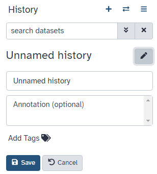
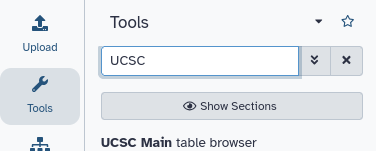

Wir sind auf ein Paper gestoßen () mit dem Titel *"The histone acetyltransferase MOF is a key regulator of the embryonic stem cell core transcriptional network"*. Das Paper enthält die Analyse von möglichen Zielgenen eines interessanten Proteins namens Mof. Die Ziele wurden durch ChIP-seq in Mäusen bestimmt, und die Rohdaten sind über [GEO](https://www.ncbi.nlm.nih.gov/geo/query/acc.cgi?acc=GSE37268) verfügbar. Allerdings ist die Liste der Gene weder im Supplement des Papers noch als Teil der GEO-Einreichung enthalten. Das Einzige, was wir finden konnten, ist eine Datei in GEO, die eine Liste der Regionen enthält, in denen das Signal signifikant angereichert ist (sogenannte *Peaks*):

1 | 3660676 | 3661050 | 375 | 210 | 62.0876250438913 | -2.00329386666667  
1 | 3661326 | 3661500 | 175 | 102 | 28.2950833625942 | -0.695557142857143  
1 | 3661976 | 3662325 | 350 | 275 | 48.3062708406486 | -1.29391285714286  
1 | 3984926 | 3985075 | 150 | 93 | 34.1879823073944 | -0.816992  
1 | 4424801 | 4424900 | 100 | 70 | 26.8023246007435 | -0.66282

**Tabelle 1** Beispiel der verfügbaren Datei

Das Ziel dieser Übung ist es, **diese Liste von genomischen Regionen in eine Liste von möglichen Zielgenen umzuwandeln**.



> <agenda-title></agenda-title>
>
> In diesem Tutorial beschäftigen wir uns mit:
>
> 1. TOC
> {:toc}
>
{: .agenda}

# Vorbereitungen

> <hands-on-title>Galaxy öffnen</hands-on-title>
>
> 1. Öffne eine Galaxy-Instanz: die von deinem Kursleiter empfohlene oder eine aus der Liste **Galaxy-Instanz** oben auf dieser Seite
> 2. Melde dich an oder registriere dich (obere Leiste)
>
>    
{: .hands_on}

Die Galaxy-Oberfläche besteht aus drei Hauptteilen. Links sind die verfügbaren Werkzeuge aufgelistet, rechts wird deine Analysehistorie aufgezeichnet, und im mittleren Bereich werden die Werkzeuge und Datensätze angezeigt.


Lass uns mit einer neuen Historie beginnen.

> <hands-on-title>Historie erstellen</hands-on-title>
>
> 1. Stelle sicher, dass du eine leere Analysehistorie hast.
>
>    
>
> 2. **Benenne deine Historie um**, um sie leichter zu erkennen
>
>    > <tip-title>Historie umbenennen</tip-title>
>    >
>    > * Klicke auf den Titel der Historie (standardmäßig lautet der Titel `Unbenannte Historie`)
>    >
>    >   
>    >
>    > * Gib `Galaxy Einführung` als Namen ein
>    > * Drücke <kbd>Enter</kbd>
>    >
>    {: .tip}
>
{: .hands_on}

## Daten hochladen

> <hands-on-title>Daten hochladen</hands-on-title>
>
> 1. Lade die Liste der Peak-Regionen (die Datei [`GSE37268_mof3.out.hpeak.txt.gz`](https://www.ncbi.nlm.nih.gov/geo/download/?acc=GSE37268&format=file&file=GSE37268%5Fmof3%2Eout%2Ehpeak%2Etxt%2Egz)) von [GEO](https://www.ncbi.nlm.nih.gov/geo/query/acc.cgi?acc=GSE37268) auf deinen Computer herunter
> 2. Klicke auf den Hochladen-Button oben links in der Benutzeroberfläche
>
>    
>
> 3. Drücke **Wähle lokale Dateien** und suche die Datei auf deinem Computer
> 4. Wähle `interval` als **Typ**
> 5. Drücke **Start**
> 6. Drücke **Schließen**
> 7. Warte, bis der Upload abgeschlossen ist. Galaxy wird die Datei automatisch entpacken.
>
> 8. Danach siehst du das erste Element in deiner Galaxy-Historie im rechten Bereich. Es wird die grauen (vorbereitend/queued) und gelben (laufend) Zustände durchlaufen, bis es grün (erfolgreich) wird:
>
>    
>
>    Direktes Hochladen von Dateien ist nicht die einzige Möglichkeit, Daten in Galaxy zu importieren.
>
>    
>
>    > <tip-title>Daten in Galaxy importieren</tip-title>
>    > Es gibt [weitere Optionen]() für fortgeschrittene Benutzer.
>    {: .tip}
>
{: .hands_on}

> <comment-title>Intervall-Dateiformat</comment-title>
> Das **Intervall**-Format ist ein Galaxy-Format zur Darstellung genomischer Intervalle. Es ist tab-getrennt, hat aber die zusätzliche Anforderung, dass drei der Spalten Folgendes enthalten müssen:
> - Chromosomen-ID
> - Startposition (0-basiert)
> - Endposition (end-exklusiv)
>
> Eine optionale Strang-Spalte kann ebenfalls angegeben werden, und eine initiale Kopfzeile kann verwendet werden, um die Spalten zu beschriften, die keiner bestimmten Reihenfolge folgen müssen. Im Gegensatz zum BED-Format (siehe unten) können auch beliebige zusätzliche Spalten vorhanden sein.
>
> Weitere Informationen über die in Galaxy verwendbaren Formate findest du auf der [Galaxy Data Formats-Seite](https://usegalaxy.org/static/formatHelp.html).
{: .comment}


> <hands-on-title>Attribute einer Datei inspizieren und bearbeiten</hands-on-title>
>
> 1. Klicke auf die Datei im Historienbereich.
>
>    Einige Metainformationen (z. B. Format, Referenzdatenbank) über die Datei und der Header werden dann angezeigt, zusammen mit der Anzahl der Zeilen in der Datei (48.647):
>
>    
>
> 2. Klicke auf das  (Auge) Symbol (**Daten anzeigen**) in deinem Datensatz in der Historie.
>
>    Der Inhalt der Datei wird im mittleren Bereich angezeigt.
>
> 3. Klicke auf das  (Stift) Symbol (**Attribute bearbeiten**) in deinem Datensatz in der Historie.
>
>    Ein Formular zum Bearbeiten der Datensatz-Attribute wird im mittleren Bereich angezeigt.
>
> 4. Suche nach `mm9` im Attribut **Datenbank/Build** und wähle `Mouse July 2007 (NCBI37/mm9)` (das Paper sagt uns, dass die Peaks von `mm9` stammen).
>
>    
>
> 5. Klicke oben auf **Speichern**.
> 6. Füge dem Datensatz ein Tag namens `#peaks` hinzu, um ihn in der Historie leichter nachzuverfolgen.
>
>    
>
>    Der Datensatz sollte nun in der Historie wie folgt aussehen:
>
>    {: width="250px" height="300px"}
{: .hands_on}

Um die zu diesen Peak-Regionen gehörenden Gene zu finden, benötigen wir auch eine Liste von Genen in Mäusen, die wir von UCSC erhalten können.

> <hands-on-title>Datenupload von UCSC</hands-on-title>
>
> 1. Suche nach `UCSC Main` in der Werkzeug-Suchleiste (oben links)
>
>     
>
> 2. Klicke auf `UCSC Main` 
>
>     Du wirst zum **UCSC Tabellenbrowser** weitergeleitet, der etwa so aussieht:
>
>     
>
> 3. Setze die folgenden Optionen:
>     - *"clade"*: `Mammal`
>     - *"genome"*: `Mouse`
>     - *"assembly"*: `July 2007 (NCBI37/mm9)`
>     - *"group"*: `Genes and Gene Predictions`
>     - *"track"*: `RefSeq Genes`
>     - *"table"*: `refGene`
>     - *"region"*: `genome`
>     - *"output format"*: `BED - browser extensible data`
>     - *"Send output to"*: `Galaxy` (only)
>
> 4. Klicke auf den **get output**-Button.
>
>    Du wirst den nächsten Bildschirm sehen:
>
>    
>
> 5. Stelle sicher, dass *"Create one BED record per"* auf `Whole Gene` gesetzt ist.
> 6. Klicke auf den **Send Query to Galaxy**-Button.
> 7. Warte, bis der Upload abgeschlossen ist.
> 8. Benenne unseren Datensatz um, damit er leichter zu erkennen ist, z.B. `Genes`.
>
>    
>
> 9. Füge dem Datensatz ein Tag namens `#genes` hinzu, um ihn in der Historie leichter zu verfolgen.
>
{: .hands_on}

> <comment-title>BED-Dateiformat</comment-title>
> Das **BED - Browser Extensible Data**-Format bietet eine flexible Möglichkeit, Genregionen zu kodieren. BED-Zeilen haben drei erforderliche Felder:
> - Chromosomen-ID
> - Startposition (0-basiert)
> - Endposition (end-exklusiv)
>
> Es können bis zu neun zusätzliche optionale Felder vorhanden sein, aber die Anzahl der Felder pro Zeile muss in einem Datensatz konsistent sein.
>
> Weitere Informationen findest du bei [UCSC](https://genome.ucsc.edu/FAQ/FAQformat#format1), einschließlich einer Beschreibung der optionalen Felder.
{: .comment}

Nun haben wir alle Daten gesammelt, die wir für unsere Analyse benötigen.

# Teil 1: Naiver Ansatz

Zunächst verwenden wir einen "naiven" Ansatz, um zu versuchen, die Gene zu identifizieren, mit denen die Peak-Regionen assoziiert sind. Wir werden Gene identifizieren, die sich mit den Peak-Regionen mindestens 1bp überlappen.

## Dateivorbereitung

Schauen wir uns unsere Dateien an, um zu sehen, was wir tatsächlich hier haben.

> <hands-on-title>Dateiinhalt anzeigen</hands-on-title>
>
> 1. Klicke auf das  (Auge)-Symbol (**Daten anzeigen**) der Peak-Datei, um deren Inhalt anzuzeigen.
>
>    Es sollte so aussehen:
>
>    
>
> 2. Sieh dir den Inhalt der Gen-Regionen von UCSC an.
>
>    
>
{: .hands_on}

> <question-title></question-title>
>
> Während die Datei von UCSC Spaltenbeschriftungen hat, hat die Peak-Datei keine. Kannst du erraten, wofür die Spalten stehen?
>
>
> > <solution-title></solution-title>
> >
> > Diese Peak-Datei entspricht keinem Standardformat, und nur durch Ansehen können wir nicht herausfinden, was die Zahlen in den verschiedenen Spalten bedeuten. In dem Paper erwähnen die Autoren, dass sie den Peak-Caller [HPeak](https://www.ncbi.nlm.nih.gov/pubmed/20598134) verwendet haben.
> >
> > Durch einen Blick in das HPeak-Handbuch können wir herausfinden, dass die Spalten folgende Informationen enthalten:
> >
> >  - Chromosomenname durch Nummer
> >  - Startkoordinate
> >  - Endkoordinate
> >  - Länge
> >  - Position innerhalb des Peaks mit der höchsten hypothetischen DNA-Fragmentabdeckung (Summit)
> >  - nicht relevant
> >  - nicht relevant
> >
> {: .solution}
{: .question}

Um die beiden Dateien zu vergleichen, müssen wir sicherstellen, dass die Chromosomennamen dasselbe Format haben.
Wie wir sehen, fehlt in der Peak-Datei `chr` vor den Chromosomennummern. Aber was passiert mit den Chromosomen 20 und 21? Werden sie stattdessen X und Y sein? Lass uns das überprüfen:

> <hands-on-title>Ende der Datei anzeigen</hands-on-title>
>
> 1. Suche nach dem Werkzeug **Select last**  und führe **Select last lines from a dataset (tail)** mit den folgenden Einstellungen aus:
>     - *"Text file"*: unsere Peak-Datei `GSE37268_mof3.out.hpeak.txt.gz`
>     - *"Operation"*: `Keep last lines`
>     - *"Number of lines"*: Wähle einen Wert, z.B. `100`
> 2. Klicke auf **Run Tool**
> 3. Warte, bis der Job abgeschlossen ist
> 4. Überprüfe die Datei durch das  (Auge)-Symbol (**Daten anzeigen**)
>
>    > <question-title></question-title>
>    >
>    > 1. Wie sind die Chromosomen benannt?
>    > 2. Wie sind die Chromosomen X und Y benannt?
>    >
>    > > <solution-title></solution-title>
>    > > 1. Die Chromosomen sind einfach durch ihre Nummer angegeben. In der Gen-Datei von UCSC begannen sie mit `chr`.
>    > > 2. Die Chromosomen X und Y sind als 20 und 21 benannt.
>    > {: .solution }
>    {: .question}
{: .hands_on}

Um die Chromosomennamen zu konvertieren, müssen wir daher zwei Dinge tun:

1. `chr` hinzufügen
2. Die Nummern 20 und 21 in X und Y umwandeln

> <hands-on-title>Chromosomennamen anpassen</hands-on-title>
>
> 1.  in einer spezifischen Spalte mit den folgenden Einstellungen:
>     - *"File to process"*: unsere Peak-Datei `GSE37268_mof3.out.hpeak.txt.gz`
>     - *"in column"*: `1`
>     - *"Find pattern"*: `[0-9]+`
>
>         Dies wird nach Ziffern suchen
>
>     - *"Replace with"*: `chr&`
>
>         `&` ist ein Platzhalter für das Ergebnis der Mustersuche
>
> 2. Benenne deine Ausgabedatei `chr prefix added` um.
>
> 3. : Lass uns das Werkzeug mit zwei weiteren Ersetzungen erneut ausführen
>    - *"File to process"*: die Ausgabe des letzten Durchlaufs, `chr prefix added`
>    - *"in column"*: `1`
>    -  Ersetzung
>      - *"Find pattern"*: `chr20`
>      - *"Replace with"*: `chrX`
>    -  Weitere Ersetzung einfügen
>      - *"Find pattern"*: `chr21`
>      - *"Replace with"*: `chrY`
>
>    > <tip-title>Ein Werkzeug erneut ausführen</tip-title>
>    >
>    > * Erweitere die Datensatzinformationen
>    > * Drücke das  Symbol (**Diesen Job erneut ausführen**)
>    {: .tip}
>
> 4. Überprüfe die neueste Datei durch das  (Auge)-Symbol. Waren wir erfolgreich?
>
>    Wir haben jetzt ziemlich viele Dateien und müssen darauf achten, bei jedem Schritt die richtigen auszuwählen.
>
>    > <question-title></question-title>
>    >
>    > Wie viele Regionen sind in unserer Ausgabedatei? Du kannst auf den Namen der Ausgabe klicken, um sie zu erweitern und die Anzahl zu sehen.
>    >
>    > > <solution-title></solution-title>
>    > > Es sollte der Anzahl der Regionen in deiner ersten Datei, `GSE37268_mof3.out.hpeak.txt.gz`, entsprechen: 48.647
>    > > Wenn bei dir 100 Regionen angezeigt werden, hast du das Werkzeug auf die `Tail`-Datei ausgeführt und musst die Schritte erneut ausführen.
>    > {: .solution }
>    {: .question}
>
> 5. Benenne die Datei in etwas Erkennbareres um, z.B. `Peak regions`.
{: .hands_on}

## Analyse

Unser Ziel ist es, die 2 Regionsdateien (die Gen-Datei und die Peak-Datei aus der Veröffentlichung) zu vergleichen, um herauszufinden, welche Peaks mit welchen Genen verbunden sind. Wenn du nur wissen möchtest, welche Peaks **innerhalb** von Genen (im Genkörper) liegen, kannst du den nächsten Schritt überspringen. Andernfalls ist es sinnvoll, die **Promotorregion** der Gene in den Vergleich einzubeziehen, z. B. weil du Transkriptionsfaktoren in ChIP-seq-Experimenten einbeziehen möchtest. Es gibt keine strikte Definition für die Promotorregion, aber 2 kb stromaufwärts des TSS (Start der Region) wird häufig verwendet. Wir verwenden das Werkzeug **Get Flanks**, um Regionen zu erhalten, die 2 kb stromaufwärts vom Start des Gens bis 10 kb stromabwärts vom Start liegen (12 kb Länge). Dazu teilen wir dem Get Flanks-Werkzeug mit, dass wir Regionen stromaufwärts vom Start, mit einem Offset von 10 kb, die 12 kb lang sind, wie unten im Diagramm gezeigt, erhalten möchten.


> <hands-on-title>Promotorregion zu Genaufzeichnungen hinzufügen</hands-on-title>
>
> 1.  gibt flankierende Regionen für jedes Gen zurück, mit den folgenden Einstellungen:
>     - *"Select data"*: `Genes` Datei von UCSC
>     - *"Region"*: `Around Start`
>     - *"Location of the flanking region/s"*: `Upstream`
>     - *"Offset"*: `10000`
>     - *"Length of the flanking region(s)"*: `12000`
>
>     Dieses Werkzeug gibt flankierende Regionen für jedes Gen zurück.
>
> 2. Vergleiche die Zeilen der resultierenden BED-Datei mit dem Input, um herauszufinden, wie sich die Start- und Endpositionen geändert haben.
>
>    > <tip-title>Mehrere Dateien mit dem Scratchbook inspizieren</tip-title>
>    >
>    > * Klicke auf **Scratchbook aktivieren/deaktivieren** im oberen Panel.
>    >
>    >    
>    >
>    > * Klicke auf das  (Auge)-Symbol der Dateien, um sie zu inspizieren.
>    > * Klicke auf **Scratchbook anzeigen/verbergen**.
>    >
>    >    
>    {: .tip}
>
> 3. Benenne deinen Datensatz um, um deine Ergebnisse widerzuspiegeln (`Promoter regions`).
{: .hands_on}

Die Ausgabe sind Regionen, die 2 kb stromaufwärts des TSS beginnen und 10 kb stromabwärts umfassen. Für Eingaberegionen auf dem positiven Strang, z. B. `chr1 134212701 134230065`, ergibt dies `chr1 134210701 134222701`. Für Regionen auf dem negativen Strang, z. B. `chr1 8349819 9289958`, ergibt dies `chr1 9279958 9291958`.

Vielleicht hast du bemerkt, dass die UCSC-Datei im `BED`-Format vorliegt und eine zugeordnete Datenbank hat. Das ist genau das, was wir auch für unsere Peak-Datei möchten. Das Werkzeug **Intersect**, das wir verwenden, kann Intervall-Dateien automatisch in das BED-Format umwandeln, aber wir werden unsere Intervall-Datei hier explizit umwandeln, um zu zeigen, wie das in Galaxy funktioniert.

> <hands-on-title>Format und Datenbank ändern</hands-on-title>
>
> 1. Klicke auf das  (Stift)-Symbol im Historieneintrag unserer Peak-Region-Datei.
> 2. Wechsle zum **Konvertieren**-Tab.
> 3. Unter *"Target datatype"*: `bed (using 'interval-to-bed')`.
> 4. Drücke **Create Dataset**.
> 5. Überprüfe, dass die "Datenbank/Build" `mm9` ist (der Datenbank-Build für Mäuse, der im Paper verwendet wurde).
> 6. Benenne die Datei erneut um, z. B. `Peak regions BED`.
{: .hands_on}

Jetzt ist es an der Zeit, die überlappenden Intervalle zu finden (endlich!). Um dies zu tun, möchten wir die Gene extrahieren, die sich mit unseren Peaks überlappen oder schneiden.

> <hands-on-title>Überlappungen finden</hands-on-title>
>
> 1.  die Intervalle von zwei Datensätzen, mit den folgenden Einstellungen:
>     - *"Return"*: `Überlappende Intervalle`
>     - *"of"*: die UCSC-Datei mit Promotorregionen (`Promoter regions`)
>     - *"die sich schneiden mit"*: unsere Peak-Region-Datei aus **Replace** (`Peak regions BED`)
>     - *"für mindestens"*: `1`
>
>    > <comment-title></comment-title>
>    > Die Reihenfolge der Eingaben ist wichtig! Wir möchten am Ende eine Liste von **Genen** haben, daher muss der entsprechende Datensatz mit den Geninformationen die erste Eingabe sein (`Promoter regions`).
>    {: .comment}
>    
{: .hands_on}

Wir haben jetzt die Liste der Gene (Spalte 4), die sich mit den Peak-Regionen überschneiden, wie oben gezeigt.

Um einen besseren Überblick über die erhaltenen Gene zu bekommen, möchten wir uns deren Verteilung über die verschiedenen Chromosomen ansehen.
Wir werden die Tabelle nach Chromosomen gruppieren und die Anzahl der Gene mit Peaks auf jedem Chromosom zählen.

> <hands-on-title>Gene auf verschiedenen Chromosomen zählen</hands-on-title>
>
> 1.  Daten nach einer Spalte gruppieren und eine Aggregatoperation auf anderen Spalten ausführen, mit den folgenden Einstellungen:
>     - *"Select data"*: das Ergebnis der Schnittmenge.
>     - *"Group by column"*: `Spalte 1`
>     - Drücke **Insert Operation** und wähle:
>         - *"Typ"*: `Zählen`
>         - *"Auf Spalte"*: `Spalte 1`
>         - *"Ergebnis auf die nächste ganze Zahl runden?"*: `Nein`.
>
>    > <question-title></question-title>
>    >
>    > Welches Chromosom enthielt die höchste Anzahl an Zielgenen?
>    >
>    > > <solution-title></solution-title>
>    > >
>    > > Das Ergebnis variiert je nach Einstellungen, z. B. kann sich die Annotation aufgrund von Updates bei UCSC ändern. Wenn du die Schritte genau befolgt hast, sollte es Chromosom 11 mit 1992 Genen sein. Beachte, dass du zur Reproduzierbarkeit alle Eingabedaten, die in der Analyse verwendet wurden, behalten solltest. Wenn du die Analyse mit demselben Parametersatz erneut ausführst, der in Galaxy gespeichert ist, kann ein anderes Ergebnis erzielt werden, falls sich die Eingaben geändert haben, z. B. durch die Annotation von UCSC.
>    > {: .solution }
>    {: .question}
{: .hands_on}

## Visualisierung

Wir haben einige schöne aggregierte Daten, warum also nicht ein Balkendiagramm daraus erstellen?

Bevor wir das tun, sollten wir unsere gruppierten Daten jedoch noch etwas verfeinern.

Vielleicht hast du bemerkt, dass die Maus-Chromosomen in diesem Datensatz nicht in der richtigen Reihenfolge aufgelistet sind (das **Group**-Werkzeug hat versucht, sie zu sortieren, aber alphabetisch).

Wir können dies beheben, indem wir ein spezielles Werkzeug zum Sortieren unserer Daten verwenden.

> <hands-on-title>Sortierreihenfolge der Genzählungstabelle korrigieren</hands-on-title>
>
> 1.  Daten in aufsteigender oder absteigender Reihenfolge sortieren, mit den folgenden Einstellungen:
>     - *"Sort Query"*: Ergebnis des Ausführens des Group-Werkzeugs
>     - in  *"Spaltenauswahl"*
>       - *"auf Spalte"*: `Spalte 1`
>       - *"in"*: `Aufsteigende Reihenfolge`
>       - *"Sortierungsart"*: `Natürliche/Versionssortierung (-V)`
>
>    
>
{: .hands_on}

Super, wir sind bereit, etwas zu zeichnen!

> <hands-on-title>Balkendiagramm zeichnen</hands-on-title>
>
> 1. Klicke auf das  (visualisieren)-Symbol in der Ausgabe des **Group**-Werkzeugs.
> 2. Wähle `Balkendiagramm (NVD3)` aus.
> 3. Klicke oben rechts auf **<<**.
> 4. Wähle einen Titel unter **Einen Titel angeben**, z.B. `Gene pro Chromosom`.
> 5. Wechsle zum  **Daten auswählen**-Tab und spiele mit den Einstellungen herum.
> 6. Wenn du zufrieden bist, klicke auf das  **Speichern**-Symbol für die Visualisierung oben rechts im *Hauptbereich*.
>
>    Dies speichert es in deinen gespeicherten Visualisierungen. Später kannst du es anzeigen, herunterladen oder mit anderen teilen, indem du im oberen Menü von Galaxy zu **User -> Visualizations** gehst.
>
{: .hands_on}

## Workflow extrahieren

Wenn du dir deine Historie genau ansiehst, wirst du feststellen, dass sie alle Schritte unserer Analyse enthält, von Anfang bis Ende. Durch das Erstellen dieser Historie haben wir tatsächlich einen vollständigen Datensatz unserer Analyse erstellt, bei dem Galaxy alle angewendeten Parametereinstellungen für jeden Schritt speichert.
Wäre es nicht schön, diese Historie einfach in einen Workflow umzuwandeln, den wir immer wieder ausführen können?

Galaxy macht dies sehr einfach mit der Option `Workflow extrahieren`. Das bedeutet, dass du, wann immer du einen Workflow erstellen möchtest, ihn einfach einmal manuell durchführen und dann in einen Workflow umwandeln kannst, sodass es das nächste Mal viel weniger Arbeit ist, dieselbe Analyse durchzuführen. Es ermöglicht dir auch, deine Analyse einfach zu teilen oder zu veröffentlichen.

> <hands-on-title>Workflow extrahieren</hands-on-title>
>
> 1. **Bereinige** deine Historie: Entferne alle fehlgeschlagenen (roten) Jobs aus deiner Historie, indem du auf das  Symbol klickst.
>
>    Dies erleichtert das Erstellen des Workflows.
>
> 2. Klicke oben im Historienbereich auf  (**Historienoptionen**) und wähle **Workflow extrahieren**.
>
>    
>
>    Der zentrale Bereich zeigt den Inhalt der Historie in umgekehrter Reihenfolge (die ältesten oben), und du kannst auswählen, welche Schritte im Workflow enthalten sein sollen.
>
> 3. Ersetze den **Workflow-Namen** durch etwas Beschreibenderes, z.B. `Von Peaks zu Genen`.
>
> 4. Wenn es Schritte gibt, die nicht im Workflow enthalten sein sollen, kannst du sie in der ersten Spalte der Kästchen **abwählen**.
>
>    Da wir einige Schritte durchgeführt haben, die spezifisch für unsere benutzerdefinierte Peak-Datei waren, möchten wir möglicherweise ausschließen:
>    - **Select last** 
>    - alle **Replace Text** -Schritte
>    - **Genomische Intervalle in BED konvertieren**
>    - **Get flanks** 
>
> 5. Klicke oben auf die Schaltfläche **Workflow erstellen**.
>
>    Du erhältst eine Nachricht, dass der Workflow erstellt wurde. Aber wo ist er hin?
>
> 6. Klicke oben im Menü von Galaxy auf **Workflow**.
>
>    Hier siehst du eine Liste aller deiner Workflows.
>
> 7. Wähle den neu erstellten Workflow aus und klicke auf **Bearbeiten**.
>
>    Du solltest etwas Ähnliches wie das Folgende sehen:
>
>    
>
>    > <comment-title>Der Workflow-Editor</comment-title>
>    > Wir können den Workflow im Workflow-Editor von Galaxy untersuchen. Hier kannst du die Parametereinstellungen für jeden Schritt anzeigen/ändern, Werkzeuge hinzufügen und entfernen und einen Ausgang von einem Werkzeug mit dem Eingang eines anderen verbinden – alles auf eine einfache und grafische Weise. Du kannst diesen Editor auch verwenden, um Workflows von Grund auf zu erstellen.
>    {: .comment}
>
>     Obwohl wir unsere zwei Eingaben im Workflow haben, fehlt ihre Verbindung zum ersten Werkzeug (**Intersect** ), da wir einige Zwischenschritte nicht mitgenommen haben.
>
> 8. Verbinde jeden Eingabedatensatz mit dem **Intersect**  Werkzeug, indem du den Pfeil, der nach außen auf der rechten Seite seiner Box zeigt (der einen Ausgang kennzeichnet), zu einem Pfeil auf der linken Seite der **Intersect**-Box ziehst (der einen Eingang kennzeichnet).
> 9. Benenne die Eingabedatensätze in `Referenzregionen` und `Peak-Regionen` um.
> 10. Klicke oben rechts auf das  (Zahnrad)-Symbol.
> 11. Drücke auf **Auto Re-layout**, um die Ansicht aufzuräumen.
>     
> 12. Klicke auf das  **Speichern**-Symbol (oben rechts), um deine Änderungen zu speichern.
>     {: width="50%"}
>
>    > <tip-title>Zwischenschritte ausblenden</tip-title>
>    > Wenn ein Workflow ausgeführt wird, interessiert sich der Benutzer normalerweise hauptsächlich für das Endprodukt und nicht für alle Zwischenschritte. Standardmäßig werden alle Ausgaben eines Workflows angezeigt, aber wir können Galaxy explizit mitteilen, welche Ausgabe angezeigt und welche für einen bestimmten Workflow ausgeblendet werden soll. Dieses Verhalten wird durch das kleine Sternchen neben jedem Ausgabedatensatz gesteuert:
>    >
>    > 
>    >
>    > Wenn du auf dieses Sternchen für einen der Ausgabedatensätze klickst, werden *nur* Dateien mit einem Sternchen angezeigt, und alle Ausgaben ohne Sternchen werden ausgeblendet (beachte, dass das Klicken auf *alle* Ausgaben denselben Effekt hat wie das Klicken auf *keine* der Ausgaben – in beiden Fällen werden alle Datensätze angezeigt).
>    {: .tip}
>
{: .hands_on}

Jetzt ist es an der Zeit, unseren Workflow für einen fortgeschritteneren Ansatz wiederzuverwenden.

# Teil 2: Ein raffinierterer Ansatz

In Teil 1 haben wir eine Überlappungsdefinition von 1 bp (Voreinstellung) verwendet, um Gene zu identifizieren, die mit den Peak-Regionen assoziiert sind. Da die Peaks jedoch breit sein könnten, könnten wir stattdessen die Gene identifizieren, die sich dort überlappen, wo sich die meisten Reads konzentrieren, den **Peak Summit**. Wir werden die Informationen zur Position des Peak Summits, die in der ursprünglichen Peak-Datei enthalten sind, verwenden und auf Überlappungen der Summits mit Genen überprüfen.

## Vorbereitung

Wir benötigen wieder unsere Peak-Datei, aber wir möchten in einem sauberen Verlauf arbeiten. Statt sie zweimal hochzuladen, können wir sie in einen neuen Verlauf kopieren.

> <hands-on-title>Verlaufselemente kopieren</hands-on-title>
>
> 1. Erstelle einen neuen Verlauf und gib ihm einen neuen Namen wie `Galaxy Einführung Teil 2`
>
>    
>
> 2. Klicke oben rechts auf deinem Verlauf auf **Alle Verläufe anzeigen** ( Symbol)
>
>       Du solltest nun beide Verläufe nebeneinander sehen
>
> 3. Ziehe die bearbeitete Peak-Datei (`Peak regions`, nach den Ersetzungsschritten), die die Summit-Informationen enthält, in deinen neuen Verlauf.
> 4. Klicke auf das Home-Symbol  (oder **Daten analysieren** bei älteren Galaxy-Versionen) in der oberen Menüleiste, um zurück zu deinem Analysefenster zu gelangen
>
{: .hands_on}

## Peak Summit-Datei erstellen

Wir müssen eine neue BED-Datei aus der ursprünglichen Peak-Datei erstellen, die die Positionen der Peak Summits enthält. Der Beginn des Summit ist der Beginn des Peaks (Spalte 2) plus der Ort innerhalb des Peaks, der die höchste hypothetische DNA-Fragmentabdeckung hat (Spalte 5, abgerundet auf die nächstkleinere ganze Zahl, da einige Peak Summits zwischen zwei Basen fallen). Als Ende der Peak-Region definieren wir einfach `start + 1`.

> <hands-on-title>Peak Summit-Datei erstellen</hands-on-title>
>
> 1.  mit den folgenden Parametern:
>   - *"Eingabedatei"*: unsere Peak-Datei `Peak regions` (die Intervallformat-Datei)
>   - *"Hat die Eingabe eine Kopfzeile mit Spaltennamen?"*: `Nein`
>   - In *"Ausdrücke"*:
>       -  *"Ausdrücke"*
>           - *"Ausdruck hinzufügen"*: `c2 + int(c5)`
>           - *"Modus der Operation"*: Anhängen
>       -  *"Ausdrücke"*
>           - *"Ausdruck hinzufügen"*: `c8 + 1`
>           - *"Modus der Operation"*: Anhängen
>
>   Dies wird eine 8. und 9. Spalte in unserer Tabelle erstellen, die wir im nächsten Schritt verwenden werden:
>
> 2. Benenne die Ausgabe in `Peak summit regions` um
>
{: .hands_on}

Jetzt schneiden wir nur das Chromosom sowie den Anfang und das Ende des Summits aus:

> <hands-on-title>Spalten ausschneiden</hands-on-title>
> 1.  Spalten aus einer Tabelle mit den folgenden Einstellungen:
>   - *"Spalten ausschneiden"*: `c1,c8,c9`
>   - *"Getrennt durch Tab"*: `Tab`
>   - *"Von"*: `Peak summit regions`
>
>    Die Ausgabe von **Cut** wird im `tabellarischen` Format vorliegen.
>
> 2. Ändere das Format in `interval` (verwende das ), da dies vom Tool **Intersect** erwartet wird.
>
>    
>
>    Die Ausgabe sollte wie unten aussehen:
>
>    {: width="200px"}
{: .hands_on}

## Gen-Namen erhalten

Die von UCSC heruntergeladenen RefSeq-Gene enthielten nur die RefSeq-Identifikatoren, aber nicht die Gen-Namen. Um am Ende eine Liste der Gen-Namen zu erhalten, verwenden wir eine andere BED-Datei aus den Datenbibliotheken.

> <comment-title></comment-title>
> Es gibt mehrere Möglichkeiten, die Gen-Namen zu erhalten, falls du es selbst tun musst. Eine Möglichkeit ist, eine Zuordnung über Biomart abzurufen und dann die beiden Dateien zu verknüpfen (**Zwei Datensätze nebeneinander auf einem bestimmten Feld verknüpfen** ). Eine andere Möglichkeit ist, die vollständige RefSeq-Tabelle von UCSC zu erhalten und sie manuell in das BED-Format zu konvertieren.
{: .comment}

> <hands-on-title>Daten hochladen</hands-on-title>
>
> 1.  `mm9.RefSeq_genes_from_UCSC.bed` von [Zenodo](https://zenodo.org/record/1025586) oder aus der Datenbibliothek:
>
>    ```
>    https://zenodo.org/record/1025586/files/mm9.RefSeq_genes_from_UCSC.bed
>    ```
>
>    
>
>    
>
>    Standardmäßig verwendet Galaxy den Link als Namen, also benenne ihn um.
>
> 2. Überprüfe den Dateinhalt, um sicherzustellen, dass er Gen-Namen enthält.
>    Es sollte ähnlich wie unten aussehen:
>    
>
> 3. Benenne die Datei in `mm9.RefSeq_genes` um
> 4. Wende das Tag `#genes` an
>
{: .hands_on}

## Workflow wiederholen

Es ist Zeit, den Workflow, den wir vorher erstellt haben, wiederzuverwenden.

> <hands-on-title>Workflow ausführen</hands-on-title>
> 1. Öffne das Workflow-Menü (obere Menüleiste)
> 2. Finde den Workflow, den du im vorherigen Abschnitt erstellt hast, und wähle die Option **Ausführen**
> 3. Wähle als Eingaben unsere `mm9.RefSeq_genes` (`#genes`) BED-Datei und das Ergebnis des **Cut**-Tools (`#peaks`)
> 4. Klicke auf **Workflow ausführen**
>
>    Die Ausgaben sollten im Verlauf erscheinen, aber es kann einige Zeit dauern, bis sie abgeschlossen sind.
>
{: .hands_on}

Wir haben unseren Workflow verwendet, um unsere Analyse mit den Peak Summits erneut durchzuführen. Das Tool **Group** hat erneut eine Liste erstellt, die die Anzahl der Gene in jedem Chromosom enthält. Aber wäre es nicht interessanter zu wissen, wie viele Peaks in jedem einzigartigen Gen enthalten sind? Lass uns den Workflow mit anderen Einstellungen erneut ausführen!

> <hands-on-title>Workflow mit geänderten Einstellungen ausführen</hands-on-title>
> 1. Öffne das Workflow-Menü (obere Menüleiste)
> 2. Finde den Workflow, den du im vorherigen Abschnitt erstellt hast, und wähle die Option **Ausführen**
> 3. Wähle als Eingaben unsere `mm9.RefSeq_genes` (`#genes`) BED-Datei und das Ergebnis des **Cut**-Tools (`#peaks`)
> 4. Klicke auf den Titel des  **Group**-Tools, um die Optionen zu erweitern.
> 5. Ändere die folgenden Einstellungen, indem du auf das  (Bleistift)-Symbol auf der linken Seite klickst:
>     - *"Nach Spalte gruppieren"*: `7`
>     - In *"Operation"*:
>       - *"Auf Spalte"*: `7`
> 6. Klicke auf **Workflow ausführen**
{: .hands_on}

Herzlichen Glückwunsch! Du solltest jetzt eine Datei mit allen einzigartigen Gen-Namen und einer Zählung haben, wie viele Peaks sie enthalten.

> <question-title></question-title>
>
> Die Liste der einzigartigen Gene ist nicht sortiert. Versuche, sie selbst zu sortieren!
>
> > <solution-title></solution-title>
> > Du kannst das Tool "Daten in aufsteigender oder absteigender Reihenfolge sortieren" auf Spalte 2 verwenden und "schnelle numerische Sortierung" wählen.
> {: .solution }
{: .question}

# Teile deine Arbeit

Eine der wichtigsten Funktionen von Galaxy kommt am Ende einer Analyse. Wenn du bemerkenswerte Ergebnisse veröffentlicht hast, ist es wichtig, dass andere Forscher dein In-Silico-Experiment reproduzieren können. Galaxy ermöglicht es Nutzern, ihre Workflows und Verläufe einfach mit anderen zu teilen.

Um einen Verlauf zu teilen, klicke auf das  (Zahnrad)-Symbol im Verlaufspaneel und wähle `Teilen oder Veröffentlichen`. Auf dieser Seite kannst du 3 Dinge tun:

1. **Über Link zugänglich machen**

    Dies erstellt einen Link, den du anderen geben kannst. Jeder, der diesen Link hat, kann deinen Verlauf einsehen.

2. **Verlauf veröffentlichen**

    Dies erstellt nicht nur einen Link, sondern veröffentlicht auch deinen Verlauf. Das bedeutet, dein Verlauf wird unter `Shared Data → Published Histories` in der oberen Menüleiste aufgeführt.

3. **Mit einzelnen Nutzern teilen**

    Dies teilt den Verlauf nur mit spezifischen Nutzern auf der Galaxy-Instanz.


> <hands-on-title>Verlauf und Workflow teilen</hands-on-title>
>
> 1. Teile einen deiner Verläufe mit deinem Nachbarn
> 2. Sieh nach, ob du dasselbe mit deinem Workflow tun kannst!
> 3. Finde den Verlauf und/oder Workflow, den dein Nachbar geteilt hat
>
>    Verläufe, die mit spezifischen Nutzern geteilt wurden, können von diesen Nutzern in ihrem Verlaufmenü ( (Zahnrad)-Symbol) unter `Mit mir geteilte Verläufe` eingesehen werden.
>
{: .hands_on}

# Fazit

 Du hast gerade deine erste Analyse in Galaxy durchgeführt. Du hast auch einen Workflow aus deiner Analyse erstellt, damit du die genau gleiche Analyse auf anderen Datensätzen wiederholen kannst. Zusätzlich hast du deine Ergebnisse und Methoden mit anderen geteilt.


