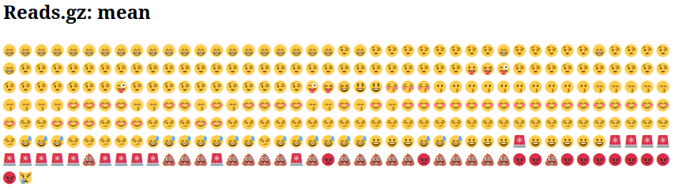
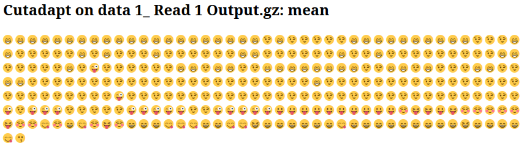

Während der Sequenzierung werden die Nukleotidbasen in einer DNA- oder RNA-Probe (Bibliothek) durch das Sequenziergerät bestimmt. Für jedes Fragment in der Bibliothek wird eine Sequenz erstellt, die auch als **Read** bezeichnet wird und einfach eine Abfolge von Nukleotiden darstellt.

Moderne Sequenzierungstechnologien können in einem einzigen Experiment eine enorme Anzahl von Reads erzeugen. Allerdings ist keine Sequenziertechnologie perfekt, und jedes Instrument erzeugt unterschiedliche Arten und Mengen von Fehlern, wie z.B. falsch bestimmte Nukleotide. Diese falsch bestimmten Basen resultieren aus den technischen Einschränkungen jeder Sequenzierplattform.

Daher ist es notwendig, Fehlerarten zu verstehen, zu identifizieren und auszuschließen, die die Interpretation der nachfolgenden Analyse beeinflussen könnten.
Die Qualitätskontrolle der Sequenzen ist daher ein wesentlicher erster Schritt in deiner Analyse. Fehler frühzeitig zu erkennen, spart später Zeit.

> <agenda-title></agenda-title>
>
> In diesem Tutorial werden wir uns mit Folgendem befassen:
>
> 1. TOC
> {:toc}
>
{: .agenda}

# Eine Rohsequenzdatei inspizieren

> <hands-on-title>Daten hochladen</hands-on-title>
>
> 1. Erstelle eine neue Historie für dieses Tutorial und gib ihr einen passenden Namen.
>
>    
>
>    
>
> 2. Importiere die Datei `female_oral2.fastq-4143.gz` von [Zenodo](https://zenodo.org/record/3977236) oder aus der Datenbibliothek (frag deinen Dozenten).
>    Dies ist eine Mikrobiom-Probe von einer Schlange .
>
>    ```
>    https://zenodo.org/record/3977236/files/female_oral2.fastq-4143.gz
>    ```
>
>    
>
>    
>
> 3. Benenne das importierte Dataset in `Reads` um.
{: .hands_on}

Wir haben gerade eine Datei in Galaxy importiert. Diese Datei ähnelt den Daten, die wir direkt von einer Sequenzierungseinrichtung erhalten könnten: einer [FASTQ-Datei](https://de.wikipedia.org/wiki/FASTQ-Format).

> <hands-on-title>Die FASTQ-Datei inspizieren</hands-on-title>
>
> 1. Untersuche die Datei, indem du auf das  (Auge)-Symbol klickst.
>
{: .hands_on}

Auch wenn es kompliziert aussieht (und vielleicht ist es das auch), ist das FASTQ-Format leicht verständlich, wenn man es einmal entschlüsselt hat.

Jeder Read, der ein Fragment der Bibliothek darstellt, wird in 4 Zeilen kodiert:
Zeile  | Beschreibung
--- | ---
1 | Beginnt immer mit `@`, gefolgt von Informationen über den Read
2 | Die tatsächliche Nukleotidsequenz
3 | Beginnt immer mit einem `+` und enthält manchmal die gleichen Informationen wie in Zeile 1
4 | Eine Zeichenfolge, die die Qualitätswerte für jede Base der Nukleotidsequenz darstellt; muss die gleiche Anzahl von Zeichen wie Zeile 2 haben

Zum Beispiel ist die erste Sequenz in unserer Datei:

@M00970:337:000000000-BR5KF:1:1102:17745:1557 1:N:0:CGCAGAAC+ACAGAGTT  
GTGCCAGCCGCCGCGGTAGTCCGACGTGGCTGTCTCTTATACACATCTCCGAGCCCACGAGACCGAAGAACATCTCGTATGCCGTCTTCTGCTTGAAAAAAAAAAAAAAAAAAAACAAAAAAAAAAAAAGAAGCAAATGACGATTCAAGAAAGAAAAAAACACAGAATACTAACAATAAGTCATAAACATCATCAACATAAAAAAGGAAATACACTTACAACACATATCAATATCTAAAATAAATGATCAGCACACAACATGACGATTACCACACATGTGTACTACAAGTCAACTA  
+  
GGGGGGGGGGGGGGGGGGGGGGGGGGGGGGGGGGGGGGGGGGGGGGGGGGGGGGGGGGGGGFGGGFGGGGGGAFFGGFGGGGGGGGFGGGGGGGGGGGGGGFGGG+38+35*311*6,,31=******441+++0+0++0+*1*2++2++0*+*2*02*/***1*+++0+0++38++00++++++++++0+0+2++*+*+*+*+*****+0**+0**+***+)*.***1**//*)***)/)*)))*)))*),)0(((-((((-.(4(,,))).,(())))))).)))))))-))-(
  
Das bedeutet, dass das Fragment mit dem Namen `@M00970` der DNA-Sequenz `GTGCCAGCCGCCGCGGTAGTCCGACGTGGCTGTCTCTTATACACATCTCCGAGCCCACGAGACCGAAGAACATCTCGTATGCCGTCTTCTGCTTGAAAAAAAAAAAAAAAAAAAACAAAAAAAAAAAAAGAAGCAAATGACGATTCAAGAAAGAAAAAAACACAGAATACTAACAATAAGTCATAAACATCATCAACATAAAAAAGGAAATACACTTACAACACATATCAATATCTAAAATAAATGATCAGCACACAACATGACGATTACCACACATGTGTACTACAAGTCAACTA` entspricht und diese Sequenz mit einer Qualität von `GGGGGGGGGGGGGGGGGGGGGGGGGGGGGGGGGGGGGGGGGGGGGGGGGGGGGGGGGGGGGFGGGFGGGGGGAFFGGFGGGGGGGGFGGGGGGGGGGGGGGFGGG+38+35*311*6,,31=******441+++0+0++0+*1*2++2++0*+*2*02*/***1*+++0+0++38++00++++++++++0+0+2++*+*+*+*+*****+0**+0**+***+)*.***1**//*)***)/)*)))*)))*),)0(((-((((-.(4(,,))).,(())))))).)))))))-))-` sequenziert wurde.



> <question-title></question-title>
>
> 1. Welches ASCII-Zeichen entspricht dem schlechtesten Phred-Score für Illumina 1.8+?
> 2. Was ist der Phred-Qualitätswert des 3. Nukleotids der 1. Sequenz?
> 3. Wie genau ist dieses 3. Nukleotid?
>
> > <solution-title></solution-title>
> > 1. Der schlechteste Phred-Score ist der kleinste, also 0. Für Illumina 1.8+ entspricht er dem Zeichen `!`.
> > 2. Das 3. Nukleotid der 1. Sequenz hat das ASCII-Zeichen `G`, was einem Score von 38 entspricht.
> > 3. Das entsprechende Nukleotid `G` hat eine Genauigkeit von fast 99,99 %
> >
> {: .solution }
{: .question}

> <comment-title></comment-title>
> Die aktuelle Illumina-Version (1.8+) verwendet das Sanger-Format (Phred+33). Wenn du mit älteren Datensätzen arbeitest, kannst du auf ältere Bewertungsschemata stoßen. **FastQC** , ein Werkzeug, das wir später in diesem Tutorial verwenden werden, kann verwendet werden, um zu bestimmen, welches Qualität-Encoding verwendet wird (durch Bewertung des Bereichs der Phred-Werte, die in der FASTQ-Datei sichtbar sind).
{: .comment}

Beim Betrachten der Datei in Galaxy sieht es so aus, als hätten die meisten Nukleotide eine hohe Punktzahl (`G`, was einem Score von 38 entspricht). Ist das bei allen Sequenzen der Fall? Und über die gesamte Sequenzlänge hinweg?

# Qualität mit FASTQE 🧬😎 bewerten - nur für kurze Reads

Um die Sequenzqualität über alle Sequenzen hinweg zu betrachten, können wir [FASTQE](https://fastqe.com/) verwenden. Es ist ein Open-Source-Tool, das eine einfache und unterhaltsame Möglichkeit bietet, Rohsequenzdaten zu überprüfen und sie als Emojis darzustellen. Du kannst es verwenden, um einen schnellen Eindruck davon zu bekommen, ob deine Daten Probleme aufweisen, derer du dir vor der weiteren Analyse bewusst sein solltest.

> <hands-on-title>Qualitätsprüfung</hands-on-title>
>
> 1.  mit den folgenden Parametern:
>    -  *"FastQ-Daten"*: `Reads`
>    -  *"Anzuzeigende Score-Typen"*: `Durchschnitt`
>
> 2. Überprüfe die erzeugte HTML-Datei
>
{: .hands_on}

Statt die Qualitätswerte für jeden einzelnen Read zu betrachten, analysiert FASTQE die Qualität kollektiv über alle Reads innerhalb einer Probe hinweg und kann den Durchschnitt für jede Nukleotidposition entlang der Länge der Reads berechnen. Unten sind die Mittelwerte für diesen Datensatz dargestellt.



Du kannst die Punktzahl für jedes [Emoji in der FASTQE-Dokumentation](https://github.com/fastqe/fastqe#scale) sehen. Die Emojis unten, mit Phred-Werten unter 20, sind die, die wir hoffentlich nicht häufig sehen.
Phred Quality Score | ASCII-Code | Emoji
--- | --- | ---
0 | ! | 🚫
1 | " | ❌
2 | # | 👺
3 | $ | 💔
4 | % | 🙅
5 | & | 👾
6 | ' | 👿
7 | ( | 💀
8 | ) | 👻
9 | * | 🙈
10 | + | 🙉
11 | , | 🙊
12 | - | 🐵
13 | . | 😿
14 | / | 😾
15 | 0 | 🙀
16 | 1 | 💣
17 | 2 | 🔥
18 | 3 | 😡
19 | 4 | 💩

> <question-title></question-title>
>
> Was ist der niedrigste Durchschnittswert in diesem Datensatz?
>
> > <solution-title></solution-title>
> > Der niedrigste Wert in diesem Datensatz ist 😿 13.
> {: .solution }
{: .question}

# Qualität mit FastQC bewerten - kurze & lange Reads

Eine zusätzliche oder alternative Möglichkeit zur Überprüfung der Sequenzqualität ist [FastQC](https://www.bioinformatics.babraham.ac.uk/projects/fastqc/). Es bietet eine modulare Reihe von Analysen, die du verwenden kannst, um zu überprüfen, ob deine Daten Probleme aufweisen, derer du dir vor der weiteren Analyse bewusst sein solltest. Wir können es zum Beispiel verwenden, um zu bewerten, ob bekannte Adapter in den Daten vorhanden sind. Wir werden es auf der FASTQ-Datei ausführen.

> <hands-on-title>Qualitätsprüfung</hands-on-title>
>
> 1.  mit den folgenden Parametern:
>    -  *"Rohdaten aus deiner aktuellen Historie"*: `Reads`
>
> 2. Überprüfe die erzeugte HTML-Datei
>
{: .hands_on}

> <question-title></question-title>
>
> Welches Phred-Encoding wird in der FASTQ-Datei für diese Sequenzen verwendet?
>
> > <solution-title></solution-title>
> > Die Phred-Werte sind mit `Sanger / Illumina 1.9` codiert (`Encoding` in der oberen Tabelle).
> {: .solution }
{: .question}
## Qualität der Sequenzen pro Base

Mit FastQC können wir das Diagramm zur Qualität der Sequenzen pro Base verwenden, um die Basisqualität der Reads zu überprüfen, ähnlich wie wir es mit FASTQE gemacht haben.


Auf der x-Achse sind die Basispositionen im Read angegeben. In diesem Beispiel enthält die Probe Reads, die bis zu 296 bp lang sind.

> <details-title>Nicht uniforme x-Achse</details-title>
>
> Die x-Achse ist nicht immer uniform. Bei langen Reads wird eine Binning-Technik angewendet, um die Darstellung kompakt zu halten. Das sehen wir in unserer Probe. Es beginnt mit einzelnen 1-10 Basen. Danach werden Basen über ein Fenster mit einer bestimmten Anzahl von Basen gruppiert. Daten-Binning bedeutet Gruppierung und ist eine Datenvorverarbeitungstechnik, die verwendet wird, um die Auswirkungen kleiner Beobachtungsfehler zu reduzieren. Die Anzahl der zusammengefassten Basispositionen hängt von der Länge des Reads ab. Bei Reads >50bp wird der letzte Teil des Diagramms aggregierte Statistiken für 5bp-Fenster anzeigen. Kürzere Reads haben kleinere Fenster und längere Reads größere Fenster. Binning kann beim Ausführen von FastQC entfernt werden, indem der Parameter "Grouping von Basen für Reads >50bp deaktivieren" auf Ja gesetzt wird.
{: .details}

Für jede Position wird ein Boxplot gezeichnet mit:

- dem Medianwert, dargestellt durch die zentrale rote Linie
- dem Interquartilsbereich (25-75%), dargestellt durch das gelbe Kästchen
- den 10%- und 90%-Werten in den oberen und unteren Whiskern
- der durchschnittlichen Qualität, dargestellt durch die blaue Linie

Die y-Achse zeigt die Qualitätswerte an. Je höher der Wert, desto besser ist die Basisbestimmung. Der Hintergrund des Diagramms unterteilt die y-Achse in sehr gute Qualitätswerte (grün), Werte von angemessener Qualität (orange) und Reads von geringer Qualität (rot).

Es ist bei allen Illumina-Sequenzierern normal, dass der Median-Qualitätswert in den ersten 5-7 Basen niedriger beginnt und dann ansteigt. Die Qualität der Reads wird auf den meisten Plattformen am Ende des Reads abfallen. Dies liegt oft an Signalabfall oder Phasenschwankungen während des Sequenzierlaufs. Die aktuellen Entwicklungen in der Chemie, die auf das Sequenzieren angewendet werden, haben dies etwas verbessert, aber die Reads sind jetzt länger als je zuvor.
> <details-title>Signalabfall und Phasenschwankungen</details-title>
>
> - Signalabfall
>
>  Die Fluoreszenzsignalintensität nimmt mit jedem Zyklus des Sequenzierungsprozesses ab. Aufgrund der abbauenden Fluorophore werden ein Teil der Stränge im Cluster nicht verlängert. Der Anteil des emittierten Signals nimmt mit jedem Zyklus weiter ab, was zu einer Verringerung der Qualitätswerte am 3'-Ende des Reads führt.
>
> - Phasenschwankungen
>
>  Das Signal beginnt zu verschwimmen, wenn die Anzahl der Zyklen zunimmt, da der Cluster die Synchronität verliert. Mit Fortschreiten der Zyklen treten bei einigen Strängen zufällige Fehler bei der Einbau von Nukleotiden auf, aufgrund von:
>
>  - Unvollständiger Entfernung der 3'-Terminatoren und Fluorophore
>  - Einbau von Nukleotiden ohne effektive 3'-Terminatoren
>
>  Dies führt zu einer Verringerung der Qualitätswerte am 3'-Ende des Reads.
{: .details}

> <details-title>Andere Qualitätsprofile von Sequenzen</details-title>
>
> Hier sind einige Qualitätsprofile pro Base, die auf Probleme mit der Sequenzierung hinweisen können.
>
> - Überclusterung
>
>   Sequenzierungseinrichtungen können die Flusszellen überclusterieren. Dies führt zu kleinen Abständen zwischen den Clustern und einer Überlappung der Signale. Zwei Cluster können als ein einzelner Cluster interpretiert werden, wobei gemischte Fluoreszenzsignale detektiert werden, was die Signalreinheit verringert. Dies erzeugt niedrigere Qualitätswerte über den gesamten Read hinweg.
>
> - Instrumentierungsprobleme
>
>   Während eines Laufs können gelegentlich Probleme mit den Sequenzierungsinstrumenten auftreten. Ein plötzlicher Rückgang der Qualität oder ein hoher Prozentsatz an Reads niedriger Qualität könnte auf ein Problem in der Einrichtung hinweisen. Einige Beispiele für solche Probleme:
>
>    - Manifold Burst
>
>      
>
>    - Zyklusverlust
>
>      
>
>    - Read 2 Ausfall
>
>      
>
>    Bei solchen Daten sollte die Sequenzierungseinrichtung zur Diskussion kontaktiert werden. Oft ist eine Neu-Sequenzierung erforderlich (und wird nach unserer Erfahrung auch von der Firma angeboten).
{: .details}

> <question-title></question-title>
>
> 1. Wie verändert sich der durchschnittliche Qualitätswert entlang der Sequenz?
> 2. Ist diese Tendenz in allen Sequenzen zu beobachten?
>
> > <solution-title></solution-title>
> > 1. Der durchschnittliche Qualitätswert (blaue Linie) sinkt etwa in der Mitte dieser Sequenzen. Es ist üblich, dass die durchschnittliche Qualität gegen Ende der Sequenzen abnimmt, da die Sequenzierer am Ende zunehmend falsche Nukleotide einbauen. In diesem Beispiel gibt es jedoch einen sehr großen Qualitätsabfall ab der Mitte.
> > 2. Die Boxplots werden ab Position ~100 breiter. Das bedeutet, dass viele Sequenzen ihre Qualität ab der Mitte der Sequenz verringern. Nach 100 Nukleotiden haben mehr als 10% der Sequenzen Werte unter 20.
> {: .solution }
{: .question}

Wenn der Median-Qualitätswert unter einem Phred-Score von ~20 liegt, sollten wir in Erwägung ziehen, Basen mit schlechter Qualität aus der Sequenz herauszuschneiden. Wir werden diesen Prozess im Abschnitt „Trimmen und Filtern“ erläutern.

### Adapter-Inhalt


Das Diagramm zeigt den kumulierten Prozentsatz der Reads mit den verschiedenen Adapter-Sequenzen an jeder Position. Sobald eine Adapter-Sequenz in einem Read gesehen wird, wird sie als vorhanden bis zum Ende des Reads gezählt, sodass der Prozentsatz mit der Länge des Reads zunimmt. FastQC kann einige Adapter standardmäßig erkennen (z. B. Illumina, Nextera). Für andere Adapter könnten wir eine Kontaminanten-Datei als Eingabe für das FastQC-Tool bereitstellen.

Idealerweise sollte Illumina-Sequenzdaten keine Adapter-Sequenzen enthalten. Bei langen Reads sind jedoch einige der Bibliotheks-Insertions kürzer als die Read-Länge, was zu einem Durchgang zum Adapter am 3'-Ende des Reads führt. Diese Mikrobiomprobe hat relativ lange Reads, und wir können sehen, dass der Nextera-Adapter erkannt wurde.

> <details-title>Andere Adapter-Inhaltsprofile</details-title>
>
> Adapter-Inhalt kann auch bei RNA-Seq-Bibliotheken erkannt werden, bei denen die Verteilung der Bibliotheks-Insertionsgrößen variabel ist und wahrscheinlich einige kurze Insertions enthält.
>
> 
>
{: .details}

Wir können ein Trimm-Tool wie Cutadapt verwenden, um diesen Adapter zu entfernen. Wir werden diesen Prozess im Abschnitt „Filtern und Trimmen“ erläutern.

> <tip-title>Eine Abkürzung nehmen</tip-title>
>
> Die folgenden Abschnitte gehen detailliert auf einige der anderen von FastQC erzeugten Diagramme ein. Beachten Sie, dass einige Diagramme/Module Warnungen ausgeben können, die jedoch normal für den Datentyp sein können, mit dem Sie arbeiten, wie unten besprochen und [in den FASTQC FAQ](https://rtsf.natsci.msu.edu/genomics/tech-notes/fastqc-tutorial-and-faq/). Die anderen Diagramme geben uns Informationen, um die Qualität der Daten tiefer zu verstehen und zu sehen, ob Änderungen im Labor vorgenommen werden könnten, um in Zukunft hochwertigere Daten zu erhalten. Diese Abschnitte sind **optional**. Wenn Sie diese überspringen möchten, können Sie:
>   - Direkt zum [nächsten Abschnitt](#trimmen-und-filtern---kurze-reads) springen, um mehr über das Trimmen von Paired-End-Daten zu erfahren.
{: .tip}

### Qualität pro Tile

Dieses Diagramm ermöglicht es Ihnen, die Qualitätswerte von jedem Tile über alle Ihre Basen hinweg zu betrachten, um zu sehen, ob es einen Qualitätsverlust gibt, der nur einen Teil des Flowcells betrifft. Das Diagramm zeigt die Abweichung von der durchschnittlichen Qualität für jedes Flowcell-Tile. Die wärmeren Farben zeigen an, dass Reads im angegebenen Tile schlechtere Qualitäten für diese Position haben als Reads in anderen Tiles. Bei dieser Probe können Sie sehen, dass bestimmte Tiles konstant schlechte Qualität zeigen, insbesondere ab ~100 bp. Ein gutes Diagramm sollte überall blau sein.


Dieses Diagramm erscheint nur für Illumina-Bibliotheken, die ihre ursprünglichen Sequenz-IDs beibehalten. Diese enthalten den Flowcell-Tile, von dem jeder Read stammt.

> <details-title>Andere Tile-Qualitätsprofile</details-title>
>
> In einigen Fällen können die bei der Sequenzierung verwendeten Chemikalien mit der Zeit etwas erschöpft sein und die letzten Tiles erhalten schlechtere Chemikalien, was die Sequenzierungsreaktionen fehleranfälliger macht. Das „Qualität pro Tile“-Diagramm wird dann horizontale Linien wie diese aufweisen:
>
> 
>
{: .details}

## Qualitätswerte pro Sequenz

Es zeigt den durchschnittlichen Qualitätswert über die gesamte Länge aller Reads auf der x-Achse und die Gesamtanzahl der Reads mit diesem Wert auf der y-Achse an:


Die Verteilung der durchschnittlichen Read-Qualität sollte einen engen Peak im oberen Bereich des Diagramms aufweisen. Es kann auch berichten, wenn ein Teil der Sequenzen durchweg niedrige Qualitätswerte aufweist: Dies kann passieren, weil einige Sequenzen schlecht erfasst wurden (am Rand des Sichtfeldes usw.), sollte jedoch nur einen kleinen Prozentsatz der Gesamtresequenzen darstellen.

## Inhalt pro Base der Sequenz


„Per Base Sequence Content“ zeigt den Prozentsatz jeder der vier Nukleotide (T, C, A, G) an jeder Position über alle Reads in der Eingabesequenzdatei. Wie beim Per Base Sequence Quality ist die x-Achse nicht gleichmäßig.

In einer zufälligen Bibliothek würden wir erwarten, dass es wenig bis keinen Unterschied zwischen den vier Basen gibt. Der Anteil jeder der vier Basen sollte über die Länge des Reads relativ konstant bleiben mit `%A=%T` und `%G=%C`, und die Linien in diesem Diagramm sollten parallel zueinander verlaufen. Dies ist Amplicon-Daten, bei denen 16S-DNA PCR-amplifiziert und sequenziert wird, daher erwarten wir, dass dieses Diagramm eine gewisse Verzerrung zeigt und keine zufällige Verteilung aufweist.
> <details-title>Bibliotheksbiases</details-title>
>
> Es ist erwähnenswert, dass einige Bibliothekstypen immer eine verzerrte Sequenzzusammensetzung erzeugen, normalerweise am Anfang des Reads. Bibliotheken, die durch Priming mit zufälligen Hexameren (einschließlich fast aller RNA-Seq-Bibliotheken) hergestellt wurden, und solche, die mit Transposasen fragmentiert wurden, enthalten eine intrinsische Verzerrung in den Positionen, an denen die Reads beginnen (die ersten 10-12 Basen). Diese Verzerrung bezieht sich nicht auf eine spezifische Sequenz, sondern führt zu einer Anreicherung einer Reihe von verschiedenen K-Meren am 5'-Ende der Reads. Während dies eine echte technische Verzerrung ist, kann sie durch Trimmen nicht korrigiert werden und scheint in den meisten Fällen die nachgelagerte Analyse nicht negativ zu beeinflussen. Sie wird jedoch in diesem Modul eine Warnung oder Fehlermeldung erzeugen.
>
> 
>
> ChIP-Seq-Daten können ebenfalls auf Startsequenz-Biases in diesem Diagramm stoßen, wenn sie mit Transposasen fragmentiert wurden. Bei bisulfit-konvertierten Daten, z. B. HiC-Daten, wird eine Trennung von G von C und A von T erwartet:
>
> 
>
> Am Ende gibt es eine allgemeine Verschiebung in der Sequenzzusammensetzung. Wenn die Verschiebung mit einem Verlust der Sequenzierungsqualität korreliert, kann vermutet werden, dass Fehlanrufe mit einer gleichmäßigeren Sequenz-Bias als bei bisulfit-konvertierten Bibliotheken gemacht werden. Das Trimmen der Sequenzen hat dieses Problem behoben, aber wenn dies nicht getan worden wäre, hätte es dramatische Auswirkungen auf die Methylierungsaufrufe gehabt.
{: .details}

> <question-title></question-title>
>
> Warum gibt es eine Warnung für die Per-Base-Sequence-Content-Diagramme?
>
> > <solution-title></solution-title>
> > Zu Beginn der Sequenzen ist der Sequenzinhalt pro Base nicht wirklich gut und die Prozentsätze sind nicht gleichmäßig, wie für 16S-Amplicon-Daten zu erwarten.
> >
> {: .solution }
{: .question}

## GC-Gehalt pro Sequenz


Dieses Diagramm zeigt die Anzahl der Reads im Vergleich zum Prozentsatz der Basen G und C pro Read. Es wird mit einer theoretischen Verteilung verglichen, die einen gleichmäßigen GC-Gehalt für alle Reads annimmt, der für das Whole-Genome-Shotgun-Sequencing erwartet wird, wobei der zentrale Peak dem Gesamten GC-Gehalt des zugrunde liegenden Genoms entspricht. Da der GC-Gehalt des Genoms nicht bekannt ist, wird der modale GC-Gehalt aus den beobachteten Daten berechnet und verwendet, um eine Referenzverteilung zu erstellen.

Eine ungewöhnlich geformte Verteilung könnte auf eine kontaminierte Bibliothek oder eine andere Art von verzerrtem Subset hinweisen. Eine verschobene Normalverteilung zeigt eine systematische Verzerrung an, die unabhängig von der Basenposition ist. Wenn eine systematische Verzerrung eine verschobene Normalverteilung erzeugt, wird dies vom Modul nicht als Fehler gekennzeichnet, da es nicht weiß, welcher GC-Gehalt für Ihr Genom erwartet wird.

Es gibt jedoch auch andere Situationen, in denen eine ungewöhnlich geformte Verteilung auftreten kann. Zum Beispiel kann es bei RNA-Sequenzierungen eine größere oder kleinere Verteilung des mittleren GC-Gehalts unter den Transkripten geben, was dazu führt, dass das beobachtete Diagramm breiter oder schmaler ist als eine ideale Normalverteilung.

> <question-title></question-title>
>
> Warum gibt es einen Fehler bei den Per-Sequence-GC-Gehalt-Diagrammen?
>
> > <solution-title></solution-title>
> > Es gibt mehrere Peaks. Dies kann auf unerwartete Kontaminationen hinweisen, wie Adapter, rRNA oder überrepräsentierte Sequenzen. Es kann jedoch auch normal sein, wenn es sich um Amplicon-Daten handelt oder wenn Sie hochgradig abundant RNA-Seq-Transkripte haben.
> {: .solution }
{: .question}

### Sequenzlängenverteilung

Dieses Diagramm zeigt die Verteilung der Fragmentgrößen in der analysierten Datei. In vielen Fällen wird dies ein einfaches Diagramm mit einem Peak bei einer Größe zeigen. Bei variablen Längen von FASTQ-Dateien zeigt es jedoch die relativen Mengen jeder unterschiedlichen Größe von Sequenzfragmenten. Unser Diagramm zeigt variable Längen, da wir die Daten getrimmt haben. Der größte Peak liegt bei 296 bp, aber es gibt einen zweiten großen Peak bei ~100 bp. Obwohl unsere Sequenzen bis zu 296 bp lang sind, sind viele der hochwertigen Sequenzen kürzer. Dies entspricht dem Rückgang der Sequenzqualität bei ~100 bp und den roten Streifen, die an dieser Position im Diagramm „Qualität pro Tile“ beginnen.


Einige Hochdurchsatz-Sequenzierer erzeugen Sequenzfragmente einheitlicher Länge, andere können Reads unterschiedlicher Längen enthalten. Selbst innerhalb von Bibliotheken mit einheitlicher Länge werden einige Pipelines Sequenzen trimmen, um schlechte Qualitätsbasisaufrufe vom Ende oder den ersten $$n$$ Basen zu entfernen, wenn sie bis zu 90 % (standardmäßig) mit den ersten $$n$$ Basen des Adapters übereinstimmen, wobei manchmal $$n = 1$$.

## Sequenz-Duplizierungsniveaus

Das Diagramm zeigt in Blau den Prozentsatz der Reads einer bestimmten Sequenz in der Datei, die eine bestimmte Anzahl von Malen in der Datei vorhanden sind:


In einer vielfältigen Bibliothek treten die meisten Sequenzen nur einmal im endgültigen Satz auf. Ein niedriges Maß an Duplizierung kann auf ein sehr hohes Maß an Abdeckung der Zielsequenz hinweisen, aber ein hohes Maß an Duplizierung deutet eher auf eine Art von Anreicherungsbias hin.

Zwei Quellen von Duplikat-Reads können gefunden werden:
- PCR-Duplikation, bei der Bibliotheksfragmente aufgrund von biased PCR-Anreicherung überrepräsentiert wurden

  Dies ist problematisch, da PCR-Duplikate die wahre Proportion der Sequenzen im Input falsch darstellen.

- Tatsächlich überrepräsentierte Sequenzen, wie sehr abundant Transkripte in einer RNA-Seq-Bibliothek oder in Amplicon-Daten (wie in dieser Probe)

  Dies ist ein erwarteter Fall und kein Grund zur Sorge, da es den Input treu darstellt.

> <details-title>Weitere Details zur Duplizierung</details-title>
>
> FastQC zählt den Grad der Duplizierung für jede Sequenz in einer Bibliothek und erstellt ein Diagramm, das die relative Anzahl der Sequenzen mit unterschiedlichen Duplizierungsgraden zeigt. Es gibt zwei Linien im Diagramm:
> - Blaue Linie: Verteilung der Duplizierungsniveaus für den gesamten Sequenzsatz
> - Rote Linie: Verteilung der deduplizierten Sequenzen mit den Anteilen des deduplizierten Sets, die aus verschiedenen Duplizierungsgraden in den ursprünglichen Daten stammen.
>
> Für Whole-Genome-Shotgun-Daten wird erwartet, dass nahezu 100 % Ihrer Reads einzigartig sind (nur 1 Mal in den Sequenzdaten auftauchend). Die meisten Sequenzen sollten sich weit links im Diagramm sowohl in der roten als auch in der blauen Linie befinden. Dies deutet auf eine sehr vielfältige Bibliothek hin, die nicht übersequenziert wurde. Wenn die Sequiftungstiefe extrem hoch ist (z. B. > 100x der Größe des Genoms), kann eine unvermeidliche Sequenzduplizierung auftreten: Es gibt theoretisch nur eine begrenzte Anzahl vollständig einzigartiger Sequenz-Reads, die aus einer gegebenen DNA-Probe erhalten werden können.
>
> Spezifischere Anreicherungen von Subsets oder das Vorhandensein von niedrigkomplexen Kontaminanten neigen dazu, Spitzen nach rechts im Diagramm zu erzeugen. Diese hohen Duplikationspeaks erscheinen meistens in der blauen Spur, da sie einen hohen Anteil an der ursprünglichen Bibliothek ausmachen, verschwinden jedoch normalerweise in der roten Spur, da sie einen unbedeutenden Anteil des deduplizierten Sets ausmachen. Wenn Spitzen in der roten Spur bestehen bleiben, deutet dies darauf hin, dass eine große Anzahl von stark duplizierten Sequenzen vorhanden ist, was entweder auf einen Kontaminantensatz oder eine sehr starke technische Duplizierung hinweisen könnte.
>
> Dies ist normalerweise bei RNA-Sequenzierungen der Fall, bei denen es einige sehr abundant Transkripte und einige weniger abundant gibt. Es wird erwartet, dass Duplikat-Reads für hochgradig abundant Transkripte beobachtet werden:
>
> 
>
{: .details}
## Überrepräsentierte Sequenzen

Eine normale Hochdurchsatzbibliothek enthält eine vielfältige Menge von Sequenzen, wobei keine einzelne Sequenz einen winzigen Bruchteil des Ganzen ausmacht. Wenn eine einzelne Sequenz sehr überrepräsentiert ist, bedeutet das entweder, dass sie biologisch sehr signifikant ist, oder dass die Bibliothek kontaminiert ist oder nicht so vielfältig wie erwartet ist.

FastQC listet alle Sequenzen auf, die mehr als 0,1 % des Gesamten ausmachen. Für jede überrepräsentierte Sequenz wird FastQC nach Übereinstimmungen in einer Datenbank häufiger Kontaminanten suchen und den besten Treffer melden, den es findet. Treffer müssen mindestens 20 bp lang sein und dürfen nicht mehr als 1 Fehlpaarung aufweisen. Einen Treffer zu finden bedeutet nicht unbedingt, dass dies die Quelle der Kontamination ist, kann jedoch in die richtige Richtung weisen. Es ist auch erwähnenswert, dass viele Adaptersequenzen sehr ähnlich sind, sodass ein gemeldeter Treffer möglicherweise nicht technisch korrekt ist, aber eine sehr ähnliche Sequenz wie das tatsächliche Match aufweist.

RNA-Sequenzierungsdaten können einige Transkripte enthalten, die so abundant sind, dass sie als überrepräsentierte Sequenzen registriert werden. Bei DNA-Sequenzierungsdaten sollte keine einzelne Sequenz in einer so hohen Frequenz vorhanden sein, dass sie aufgelistet wird, aber manchmal sehen wir einen kleinen Prozentsatz an Adapter-Reads.

> <question-title></question-title>
>
> Wie können wir herausfinden, was die überrepräsentierten Sequenzen sind?
>
> > <solution-title></solution-title>
> > Wir können überrepräsentierte Sequenzen mit BLAST untersuchen, um herauszufinden, was sie sind. In diesem Fall, wenn wir die oberste überrepräsentierte Sequenz nehmen
> > ```
> > >overrep_seq1
> > GTGTCAGCCGCCGCGGTAGTCCGACGTGGCTGTCTCTTATACACATCTCC
> > ```
> > und mit [blastn](https://blast.ncbi.nlm.nih.gov/Blast.cgi) gegen die Standard-Nukleotid-Datenbank (nr/nt) abgleichen, erhalten wir keine Treffer. Wenn wir jedoch [VecScreen](https://www.ncbi.nlm.nih.gov/tools/vecscreen/) verwenden, sehen wir, dass es sich um den Nextera-Adapter handelt.
> > 
> {: .solution }
{: .question}

> <details-title>Weitere Details zu anderen FastQC-Diagrammen</details-title>
>
> #### Per Base N Inhalt
>
> 
>
> Wenn ein Sequenzierer mit ausreichender Zuversicht keinen Basisaufruf machen kann, wird ein "N" anstelle eines herkömmlichen Basisaufrufs geschrieben. Dieses Diagramm zeigt den Prozentsatz der Basisaufrufe an jeder Position oder in jedem Bin, bei denen ein N aufgerufen wurde.
>
> Es ist nicht ungewöhnlich, eine sehr hohe Anzahl von Ns in einer Sequenz zu sehen, insbesondere am Ende einer Sequenz. Aber diese Kurve sollte niemals deutlich über Null steigen. Wenn sie das tut, deutet dies auf ein Problem während des Sequenzierungslaufs hin. Im folgenden Beispiel verursachte ein Fehler, dass das Instrument für etwa 20 % der Reads an Position 29 keinen Basisaufruf machen konnte:
>
> 
>
>
> #### Kmer Inhalt
>
> Dieses Diagramm wird standardmäßig nicht ausgegeben. Wie im Tool-Formular angegeben, muss dieses Modul aktiviert werden, indem eine benutzerdefinierte Submodul- und Limits-Datei verwendet wird. Mit diesem Modul führt FastQC eine allgemeine Analyse aller kurzen Nukleotidsequenzen der Länge k (kmer, standardmäßig k = 7) durch, die an jeder Position entlang des Reads in der Bibliothek beginnen, um diejenigen zu finden, die keine gleichmäßige Abdeckung entlang der Länge Ihrer Reads aufweisen. Jeder gegebene kmer sollte gleichmäßig über die Länge des Reads verteilt sein.
>
> FastQC wird die Liste der kmers berichten, die an bestimmten Positionen häufiger erscheinen als erwartet. Dies kann auf verschiedene Quellen von Bias in der Bibliothek hinweisen, einschließlich der Anwesenheit von Adaptersequenzen, die am Ende der Sequenzen auflaufen. Die Anwesenheit von überrepräsentierten Sequenzen in der Bibliothek (wie Adapter-Dimere) führt dazu, dass das Kmer-Diagramm von diesen Sequenzen dominiert wird. Jeder verzerrte kmer aufgrund anderer interessanter Verzerrungen kann dann verdünnt und schwer zu erkennen sein.
>
> Das folgende Beispiel stammt aus einer hochwertigen DNA-Seq-Bibliothek. Die verzerrten kmers in der Nähe des Starts des Reads sind wahrscheinlich auf eine leichte sequenzabhängige Effizienz der DNA-Scherung oder auf zufälliges Priming zurückzuführen:
>
> 
>
> Dieses Modul kann sehr schwierig zu interpretieren sein. Das Adapter-Inhalt-Diagramm und die Tabelle der überrepräsentierten Sequenzen sind leichter zu interpretieren und können Ihnen möglicherweise genügend Informationen geben, ohne dass dieses Diagramm erforderlich ist. RNA-Seq-Bibliotheken können stark vertretene kmers enthalten, die von hoch exprimierten Sequenzen abgeleitet sind. Weitere Informationen zu diesem Diagramm finden Sie in der [FastQC Kmer Content Dokumentation](http://www.bioinformatics.babraham.ac.uk/projects/fastqc/Help/3%20Analysis%20Modules/11%20Kmer%20Content.html).
>
{: .details}

Wir haben hier versucht, verschiedene FastQC-Berichte und einige Anwendungsfälle zu erklären. Weitere Informationen und auch einige häufige Probleme der Next-Generation-Sequenzierung finden Sie auf [QCFAIL.com](https://sequencing.qcfail.com/)

> <details-title>Besondere Probleme bei alternativen Bibliothekstypen</details-title>
>
> #### Kleine/mikro RNA
>
> In kleinen RNA-Bibliotheken haben wir typischerweise eine relativ kleine Menge einzigartiger, kurzer Sequenzen. Kleine RNA-Bibliotheken werden nicht zufällig gescheret, bevor Sequenzierungsadapter an ihren Enden hinzugefügt werden: Alle Reads für bestimmte Klassen von Mikro-RNAs werden identisch sein. Dies führt zu:
>
> - Extrem verzerrtem Per Base Sequence Content
> - Extrem enger Verteilung des GC-Gehalts
> - Sehr hohen Sequenz-Duplizierungsniveaus
> - Häufigen überrepräsentierten Sequenzen
> - Read-through in Adapter
>
> #### Amplicon
>
> Amplicon-Bibliotheken werden durch PCR-Amplifikation eines spezifischen Ziels vorbereitet. Zum Beispiel die V4-Hypervariable Region des bakteriellen 16S-rRNA-Gens. Alle Reads aus diesem Typ von Bibliothek werden nahezu identisch sein. Dies führt zu:
>
> - Extrem verzerrtem Per Base Sequence Content
> - Extrem enger Verteilung des GC-Gehalts
> - Sehr hohen Sequenz-Duplizierungsniveaus
> - Häufigen überrepräsentierten Sequenzen
>
> #### Bisulfit- oder Methylierungssequenzierung
>
> Bei Bisulfit- oder Methylierungssequenzierung werden die meisten Cytosin (C)-Basen in Thymine (T) umgewandelt. Dies führt zu:
>
> - Verzerrtem Per Base Sequence Content
> - Verzerrtem Per Sequence GC-Gehalt
>
> #### Adapter-Dimer-Kontamination
>
> Jeder Bibliothekstyp kann einen sehr kleinen Prozentsatz von Adapter-Dimer-Fragmente (d. h. ohne Insert) enthalten. Sie sind eher in Amplicon-Bibliotheken zu finden, die vollständig durch PCR aufgebaut wurden (durch Bildung von PCR-Primer-Dimere) als in DNA-Seq- oder RNA-Seq-Bibliotheken, die durch Adapter-Ligation konstruiert wurden. Wenn ein ausreichender Anteil der Bibliothek Adapter-Dimer ist, wird dies im FastQC-Bericht auffällig:
>
> - Rückgang der Sequenzqualität pro Base nach Base 60
> - Mögliche bimodale Verteilung der Qualitätswerte pro Sequenz
> - Deutliches Muster im Per Base Sequence Content bis Base 60
> - Spitze im Per Sequence GC-Gehalt
> - Überrepräsentierte Sequenz, die dem Adapter entspricht
> - Adapter-Inhalt > 0 % ab Base 1
>
{: .details}
> <comment-title>Schlechte Qualitätssequenzen</comment-title>
> Wenn die Qualität der Reads nicht gut ist, sollten wir immer zuerst überprüfen, was falsch ist und darüber nachdenken: Es kann vom Sequenzierungstyp oder vom Sequenzierten kommen (hohe Menge an überrepräsentierten Sequenzen in Transkriptom-Daten, verzerrter Prozentsatz an Basen in HiC-Daten).
>
> Sie können auch die Sequenzierungsanlage darüber informieren, insbesondere wenn die Qualität wirklich schlecht ist: Die Qualitätsbehandlungen können nicht alles lösen. Wenn zu viele schlechte Qualitätsbasen entfernt werden, werden die entsprechenden Reads herausgefiltert und Sie verlieren sie.

# Trimmen und Filtern - Kurze Reads

Die Qualität sinkt in der Mitte dieser Sequenzen. Dies kann Bias in nachgelagerten Analysen mit diesen möglicherweise falsch aufgerufenen Nukleotiden verursachen. Sequenzen müssen behandelt werden, um Bias in nachgelagerten Analysen zu reduzieren. Das Trimmen kann helfen, die Anzahl der Reads zu erhöhen, die der Alignierer oder Assemblierer erfolgreich verwenden kann, und die Anzahl der nicht zugeordneten oder nicht assemblierten Reads zu reduzieren. Im Allgemeinen umfassen Qualitätsbehandlungen:

1. Trimmen/Schneiden/Maskieren von Sequenzen
    - von Regionen mit niedriger Qualitätsbewertung
    - Anfang/Ende der Sequenz
    - Entfernen von Adaptern
2. Filtern von Sequenzen
    - mit niedriger mittlerer Qualitätsbewertung
    - zu kurz
    - mit zu vielen mehrdeutigen (N) Basen

Um diese Aufgabe zu erfüllen, verwenden wir [Cutadapt](https://cutadapt.readthedocs.io/en/stable/guide.html) , ein Werkzeug, das die Sequenzqualität durch automatisches Trimmen von Adaptern sowie Qualitätskontrolle verbessert. Wir werden:

- Niedrigwertige Basen von den Enden trimmen. Die Qualitätsbewertung wird vor dem Trimmen von Adaptern durchgeführt. Wir setzen die Qualitätsgrenze auf 20, einen häufig verwendeten Schwellenwert, siehe mehr [im GATK Phred Score FAQ](https://gatk.broadinstitute.org/hc/en-us/articles/360035531872-Phred-scaled-quality-scores).
- Adapter mit Cutadapt trimmen. Dazu müssen wir die Sequenz des Adapters angeben. In diesem Beispiel ist Nextera der erkannte Adapter. Die Sequenz des Nextera-Adapterns finden wir auf der [Illumina-Website hier](https://support.illumina.com/bulletins/2016/12/what-sequences-do-i-use-for-adapter-trimming.html) `CTGTCTCTTATACACATCT`. Wir werden diese Sequenz vom 3'-Ende der Reads trimmen.
- Sequenzen mit einer Länge < 20 nach dem Trimmen herausfiltern

> <hands-on-title>Verbesserung der Sequenzqualität</hands-on-title>
>
> 1.  mit den folgenden Parametern
>    - *"Single-end oder Paired-end Reads?"*: `Single-end`
>       -  *"Reads im FASTQ-Format"*: `Reads` (Eingabedataset)
>
>          > <tip-title>Dateien nicht auswählbar?</tip-title>
>          > Wenn Ihre FASTQ-Datei nicht ausgewählt werden kann, überprüfen Sie, ob das Format FASTQ mit Sanger-skalierten Qualitätswerten (`fastqsanger.gz`) ist. Sie können den Datentyp ändern, indem Sie auf das Bleistiftsymbol klicken.
>          {: .tip}
>    - In *"Read 1 Optionen"*:
>       - *"3'-Endadapter einfügen"*:
>          - *"Quelle"*: `Benutzerdefinierte Sequenz eingeben`
>          - *"Benutzerdefinierte 3'-Adapter-Sequenz eingeben"*: `CTGTCTCTTATACACATCT`
>    - In *"Filter Optionen"*
>       - *"Minimale Länge"*: `20`
>    - In *"Read Modification Optionen"*
>       - *"Qualitäts-Schwellenwert"*: `20`
>    -  *"Auswahl der Ausgaben"*: `Bericht`
>
> 2. Untersuchen Sie die erzeugte txt-Datei (`Bericht`)
>
>    > <question-title></question-title>
>    >
>    > 1. Wie hoch ist der Prozentsatz der Reads, die Adapter enthalten?
>    > 2. Wie hoch ist der Prozentsatz der Reads, die aufgrund schlechter Qualität getrimmt wurden?
>    > 3. Wie hoch ist der Prozentsatz der Reads, die entfernt wurden, weil sie zu kurz waren?
>    >
>    > > <solution-title></solution-title>
>    > > 1. 56,8 % der Reads enthalten Adapter (`Reads mit Adaptern:`)
>    > > 2. 35,1 % der Reads wurden aufgrund schlechter Qualität getrimmt (`Qualitäts-getrimmt:`)
>    > > 3. 0 % der Reads wurden entfernt, weil sie zu kurz waren
>    > {: .solution }
>    {: .question}

> <details-title>Trimmen mit Cutadapt</details-title>
>
> Einer der größten Vorteile von Cutadapt im Vergleich zu anderen Trimmwerkzeugen (z. B. TrimGalore!) ist, dass es eine gute [Dokumentation](https://cutadapt.readthedocs.io) gibt, die erklärt, wie das Werkzeug im Detail funktioniert.
>
> Der Qualitäts-Trimmalgorithmus von Cutadapt besteht aus drei einfachen Schritten:
>
> 1. Subtrahiere den gewählten Schwellenwert von der Qualitätsbewertung jeder Position
> 2. Berechne eine Teilsumme dieser Differenzen vom Ende der Sequenz bis zu jeder Position
>    (solange die Teilsumme negativ ist)
> 3. Schneide an der Position des Minimums der Teilsumme
>
> Im folgenden Beispiel nehmen wir an, dass das 3'-Ende mit einer Schwelle von 10 qualitätsgetrimmt werden soll und wir folgende Qualitätswerte haben:
>
> ```
> 42 40 26 27 8 7 11 4 2 3
> ```
>
> 1. Subtrahiere die Schwelle
>
>     ```
>     32 30 16 17 -2 -3 1 -6 -8 -7
>     ```
>
> 2. Summiere die Zahlen, beginnend vom 3'-Ende (Teilsummen) und stoppe vorzeitig, wenn die Summe größer als Null ist
>
>     ```
>     (70) (38) 8 -8 -25 -23 -20, -21 -15 -7
>     ```
>
>     Die Zahlen in Klammern werden nicht berechnet (weil 8 größer als Null ist), sind aber der Vollständigkeit halber aufgeführt.
>
> 3. Wähle die Position des Minimums (`-25`) als Trimmposition
>
> Daher wird das Read auf die ersten vier Basen gekürzt, die Qualitätswerte haben
>
> ```
> 42 40 26 27
> ```
>
> Beachten Sie, dass daher Positionen mit einer Qualitätsbewertung größer als der gewählte Schwellenwert ebenfalls entfernt werden, wenn sie in Regionen mit niedrigerer Qualität eingebettet sind (die Teilsumme sinkt, wenn die Qualitätswerte kleiner als der Schwellenwert sind). Der Vorteil dieses Verfahrens ist, dass es robust gegenüber einer kleinen Anzahl von Positionen mit einer Qualität höher als dem Schwellenwert ist.
>
> Alternativen zu diesem Verfahren wären:
>
> * Schneiden nach der ersten Position mit einer Qualität kleiner als der Schwellenwert
> * Sliding-Window-Ansatz
>
>     Der Sliding-Window-Ansatz überprüft, ob die durchschnittliche Qualität jedes Sequenzfensters einer bestimmten Länge größer als der Schwellenwert ist. Beachten Sie, dass dieser Ansatz im Gegensatz zum Ansatz von Cutadapt einen Parameter mehr hat und die Robustheit von der Länge des Fensters (in Kombination mit dem Qualitäts-Schwellenwert) abhängt. Beide Ansätze sind in Trimmomatic implementiert.
{: .details}

Wir können unsere getrimmten Daten mit FASTQE und/oder FastQC überprüfen.

> <hands-on-title>Überprüfung der Qualität nach dem Trimmen</hands-on-title>
>
> 1. : Führen Sie **FASTQE** mit den folgenden Parametern erneut aus
>    -  *"FASTQ-Daten"*: `Cutadapt Read 1 Output`
>    -  *"Anzuzeigende Bewertungsarten"*: `Mittelwert`
>
> 2. Untersuchen Sie den neuen FASTQE-Bericht
>
>    > <question-title></question-title>
>    >
>    > Vergleichen Sie die FASTQE-Ausgabe mit der vorherigen vor dem Trimmen oben. Wurde die Sequenzqualität verbessert?
>    >
>    > 
>    >
>    > > <solution-title></solution-title>
>    > > Ja, die Qualitätsscore-Emojis sehen jetzt besser (glücklicher) aus.
>    > >
>    > > 
>    > >
>    > > 
>    > >
>    > {: .solution }
>    {: .question}
Mit FASTQE können wir sehen, dass wir die Qualität der Basen im Datensatz verbessert haben.

Wir können auch, oder alternativ, die qualitätskontrollierten Daten mit FastQC überprüfen.

> <hands-on-title>Qualität nach dem Trimmen überprüfen</hands-on-title>
>
> 1.  mit den folgenden Parametern
>    -  *"Kurze Read-Daten aus Ihrem aktuellen Verlauf"*: `Cutadapt Read 1 Output`
>
> 2. Untersuchen Sie die generierte HTML-Datei
>
{: .hands_on}

> <question-title></question-title>
> 1. Sieht die Qualität der Basen pro Position besser aus?
> 2. Ist der Adapter verschwunden?
>
> > <solution-title></solution-title>
> > 1. Ja. Die überwiegende Mehrheit der Basen hat jetzt eine Qualitätsbewertung über 20.
> > 
> >
> > 2. Ja. Kein Adapter wird jetzt mehr erkannt.
> > 
> >
> {: .solution }
{: .question}

Mit FastQC können wir sehen, dass wir die Qualität der Basen im Datensatz verbessert und den Adapter entfernt haben.

> <details-title>Andere FastQC-Diagramme nach dem Trimmen</details-title>
>
> 
> Wir haben einige rote Streifen, da wir diese Regionen von den Reads getrimmt haben.
>
> 
> Wir haben jetzt einen Gipfel hoher Qualität, statt einem hohen und einem niedrigen Qualität, wie vorher.
>
> 
> Wir haben keine gleichmäßige Verteilung der Basen wie vorher, da dies Amplicon-Daten sind.
>
> 
> Wir haben jetzt einen einzigen Haupt-GC-Gipfel aufgrund der Entfernung des Adapters.
>
> 
> Dies ist gleich wie vorher, da wir keine Ns in diesen Reads haben.
>
> 
> Wir haben jetzt mehrere Peaks und eine Range von Längen, statt dem einzigen Peak, den wir vor dem Trimmen hatten, als alle Sequenzen die gleiche Länge hatten.
>
> 
> > <question-title></question-title>
> >
> > Was entspricht der am stärksten überrepräsentierten Sequenz `GTGTCAGCCGCCGCGGTAGTCCGACGTGG`?
> >
> > > <solution-title></solution-title>
> > > Wenn wir die am stärksten überrepräsentierte Sequenz
> > > ```
> > > >overrep_seq1_after
> > > GTGTCAGCCGCCGCGGTAGTCCGACGTGG
> > > ```
> > > nehmen und [blastn](https://blast.ncbi.nlm.nih.gov/Blast.cgi) gegen die Standard-Nukleotid (nr/nt) Datenbank verwenden, sehen wir, dass die Top-Treffer zu 16S rRNA-Genen gehören. Das macht Sinn, da dies 16S-Amplicon-Daten sind, bei denen das 16S-Gen PCR-amplifiziert ist.
> > {: .solution }
> {: .question}
{: .details}

# Verarbeitung mehrerer Datensätze

## Verarbeiten von Paar-End-Daten

Bei der Paar-End-Sequenzierung werden die Fragmente von beiden Seiten sequenziert. Dieser Ansatz ergibt zwei Reads pro Fragment, wobei der erste Read in der Vorwärtsorientierung und der zweite Read in der Reverse-Komplement-Orientierung vorliegt. Mit dieser Technik erhalten wir mehr Informationen über jedes DNA-Fragment im Vergleich zu Reads, die nur durch Einzel-End-Sequenzierung sequenziert wurden:

------>                       [Einzel-End]

----------------------------- [Fragment]

------>               <------ [Paar-End]
Der Abstand zwischen beiden Reads ist bekannt und stellt daher zusätzliche Informationen bereit, die das Mapping der Reads verbessern können.

Die Paar-End-Sequenzierung erzeugt 2 FASTQ-Dateien:
- Eine Datei mit den Sequenzen, die die **Vorwärts**-Orientierung aller Fragmente entsprechen
- Eine Datei mit den Sequenzen, die die **Reverse**-Orientierung aller Fragmente entsprechen

Normalerweise erkennen wir diese beiden Dateien, die zu einer Probe gehören, anhand des Namens, der denselben Identifier für die Reads hat, jedoch eine andere Erweiterung, z.B. `sampleA_R1.fastq` für die Vorwärts-Reads und `sampleA_R2.fastq` für die Reverse-Reads. Es kann auch `_f` oder `_1` für die Vorwärts-Reads und `_r` oder `_2` für die Reverse-Reads sein.

Die Daten, die wir im vorherigen Schritt analysiert haben, waren Einzel-End-Daten, daher werden wir ein Paar-End-RNA-seq-Dataset importieren. Wir werden FastQC ausführen und die beiden Berichte mit MultiQC  aggregieren.

> <hands-on-title>Qualität der Paar-End-Reads bewerten</hands-on-title>
>
> 1. Importieren Sie die Paar-End-Reads `GSM461178_untreat_paired_subset_1.fastq` und `GSM461178_untreat_paired_subset_2.fastq` von [Zenodo](https://zenodo.org/record/61771) oder aus der Datenbibliothek (fragen Sie Ihren Dozenten)
>
>    ```
>    https://zenodo.org/record/61771/files/GSM461178_untreat_paired_subset_1.fastq
>    https://zenodo.org/record/61771/files/GSM461178_untreat_paired_subset_2.fastq
>    ```
>
> 2.  mit beiden Datensätzen:
>    -  *"Rohdaten aus Ihrem aktuellen Verlauf"*: beide hochgeladenen Datensätze.
>
>    
>
> 3.  mit den folgenden Parametern zur Aggregation der FastQC-Berichte von beiden Vorwärts- und Rückwärts-Reads
>      - In *"Ergebnisse"*
>        - *"Welches Tool wurde verwendet, um Logs zu erstellen?"*: `FastQC`
>        - In *"FastQC-Ausgabe"*
>           - *"Art der FastQC-Ausgabe?"*: `Rohdaten`
>           -  *"FastQC-Ausgabe"*: `Rohdaten`-Dateien (Ausgabe von beiden **FastQC** )
>
> 4. Überprüfen Sie die von MultiQC generierte Webseite.
>
{: .hands_on}

> <question-title></question-title>
>
> 1. Was halten Sie von der Qualität der Sequenzen?
> 2. Was sollten wir tun?
>
> > <solution-title></solution-title>
> >
> > 1. Die Qualität der Sequenzen scheint für die Rückwärts-Reads schlechter zu sein als für die Vorwärts-Reads:
> >     - Per Sequence Quality Scores: Verteilung weiter links, d.h. eine niedrigere mittlere Qualität der Sequenzen
> >     - Per Base Sequence Quality: weniger glatte Kurve und stärkerer Rückgang am Ende mit einem Mittelwert unter 28
> >     - Per Base Sequence Content: stärkere Verzerrung am Anfang und keine klare Unterscheidung zwischen C-G- und A-T-Gruppen
> >
> >    Die anderen Indikatoren (Adapter, Duplikationsniveaus usw.) sind ähnlich.
> >
> > 2. Wir sollten die Enden der Sequenzen trimmen und mit **Cutadapt**  filtern.
> >
> {: .solution}
{: .question}

Bei Paar-End-Reads sind die durchschnittlichen Qualitätswerte für Vorwärts-Reads fast immer höher als für Rückwärts-Reads.

Nach dem Trimmen werden Rückwärts-Reads kürzer aufgrund ihrer Qualität und werden dann während des Filterungsschritts eliminiert. Wenn einer der Rückwärts-Reads entfernt wird, sollte auch der entsprechende Vorwärts-Read entfernt werden. Andernfalls erhalten wir unterschiedliche Anzahl von Reads in beiden Dateien und in unterschiedlicher Reihenfolge, und die Reihenfolge ist für die nächsten Schritte wichtig. Daher **ist es wichtig, die Vorwärts- und Rückwärts-Reads gemeinsam für das Trimmen und Filtern zu behandeln**.

> <hands-on-title>Verbesserung der Qualität von Paar-End-Daten</hands-on-title>
> 1.  mit den folgenden Parametern
>    - *"Einzel-End oder Paar-End Reads?"*: `Paar-End`
>       -  *"FASTQ/A Datei #1"*: `GSM461178_untreat_paired_subset_1.fastq` (Eingabedatensatz)
>       -  *"FASTQ/A Datei #2"*: `GSM461178_untreat_paired_subset_2.fastq` (Eingabedatensatz)
>
>          Die Reihenfolge ist hier wichtig!
>
>       - In *"Read 1 Optionen"* oder *"Read 2 Optionen"*
>
>         Keine Adapter wurden in diesen Datensätzen gefunden. Wenn Sie Ihre eigenen Daten verarbeiten und wissen, welche Adaptersequenzen während der Bibliotheksvorbereitung verwendet wurden, sollten Sie deren Sequenzen hier angeben.
>
>    - In *"Filteroptionen"*
>       - *"Minimale Länge"*: `20`
>    - In *"Read Modification Optionen"*
>       - *"Qualitätsschwellwert"*: `20`
>    - In *"Ausgabeoptionen"*
>       - *"Bericht"*: `Ja`
>
> 2. Überprüfen Sie die generierte txt-Datei (`Bericht`)
>
>    > <question-title></question-title>
>    >
>    > 1. Wie viele Basenpaare wurden aufgrund schlechter Qualität von den Reads entfernt?
>    > 2. Wie viele Sequenzpaare wurden entfernt, weil sie zu kurz waren?
>    >
>    > > <solution-title></solution-title>
>    > > 1. 44.164 bp (`Qualität-getrimmt:`) für die Vorwärts-Reads und 138.638 bp für die Rückwärts-Reads.
>    > > 2. 1.376 Sequenzen wurden entfernt, weil mindestens ein Read kürzer als der Längenschwellenwert war (322, als nur die Vorwärts-Reads analysiert wurden).
>    > {: .solution }
>    {: .question}
>
> Zusätzlich zum Bericht generiert Cutadapt 2 Dateien:
> - Read 1 mit den getrimmten und gefilterten Vorwärts-Reads
> - Read 2 mit den getrimmten und gefilterten Rückwärts-Reads
>
> Diese Datensätze können für die nachgelagerte Analyse, z.B. Mapping, verwendet werden.

> <question-title></question-title>
>
> 1. Welche Art der Ausrichtung wird verwendet, um Adapter in Reads zu finden?
> 2. Welches Kriterium wird verwendet, um die beste Adapter-Ausrichtung auszuwählen?
>
> > <solution-title></solution-title>
> > 1. Semi-global alignment, d.h. nur der überlappende Teil des Reads und der Adaptersequenz wird für die Bewertung verwendet.
> > 2. Eine Ausrichtung mit maximalem Überlapp wird berechnet, die die kleinste Anzahl an Fehlanpassungen und Indels aufweist.
> >
> {: .solution}
> {: .question}

# Qualität mit Nanoplot bewerten - Nur lange Reads

Bei langen Reads können wir die Sequenzqualität mit [Nanoplot](https://github.com/wdecoster/NanoPlot/) () überprüfen. Es bietet grundlegende Statistiken mit schönen Diagrammen für eine schnelle Qualitätskontrolle.

> <hands-on-title>Qualitätsprüfung von langen Reads</hands-on-title>
> 1. Erstellen Sie einen neuen Verlauf für diesen Teil und geben Sie ihm einen geeigneten Namen
>
> 2. Importieren Sie die PacBio HiFi Reads `m64011_190830_220126.Q20.subsample.fastq.gz` von [Zenodo](https://zenodo.org/record/5730295)
>
>    ```
>    https://zenodo.org/records/5730295/files/m64011_190830_220126.Q20.subsample.fastq.gz
>    ```
>
> 3.  mit den folgenden Parametern
>    -  *"Dateien"*: `m64011_190830_220126.Q20.subsample.fastq.gz`
>    - *"Optionen zur Anpassung der erstellten Diagramme"*
>        -  *"Bivariate Format der Diagramme angeben."*: `dot`, `kde`
>        -  *"Zeigen Sie die N50-Markierung im Längendiagramm an."*: `Ja`
>
> 4. Überprüfen Sie die generierte HTML-Datei
>
{: .hands_on}

> <question-title></question-title>
>
> Was ist der mittlere Qscore?
>
> > <solution-title></solution-title>
> > Der Qscore liegt bei etwa Q32.
> > Bei PacBio CLR und Nanopore liegt er bei etwa Q12 und bei Illumina (NovaSeq 6000) nahe Q31.
> > 
> >
> > Definition: Qscores ist die durchschnittliche Fehlerwahrscheinlichkeit pro Base, ausgedrückt auf der log (Phred) Skala
> {: .solution }
>
> Was sind die Median-, Mittelwert- und N50-Werte?
> > <solution-title></solution-title>
> > Der Median, der Mittelwert der Read-Länge und der N50 liegen bei etwa 18.000 bp.
> > Für PacBio HiFi Reads sind die meisten Reads in der Regel nahe diesem Wert, da die Bibliotheksvorbereitung eine Größenauswahl umfasst.
> > Für andere Technologien wie PacBio CLR und Nanopore ist der Wert größer und hängt größtenteils von der Qualität Ihrer DNA-Extraktion ab.
> {: .solution }
{: .question}
## Histogramm der Lese-Längen

Dieses Diagramm zeigt die Verteilung der Fragmentgrößen in der analysierten Datei.
Im Gegensatz zu den meisten Illumina-Läufen haben lange Reads eine variable Länge, und dies zeigt die relativen Mengen jeder unterschiedlichen Größe von Sequenzfragmenten.
In diesem Beispiel ist die Verteilung der Lese-Längen um 18kbp zentriert, aber die Ergebnisse können je nach Experiment sehr unterschiedlich sein.


## Lese-Längen vs Durchschnittliche Lese-Qualitätsplot mit Punkten

Dieses Diagramm zeigt die Verteilung der Fragmentgrößen entsprechend dem Qscore in der analysierten Datei.
Im Allgemeinen besteht keine Verbindung zwischen Lese-Länge und Lese-Qualität, aber diese Darstellung ermöglicht es, beide Informationen in einem einzigen Diagramm zu visualisieren und mögliche Abweichungen zu erkennen.
In Läufen mit vielen kurzen Reads sind die kürzeren Reads manchmal von geringerer Qualität als der Rest.


> <question-title></question-title>
> Blick auf das Diagramm "Lese-Längen vs Durchschnittliche Lese-Qualitätsplot mit Punkten". Ist Ihnen etwas Ungewöhnliches beim Qscore aufgefallen? Können Sie das erklären?
> > <solution-title></solution-title>
> > Es gibt keine Reads unter Q20.
> > Die Qualifikation für HiFi-Reads ist:
> > - Eine minimale Anzahl von 3 Subreads
> > - Ein Lese-Qscore >=20
> > 
> {: .solution }
{: .question}

> <comment-title>Probieren Sie es aus!</comment-title>
> Führen Sie die Qualitätskontrolle mit **FastQC**  auf `m64011_190830_220126.Q20.subsample.fastq.gz` durch und vergleichen Sie die Ergebnisse!
{: .comment}

# Qualität mit PycoQC bewerten - Nur Nanopore

[PycoQC](https://github.com/tleonardi/pycoQC) () ist ein Datenvisualisierungs- und Qualitätskontrollwerkzeug für Nanopore-Daten. Im Gegensatz zu FastQC/Nanoplot benötigt es eine spezifische sequencing_summary.txt-Datei, die von Oxford Nanopore Basecallern wie Guppy oder dem älteren Albacore Basecaller erzeugt wird.

Eine der Stärken von PycoQC ist, dass es interaktiv und hochgradig anpassbar ist, z.B. können Diagramme zugeschnitten, hinein- und herausgezoomt, Bereiche ausgewählt und Abbildungen exportiert werden.

> <hands-on-title>Qualitätsprüfung von Nanopore-Reads</hands-on-title>
> 1. Erstellen Sie einen neuen Verlauf für diesen Teil und geben Sie ihm einen geeigneten Namen
>
> 2. Importieren Sie die Nanopore-Reads `nanopore_basecalled-guppy.fastq.gz` und `sequencing_summary.txt` von [Zenodo](https://zenodo.org/record/5730295)
>
>    ```
>    https://zenodo.org/records/5730295/files/nanopore_basecalled-guppy.fastq.gz
>    https://zenodo.org/records/5730295/files/sequencing_summary.txt
>    ```
>
> 3.  mit den folgenden Parametern
>
>    -  *"Eine sequencing_summary-Datei "*: `sequencing_summary.txt`
>
> 4. Überprüfen Sie die von PycoQC generierte Webseite
>
{: .hands_on}

> <question-title></question-title>
>
> Wie viele Reads haben Sie insgesamt?
> > <solution-title></solution-title>
> > ~270k Reads insgesamt (siehe die Zusammenfassungstabelle der Basecall, "Alle Reads")
> > Bei den meisten Basecalling-Profilen wird Guppy Reads als "Pass" kennzeichnen, wenn der Lese-Qscore mindestens 7 beträgt.
> {: .solution }
>
> Was sind die Median-, Minimum- und Maximum-Lese-Längen, und was ist der N50?
> > <solution-title></solution-title>
> > Die Median-Lese-Länge und der N50 können für alle sowie für alle bestandenen Reads, d.h. Reads, die die Guppy-Qualitätseinstellungen (Qscore >= 7) bestanden haben, in der Zusammenfassungstabelle der Basecall gefunden werden.
> > Für die Mindest-(195bp) und Höchst-(256kbp) Lese-Längen kann dies im Diagramm der Lese-Längen gefunden werden.
> {: .solution }
{: .question}

## Basecalled Reads Länge

Wie bei FastQC und Nanoplot zeigt dieses Diagramm die Verteilung der Fragmentgrößen in der analysierten Datei.
Wie bei PacBio CLR/HiFi haben lange Reads eine variable Länge, und dies zeigt die relativen Mengen jeder unterschiedlichen Größe von Sequenzfragmenten.
In diesem Beispiel ist die Verteilung der Lese-Längen ziemlich verstreut mit einer minimalen Lese-Länge für die bestandenen Reads um 200bp und einer maximalen Länge von ~150.000bp.


### Basecalled Reads PHRED-Qualität

Dieses Diagramm zeigt die Verteilung der Qscores (Q) für jeden Read. Dieser Score soll eine globale Qualitätsbewertung für jeden Read liefern.
Die genaue Definition der Qscores ist: die durchschnittliche Fehlerwahrscheinlichkeit pro Base, ausgedrückt auf der Log-(Phred)-Skala.
Im Fall von Nanopore-Daten ist die Verteilung normalerweise um 10 oder 12 zentriert.
Bei alten Läufen kann die Verteilung niedriger sein, da Basecalling-Modelle weniger präzise sind als die aktuellen Modelle.


## Basecalled Reads Länge vs Reads PHRED-Qualität

> <question-title></question-title>
> Wie sieht die durchschnittliche Qualität und die Qualitätsverteilung des Laufs aus?
> > <solution-title></solution-title>
> > Die Mehrheit der Reads hat einen Qscore zwischen 8 und 11, was für Nanopore-Daten standardmäßig ist.
> > Beachten Sie, dass für dieselben Daten der verwendete Basecaller (Albacor, Guppy, Bonito), das Modell (fast, hac, sup) und die Tool-Version unterschiedliche Ergebnisse liefern können.
> {: .solution }
{: .question}

Wie bei NanoPlot bietet diese Darstellung eine 2D-Visualisierung des Read-Qscores entsprechend der Länge.


## Output über die Experimentzeit

Diese Darstellung gibt Informationen über sequenzierte Reads im Laufe der Zeit für einen einzelnen Lauf:

- Jede Markierung zeigt ein neues Laden der Flusszelle an (3 + die erste Ladung).
- Der Beitrag der Gesamt-Reads für jedes "Nachfüllen".
- Die Produktion von Reads nimmt im Laufe der Zeit ab:
  - Der Großteil des Materials (DNA/RNA) ist sequenziert
  - Sättigung der Pore
  - Material/Pore-Degeneration
  - ...

In diesem Beispiel ist der Beitrag jedes Nachfüllens sehr gering, und es kann als schlechter Lauf betrachtet werden.
Der Bereich "Kumulative" (hellblau) zeigt, dass 50% aller Reads und fast 50% aller Basen in den ersten 5 Stunden des 25-Stunden-Experiments produziert wurden.
Obwohl es normal ist, dass der Ertrag im Laufe der Zeit abnimmt, ist ein solcher Rückgang kein gutes Zeichen.


> <details-title>Anderes "Output über die Experimentzeit"-Profil</details-title>
>
> In diesem Beispiel hat die Datenproduktion über die Zeit nur leicht abgenommen über die 12 Stunden mit einem kontinuierlichen Anstieg der kumulierten Daten.
> Diese Abwesenheit einer abnehmenden Kurve am Ende des Laufs deutet darauf hin, dass noch biologisches Material auf der Flusszelle vorhanden ist. Der Lauf wurde beendet, bevor alles sequenziert wurde.
> Es ist ein ausgezeichneter Lauf, der sogar als außergewöhnlich betrachtet werden kann.
>
> 
>
{: .details}

### Lese-Länge über die Experimentzeit

> <question-title></question-title>
> Hat sich die Lese-Länge im Laufe der Zeit geändert? Was könnte der Grund dafür sein?
> > <solution-title></solution-title>
> > Im aktuellen Beispiel nimmt die Lese-Länge über die Zeit des Sequenzierungslaufs zu.
> > Eine Erklärung ist, dass die Adapterdichte bei vielen kurzen Fragmenten höher ist und daher die Chance, dass ein kürzeres Fragment an eine Pore anheftet, höher ist. Auch kürzere Moleküle bewegen sich möglicherweise schneller über den Chip.
> > Im Laufe der Zeit werden jedoch kürzere Fragmente seltener und somit haften mehr lange Fragmente an den Poren und werden sequenziert.
> {: .solution }
{: .question}

Die Lese-Länge über die Experimentzeit sollte stabil sein.
Sie kann leicht zunehmen, da kurze Fragmente tendenziell zu Beginn über-sequenziert werden und im Laufe der Zeit weniger vorhanden sind.


## Kanal-Aktivität über die Zeit

Es gibt einen Überblick über verfügbare Poren, Pore-Nutzung während des Experiments, inaktive Poren und zeigt, ob das Laden der Flusszelle gut ist (fast alle Poren werden verwendet).
In diesem Fall sind die überwiegende Mehrheit der Kanäle/Poren während des Sequenzierungslaufs inaktiv (weiß), sodass der Lauf als schlecht betrachtet werden kann.

Man würde sich ein Diagramm wünschen, das nahe der X-Achse dunkel ist und bei höheren Y-Werten (zunehmende Zeit) nicht zu hell/weiß wird.
Je nachdem, ob Sie "Reads" oder "Bases" auf der linken Seite auswählen, zeigt die Farbe entweder die Anzahl der Basen oder der Reads pro Zeitintervall an.


> <details-title>Anderes "Kanal-Aktivität über die Zeit"-Profil</details-title>
>
> In diesem Beispiel sind fast alle Poren während des gesamten Laufs aktiv (gelbes/rotes Profil), was auf einen ausgezeichneten Lauf hinweist.
>
> 
>
{: .details}

> <comment-title>Probieren Sie es aus!</comment-title>
> Führen Sie die Qualitätskontrolle mit **FastQC**  und/oder **Nanoplot**  auf `nanopore_basecalled-guppy.fastq.gz` durch und vergleichen Sie die Ergebnisse!
{: .comment}
# Conclusion

In this tutorial we checked the quality of FASTQ files to ensure that their data looks good before inferring any further information.
This step is the usual first step for analyses such as RNA-Seq, ChIP-Seq, or any other OMIC analysis relying on NGS data.
Quality control steps are similar for any type of sequencing data:

- Quality assessment with tools like:
  - *Short Reads*: 
  - *Short+Long*: 
  - *Long Reads*: 
  - *Nanopore only*: 
- Trimming and filtering for **short reads** with a tool like **Cutadapt** 