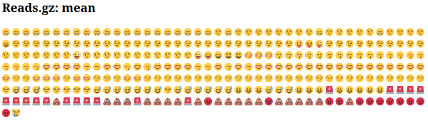

Durante il sequenziamento, le basi nucleotidiche di un campione di DNA o RNA (detto libreria) vengono determinate dal sequenziatore. Per ogni frammento della libreria viene generata una sequenza, chiamata anche **lettura (read)**, che è semplicemente una successione di nucleotidi.

Le moderne tecnologie di sequenziamento possono generare un numero enorme di letture in un singolo esperimento. Tuttavia, nessuna tecnologia di sequenziamento è perfetta e ogni strumento produce diversi tipi e quantità di errori, come l’identificazione errata di nucleotidi.
Queste basi chiamate in modo errato derivano dalle limitazioni tecniche proprie di ciascuna piattaforma di sequenziamento.
È quindi necessario comprendere, identificare ed escludere i tipi di errore che possono influire sull’interpretazione delle analisi successive.
Il controllo di qualità delle sequenze rappresenta pertanto un primo passo essenziale dell’analisi: individuare tempestivamente gli errori consente di risparmiare tempo nelle fasi successive.

> <agenda-title></agenda-title>
> 
> In questo tutorial ci occuperemo di:
> 
> 1. TOC
> {:toc}
{: .agenda}

# Ispezione di un file di sequenza grezzo

> <hands-on-title>Caricamento dei dati</hands-on-title>
> 
> 1. Crea una nuova storia per questa esercitazione e assegnale un nome appropriato.
> 
>    
> 
>    
> 
> 2. Importa il file `female_oral2.fastq-4143.gz` da [Zenodo](https://zenodo.org/record/3977236) oppure dalla libreria di dati (chiedi al tuo istruttore). Si tratta di un campione di microbioma prelevato dalla bocca di un serpente .
> 
>    ```
>    https://zenodo.org/record/3977236/files/female_oral2.fastq-4143.gz
>    ```
> 
>    
> 
>    
> 
> 3. Rinomina il dataset importato in `Reads`.
{: .hands_on}

Abbiamo appena importato un file in Galaxy. Questo file è simile ai dati che potremmo ottenere direttamente da un impianto di sequenziamento: un [file FASTQ](https://en.wikipedia.org/wiki/FASTQ_format).

> <hands-on-title>Ispezione del file FASTQ</hands-on-title>
> 
> 1. Ispeziona il file facendo clic sull’icona  (occhio)
{: .hands_on}

Anche se a prima vista può sembrare complesso (e in parte lo è), il formato FASTQ è facile da comprendere con una breve spiegazione.

Ogni lettura, che rappresenta un frammento della libreria, è codificata in 4 righe:

Line | Description
--- | ---
1 | Inizia sempre con `@` seguito dalle informazioni relative alla lettura 
2 | Contiene la sequenza nucleotidica effettiva
3 | Inizia sempre con `+` e talvolta ripete le informazioni della riga 1
4 | Contiene una stringa di caratteri che rappresentano i punteggi di qualità associati a ciascuna base della sequenza; deve avere lo stesso numero di caratteri della riga 2

Quindi, ad esempio, la prima sequenza nel nostro file è:

```
@M00970:337:000000000-BR5KF:1:1102:17745:1557 1:N:0:CGCAGAAC+ACAGAGTT
GTGCCAGCCGCCGCGGTAGTCCGACGTGGCTGTCTCTTATACACATCTCCGAGCCCACGAGACCGAAGAACATCTCGTATGCCGTCTTCTGCTTGAAAAAAAAAAAAAAAAAAAACAAAAAAAAAAAAAGAAGCAAATGACGATTCAAGAAAGAAAAAAACACAGAATACTAACAATAAGTCATAAACATCATCAACATAAAAAAGGAAATACACTTACAACACATATCAATATCTAAAATAAATGATCAGCACACAACATGACGATTACCACACATGTGTACTACAAGTCAACTA
+
GGGGGGGGGGGGGGGGGGGGGGGGGGGGGGGGGGGGGGGGGGGGGGGGGGGGGGGGGGGGGFGGGFGGGGGGAFFGGFGGGGGGGGFGGGGGGGGGGGGGGFGGG+38+35*311*6,,31=******441+++0+0++0+*1*2++2++0*+*2*02*/***1*+++0+0++38++00++++++++++0+0+2++*+*+*+*+*****+0**+0**+***+)*.***1**//*)***)/)*)))*)))*),)0(((-((((-.(4(,,))).,(())))))).)))))))-))-(
```

significa che il frammento denominato `@M00970` corrisponde alla sequenza di DNA `GTGCCAGCCGCCGCGGTAGTCCGACGTGGCTGTCTCTTATACACATCTCCGAGCCCACGAGACCGAAGAACATCTCGTATGCCGTCTTCTGCTTGAAAAAAAAAAAAAAAAAAAACAAAAAAAAAAAAAGAAGCAAATGACGATTCAAGAAAGAAAAAAACACAGAATACTAACAATAAGTCATAAACATCATCAACATAAAAAAGGAAATACACTTACAACACATATCAATATCTAAAATAAATGATCAGCACACAACATGACGATTACCACACATGTGTACTACAAGTCAACTA` e questa sequenza è stata sequenziata con una qualità `GGGGGGGGGGGGGGGGGGGGGGGGGGGGGGGGGGGGGGGGGGGGGGGGGGGGGGGGGGGGGFGGGFGGGGGGAFFGGFGGGGGGGGFGGGGGGGGGGGGGGFGGG+38+35*311*6,,31=******441+++0+0++0+*1*2++2++0*+*2*02*/***1*+++0+0++38++00++++++++++0+0+2++*+*+*+*+*****+0**+0**+***+)*.***1**//*)***)/)*)))*)))*),)0(((-((((-.(4(,,))).,(())))))).)))))))-))-(`.



> <question-title></question-title>
> 
> 1. Quale carattere ASCII corrisponde al peggior punteggio Phred per Illumina 1.8+?
> 2. Qual è il punteggio di qualità Phred del 3° nucleotide della prima sequenza?
> 3. Come si calcola la precisione della base nucleotidica con il codice ASCII `/`?
> 4. Qual è la precisione di questo terzo nucleotide?
> 
> > <solution-title></solution-title>
> > 1. Il punteggio Phred peggiore è il più basso, quindi 0. Per Illumina 1.8+, corrisponde al carattere `!`.
> > 2. Il terzo nucleotide della prima sequenza ha un carattere ASCII G, che corrisponde a un punteggio di 38.
> > 3. Il calcolo può essere eseguito come segue:
> >    - Il codice ASCII per `/` è 47
> >    - Punteggio di qualità = 47-33=14
> >    - Formula per trovare la probabilità di errore: \\(P = 10^{-Q/10}})
> >    - Probabilità di errore = \\\(10^{-14/10}\) = 0,03981
> >    - Quindi Accuratezza = 100 - 0,03981 = 99,96%
> > 4. Il nucleotide corrispondente `G` ha un'accuratezza di quasi il 96%
> >
> {: .solution }
{: .question}

> <comment-title></comment-title> L’attuale versione di Illumina (1.8+) utilizza il formato Sanger (Phred+33).Se si lavora con set di dati più vecchi, si possono incontrare altri schemi di punteggio. **FastQC** , uno strumento che useremo più avanti in questo tutorial, può essere utilizzato per determinare quale tipo di codifica della qualità viene usata, analizzando l’intervallo dei valori Phred presenti nel file FASTQ.
{: .comment}

Guardando il file in Galaxy, sembra che la maggior parte dei nucleotidi abbia un punteggio elevato (G corrisponde a un punteggio 38). È vero per tutte le sequenze? E per l’intera lunghezza della sequenza?

# Valutazione della qualità con FASTQE 🧬😎 - solo letture brevi

Per esaminare la qualità delle sequenze lungo tutte le letture, possiamo usare FASTQE [FASTQE](https://fastqe.com/). Sii tratta di uno strumento open-source che offre un modo semplice e divertente per valutare la qualità dei dati di sequenziamento grezzi, rappresentandoli anche come emoji.
Può essere utile per ottenere rapidamente un’idea generale della qualità dei dati prima di procedere con analisi più approfondite.

> <hands-on-title>Controllo della qualità</hands-on-title>
> 
> 1. Esegui il  con i seguenti parametri
>    -  *"FastQ data"*: `Reads`
>    -  *"Score types to show"*: `Mean`
> 
> 2. Ispeziona il file HTML generato.
{: .hands_on}

Invece di analizzare i punteggi di qualità per ogni singola lettura, FASTQE valuta la qualità complessiva di tutte le letture di un campione e calcola la media per ogni posizione nucleotidica lungo la lunghezza delle letture. Di seguito sono riportati i valori medi per questo set di dati:



È possibile consultare il punteggio associato a ciascuna [emoji nella documentazione di fastqe](https://github.com/fastqe/fastqe#scale). Le emoji sottostanti, con punteggi Phred inferiori a 20, sono quelle che speriamo di non vedere troppo spesso.

Phred Quality Score | ASCII code | Emoji
--- | --- | ---
0   | !   | 🚫
1   | "   | ❌
2   | #   | 👺
3   | $   | 💔
4   | %   | 🙅
5   | &   | 👾
6   | '   | 👿
7   | (   | 💀
8   | )   | 👻
9   | *   | 🙈
10  | +   | 🙉
11  | ,   | 🙊
12  | -   | 🐵
13  | .   | 😿
14  | /   | 😾
15  | 0   | 🙀
16  | 1   | 💣
17  | 2   | 🔥
18  | 3   | 😡
19  | 4   | 💩


> <question-title></question-title>
> 
> Qual è il punteggio medio più basso in questo set di dati?
> 
> > <solution-title></solution-title> Il punteggio più basso di questo set di dati è 😿 13.
> {: .solution }
{: .question}


# Valutazione della qualità con FastQC – letture corte e lunghe

Un metodo aggiuntivo o alternativo per verificare la qualità delle sequenze è [FastQC](https://www.bioinformatics.babraham.ac.uk/projects/fastqc/). Questo strumento fornisce un insieme modulare di analisi che possono essere utilizzate per individuare eventuali problemi nei dati, di cui è bene essere consapevoli prima di procedere con ulteriori analisi. Possiamo usarlo, ad esempio, per verificare la presenza di adattatori noti nei dati. Lo eseguiremo sul file FASTQ.

> <hands-on-title>Controllo della qualità</hands-on-title>
> 
> 1. Eseguite il  con i seguenti parametri
>    -  *"Raw read data from your current history"*: `Reads`
> 
> 2. Ispezionare il file HTML generato.
> 
{: .hands_on}

> <question-title></question-title>
> 
> Quale codifica Phred è utilizzata nel file FASTQ per queste sequenze?
> 
> > <solution-title></solution-title>
> > I punteggi Phred sono codificati secondo lo schema `Sanger / Illumina 1.9` (`Encoding` tabella superiore del report).
> {: .solution }
{: .question}

## Qualità della sequenza per base

Con FastQC possiamo usare il grafico “Qualità della sequenza per base” per esaminare la qualità delle basi delle letture, in modo analogo a quanto fatto con FASTQE.


Sull’asse delle ascisse (x) sono indicate le posizioni delle basi all’interno della lettura. In questo esempio, il campione contiene letture lunghe fino a 296 bp.

> <details-title>Asse x non uniforme</details-title>
> 
> L’asse x non è sempre uniforme. Quando si hanno letture lunghe, viene applicato un certo binning per mantenere il grafico compatto. Lo possiamo osservare anche nel nostro campione: inizia con basi singole da 1 a 10, poi le basi vengono raggruppate in finestre di ampiezza crescente. Il binning dei dati è una tecnica di pre-elaborazione che serve a ridurre gli effetti di piccoli errori di osservazione. Il numero di posizioni raggruppate dipende dalla lunghezza della lettura: Il numero di posizioni di base raggruppate dipende dalla lunghezza della lettura. Nel caso di letture >50bp, l'ultima parte del grafico riporterà le statistiche aggregate per finestre di 5bp. Le letture più corte avranno finestre più piccole e quelle più lunghe più grandi. Il binning può essere rimosso durante l'esecuzione di FastQC impostando il parametro "Disable grouping of bases for reads >50bp" su Yes.
{: .details}

Per ogni posizione viene disegnato un boxplot che mostra:

- la mediana (linea rossa centrale)
- l’intervallo interquartile (25–75%), rappresentato dal riquadro giallo
- i valori del 10° e 90° percentile, nei baffi superiore e inferiore
- la qualità media, rappresentata dalla linea blu
  
L’asse delle ordinate (y) mostra i punteggi di qualità Phred: più alto è il punteggio, più affidabile è la chiamata della base. Lo sfondo del grafico suddivide l’asse y in tre zone: qualità molto buoni (verde), punteggi di qualità accettabile (arancione) e letture di qualità scadente (rosso).

È normale, con tutti i sequenziatori Illumina, che il punteggio mediano inizi più basso nelle prime 5–7 basi e poi aumenti.
La qualità tende invece a diminuire verso la fine della lettura, spesso a causa del decadimento del segnale o dello sfasamento durante la corsa di sequenziamento. I recenti sviluppi della chimica di sequenziamento hanno migliorato parzialmente questo fenomeno, ma oggi le letture sono anche molto più lunghe.


> <details-title>Decadimento e sfasamento del segnale</details-title>
> 
> - Decadimento del segnale
> 
> L’intensità del segnale fluorescente diminuisce a ogni ciclo di sequenziamento.
A causa della degradazione dei fluorofori, una parte dei filamenti nel cluster non viene più allungata.
La frazione di segnale emesso continua quindi a ridursi ciclo dopo ciclo, determinando un calo dei punteggi di qualità all’estremità 3’ della lettura.
> 
> - Sfasamento
> 
> Il segnale inizia a confondersi man mano che aumentano i cicli, poiché il cluster perde sincronia.
Alcuni filamenti subiscono errori casuali di incorporazione dei nucleotidi dovuti a:
> 
> - rimozione incompleta dei terminatori e dei fluorofori in 3'
> - Incorporazione di nucleotidi privi di terminatori efficaci in 3’'
>
> Entrambi i fenomeni portano a una riduzione della qualità all’estremità 3’ della lettura.
{: .details}


> <details-title>Altri profili di qualità di sequenza</details-title>
> 
> Questi sono alcuni profili di qualità per base che possono indicare problemi di sequenziamento.
> 
> - Sovra-raggruppamento
> 
>   LIn alcuni casi, le strutture di sequenziamento possono sovraccaricare la cella di flusso, causando distanze ridotte tra i cluster e sovrapposizione dei segnali. Due cluster possono quindi essere interpretati come uno solo, con segnali fluorescenti misti che riducono la purezza del segnale.
Questo genera punteggi di qualità inferiori per l’intera lettura.
> 
> - Guasti strumentali
> 
>   Possono verificarsi problemi tecnici durante una corsa di sequenziamento.
Un calo improvviso della qualità o una percentuale elevata di letture a bassa qualità lungo tutta la sequenza possono indicare un problema di strumentazione. Alcuni esempi:
> 
>    - Rottura del collettore (Manifold burst)
> 
>      
> 
>    - Perdita di cicli (Cycle loss)
> 
>      
> 
>    - Errore della lettura 2 (Read 2 failure)
> 
>      
> 
>   CIn questi casi è consigliabile contattare il centro di sequenziamento per discuterne. Spesso è necessario un nuovo sequenziamento, che in genere viene offerto dalla struttura stessa.
{: .details}

> <question-title></question-title>
> 
> 1. Come cambia il punteggio medio di qualità lungo la sequenza?
> 2. Questa tendenza si osserva in tutte le sequenze?
> 
> > <solution-title></solution-title>
> > 1. Il punteggio medio di qualità (linea blu) diminuisce circa a metà di queste sequenze.
È normale che la qualità media cali verso la fine delle letture, poiché i sequenziatori incorporano più nucleotidi errati negli ultimi cicli.
Tuttavia, in questo campione si osserva un calo di qualità molto marcato dalla metà in poi.
> > 2. I boxplot si allargano a partire dalla posizione ~100, indicando che molte sequenze mostrano un calo di punteggio a partire da metà lettura. Dopo 100 nucleotidi, oltre il 10% delle sequenze presenta un punteggio inferiore a 20.
> >
> {: .solution }
{: .question}

Quando la qualità mediana scende sotto un punteggio Phred di circa 20, è opportuno considerare il taglio delle basi di bassa qualità dalla sequenza. Questo processo verrà illustrato nella sezione Trim e filtro.

### Contenuto adattatore


l grafico mostra la percentuale cumulativa di letture che contengono diverse sequenze adattatrici in ciascuna posizione.
Una volta che una sequenza di adattatore viene rilevata in una lettura, viene conteggiata come presente fino alla fine, quindi la percentuale aumenta con la lunghezza della lettura. FastQC rileva automaticamente diversi adattatori comuni (ad esempio Illumina, Nextera), ma è anche possibile fornire un file di contaminanti personalizzato come input allo strumento.

Idealmente, i dati di sequenziamento Illumina non dovrebbero contenere adattatori. Tuttavia, nelle letture lunghe, alcuni inserti della libreria possono essere più corti della lunghezza della lettura, facendo sì che l’adattatore venga letto all’estremità 3’.
Nel nostro campione di microbioma, FastQC rileva la presenza dell’adattatore Nextera.

> <details-title>Altri profili di contenuto adattatore</details-title>
> 
>Il contenuto di adattatori può comparire anche nelle librerie RNA-Seq, dove la distribuzione delle dimensioni degli inserti è varia e include spesso inserti corti.
> 
> 
>
{: .details}

Per rimuovere l’adattatore, è possibile utilizzare uno strumento di trimming come Cutadapt. Il processo viene illustrato nella sezione Filtro e trim


> <tip-title>Scorciatoia</tip-title>
> 
> Le sezioni seguenti descrivono nel dettaglio alcuni degli altri grafici generati da FastQC. Alcuni moduli possono dare avvertimenti che sono normali per il tipo di dati con cui si sta lavorando, come discusso sotto e [nelle FAQ di FASTQC](https://rtsf.natsci.msu.edu/genomics/tech-notes/fastqc-tutorial-and-faq/). Gli altri grafici forniscono informazioni utili per comprendere più a fondo la qualità dei dati e per valutare possibili miglioramenti di laboratorio in futuro. Queste sezioni sono **opzionali** e vuoi saltarle, puoi 
>   - Passate direttamente alla [sezione successiva] (#trim-and-filter---short-reads) per imparare a ritagliare dati paired-end.
{: .tip}

### Qualità della sequenza per piastrella (tile)

Questo grafico consente di esaminare i punteggi di qualità di ciascuna piastrella della flow cell su tutte le basi per vedere se c’è stata una perdita di qualità associata a una singola area della flow cell. Mostra la deviazione dalla qualità media per ogni piastrella; i colori più caldi indicano qualità peggiore rispetto alle altre piastrelle nella stessa posizione. In questo campione, alcune piastrelle mostrano qualità costantemente bassa, soprattutto da ~100 bp in poi. Un buon grafico dovrebbe essere tutto blu.


Questo grafico appare solo per librerie Illumina che preservano gli identificatori originali nelle intestazioni delle letture (che codificano la piastrella di provenienza).

> <details-title>Altri profili di qualità delle piastrelle</details-title>
> 
> Questo grafico appare solo per librerie Illumina che preservano gli identificatori originali nelle intestazioni delle letture (che codificano la piastrella di provenienza).

<details-title>Altri profili di qualità per piastrella</details-title>

A volte le sostanze chimiche usate durante il sequenziamento si esauriscono col tempo e le ultime piastrelle ricevono reagenti meno performanti, rendendo la reazione più soggetta a errori. Il grafico può presentare linee orizzontali come in questo esempio:
> 
> 
> 
{: .details}

## Punteggi di qualità per sequenza

Traccia il punteggio medio di qualità sull'intera lunghezza di tutte le letture sull'asse delle ascisse e fornisce il numero totale di letture con questo punteggio sull'asse delle ordinate:


La distribuzione della qualità media delle letture dovrebbe avere un picco stretto nell'intervallo superiore del grafico. Può anche segnalare se un sottoinsieme di sequenze ha valori di qualità universalmente bassi: ciò può accadere perché alcune sequenze sono scarsamente rappresentate (ai margini del campo visivo ecc.), tuttavia queste dovrebbero rappresentare solo una piccola percentuale delle sequenze totali.

## Contenuto della sequenza per base


"Per Base Sequence Content" traccia la percentuale di ciascuno dei quattro nucleotidi (T, C, A, G) in ciascuna posizione in tutte le letture del file di sequenza di input. Come per la qualità della sequenza per base, l'asse x è non uniforme.

In una libreria casuale ci si aspetterebbe una differenza minima o nulla tra le quattro basi. La proporzione di ciascuna delle quattro basi dovrebbe rimanere relativamente costante per tutta la lunghezza della lettura con `%A=%T` e `%G=%C`, e le linee in questo grafico dovrebbero essere parallele tra loro. Si tratta di dati di ampliconi, in cui il DNA 16S viene amplificato con la PCR e sequenziato, quindi ci aspettiamo che questo grafico abbia qualche distorsione e non mostri una distribuzione casuale.

> <details-title>Biasi per tipo di biblioteca</details-title>
> 
> Vale la pena notare che alcuni tipi di librerie produrranno sempre una composizione di sequenza distorta, normalmente all'inizio della lettura. Le librerie prodotte mediante priming con esameri casuali (comprese quasi tutte le librerie RNA-Seq) e quelle frammentate mediante trasposasi conterranno un bias intrinseco nelle posizioni di inizio delle letture (le prime 10-12 basi). Questo bias non coinvolge una sequenza specifica, ma fornisce invece un arricchimento di un certo numero di K-mers diversi all'estremità 5' delle letture. Pur trattandosi di un vero e proprio bias tecnico, non è qualcosa che può essere corretto con il trimming e nella maggior parte dei casi non sembra influire negativamente sull'analisi a valle. Tuttavia, produrrà un avviso o un errore in questo modulo.
> 
> 
> 
> Anche i dati ChIP-seq possono presentare distorsioni della sequenza di inizio lettura in questo grafico se frammentati con trasposasi. Con i dati convertiti in bisolfito, ad esempio i dati HiC, ci si aspetta una separazione di G da C e A da T:
> 
> 
> 
> Alla fine, si nota uno spostamento complessivo nella composizione della sequenza. Se lo spostamento è correlato a una perdita di qualità del sequenziamento, si può sospettare che le miscele siano fatte con un bias di sequenza più uniforme rispetto alle librerie convertite con bisolfito. Il ritaglio delle sequenze ha risolto il problema, ma se non fosse stato fatto avrebbe avuto un effetto drammatico sulle chiamate di metilazione effettuate.
{: .details}

> <question-title></question-title>
> 
> Perché c'è un'avvertenza per i grafici del contenuto di sequenza per base?
> 
> > <solution-title></solution-title>
> > All'inizio delle sequenze, il contenuto di sequenza per base non è molto buono e le percentuali non sono uguali, come ci si aspetta per i dati degli ampliconi 16S.
> >
> {: .solution }
{: .question}


## Contenuto di GC per sequenza


Questo grafico mostra il numero di letture rispetto alla percentuale di basi G e C per lettura. Viene confrontato con una distribuzione teorica che ipotizza un contenuto di GC uniforme per tutte le letture, previsto per il sequenziamento dell'intero genoma, dove il picco centrale corrisponde al contenuto complessivo di GC del genoma sottostante. Poiché il contenuto di GC del genoma non è noto, il contenuto modale di GC viene calcolato dai dati osservati e utilizzato per costruire una distribuzione di riferimento.

Una distribuzione dalla forma insolita potrebbe indicare una libreria contaminata o un altro tipo di sottoinsieme distorto. Una distribuzione normale spostata indica un bias sistematico, indipendente dalla posizione delle basi. Se c'è un bias sistematico che crea una distribuzione normale spostata, il modulo non lo segnalerà come errore, poiché non sa quale dovrebbe essere il contenuto di GC del genoma.

Ma ci sono anche altre situazioni in cui può verificarsi una distribuzione di forma insolita. Ad esempio, nel caso del sequenziamento dell'RNA può verificarsi una maggiore o minore distribuzione del contenuto medio di GC tra i trascritti, che fa sì che il grafico osservato sia più ampio o più stretto di una distribuzione normale ideale.

> <question-title></question-title>
> 
> Perché i grafici del contenuto di GC per sequenza sono falliti?
> 
> > <solution-title></solution-title> Ci sono più picchi. Questo può essere indicativo di una contaminazione inaspettata, come ad esempio adattatori, rRNA o sequenze sovrarappresentate. Oppure può essere normale se si tratta di dati di ampliconi o di trascritti RNA-seq molto abbondanti.
> {: .solution }
{: .question}

### Distribuzione della lunghezza delle sequenze

Questo grafico mostra la distribuzione delle dimensioni dei frammenti nel file analizzato. In molti casi si otterrà un semplice grafico che mostra un picco di una sola dimensione, ma per i file FASTQ di lunghezza variabile mostrerà le quantità relative di ogni frammento di sequenza di dimensioni diverse. Il nostro grafico mostra una lunghezza variabile mentre tagliamo i dati. Il picco più grande è a 296 bp, ma c'è un secondo grande picco a ~100 bp. Quindi, anche se le nostre sequenze hanno una lunghezza massima di 296 bp, molte sequenze di buona qualità sono più corte. Ciò corrisponde al calo della qualità delle sequenze a ~100 bp e alle strisce rosse che iniziano in questa posizione nel grafico della qualità delle sequenze per tile.


Alcuni sequenziatori ad alta produttività generano frammenti di sequenza di lunghezza uniforme, ma altri possono contenere letture di lunghezza molto variabile. Anche all'interno di librerie di lunghezza uniforme, alcune pipeline tagliano le sequenze per rimuovere le chiamate di base di scarsa qualità dalla fine o dalle prime $$n$ basi se corrispondono alle prime $$n$ basi dell'adattatore fino al 90% (per impostazione predefinita), con talvolta $$n = 1$$.

## Livelli di duplicazione delle sequenze

Il grafico mostra in blu la percentuale di letture di una determinata sequenza nel file che sono presenti un determinato numero di volte nel file:


In una libreria eterogenea, la maggior parte delle sequenze si presenta una sola volta nell'insieme finale. Un basso livello di duplicazione può indicare un livello molto alto di copertura della sequenza target, ma un alto livello di duplicazione è più probabile che indichi un qualche tipo di bias di arricchimento.

Si possono trovare due fonti di letture duplicate:
- duplicazione PCR in cui i frammenti della libreria sono stati sovrarappresentati a causa di un arricchimento PCR distorto

  È un problema perché i duplicati della PCR rappresentano male la vera proporzione di sequenze in ingresso.

- Sequenze veramente sovrarappresentate, come trascritti molto abbondanti in una libreria RNA-Seq o in dati di ampliconi (come questo campione)

  è un caso atteso e non preoccupante perché rappresenta fedelmente l'input.

> <details-title>Maggiori dettagli sulla duplicazione</details-title>
> 
> FastQC conta il grado di duplicazione per ogni sequenza in una libreria e crea un grafico che mostra il numero relativo di sequenze con diversi gradi di duplicazione. Il grafico presenta due linee:
> - Linea blu: distribuzione dei livelli di duplicazione per l'intero set di sequenze
> - Linea rossa: distribuzione delle sequenze de-duplicate con le proporzioni del set deduplicato che provengono da diversi livelli di duplicazione nei dati originali.
> 
> Per i dati shotgun dell'intero genoma si prevede che quasi il 100% delle letture sia unico (appare solo una volta nei dati di sequenza). La maggior parte delle sequenze dovrebbe cadere all'estrema sinistra del grafico, sia nella linea rossa che in quella blu. Ciò indica una libreria altamente diversificata che non è stata sovra-sequenziata. Se la profondità di sequenziamento è estremamente elevata (ad esempio > 100 volte la dimensione del genoma) possono comparire alcune inevitabili duplicazioni di sequenze: in teoria esiste solo un numero finito di letture di sequenza completamente uniche che possono essere ottenute da un dato campione di DNA in ingresso.
> 
> arricchimenti più specifici di sottoinsiemi o la presenza di contaminanti a bassa complessità tenderanno a produrre picchi verso la destra del grafico. Questi picchi di duplicazione elevati appaiono spesso nella traccia blu, poiché costituiscono un'alta percentuale della libreria originale, ma di solito scompaiono nella traccia rossa, poiché costituiscono una percentuale insignificante dell'insieme deduplicato. Se i picchi persistono nella traccia rossa, ciò suggerisce la presenza di un gran numero di sequenze diverse altamente duplicate, che potrebbero indicare un set contaminante o una duplicazione tecnica molto grave.
> 
> Di solito nel sequenziamento dell'RNA ci sono trascritti molto abbondanti e altri poco abbondanti. Si prevede che per i trascritti ad alta abbondanza si osservino letture duplicate:
> 
> 
{: .details}

## Sequenze sovrarappresentate

Una normale libreria high-throughput conterrà un insieme eterogeneo di sequenze, senza che nessuna singola sequenza costituisca una frazione minima dell'insieme. Se si scopre che una singola sequenza è molto sovrarappresentata nell'insieme, significa che è altamente significativa dal punto di vista biologico oppure che la libreria è contaminata o non è così diversificata come ci si aspetta.

FastQC elenca tutte le sequenze che costituiscono più dello 0,1% del totale. Per ogni sequenza sovrarappresentata, FastQC cercherà corrispondenze in un database di contaminanti comuni e riporterà il miglior risultato trovato. Gli hit devono avere una lunghezza minima di 20 bp e non avere più di 1 mismatch. Trovare un riscontro non significa necessariamente che sia la fonte della contaminazione, ma può indicare la direzione giusta. Vale anche la pena di sottolineare che molte sequenze di adattatori sono molto simili tra loro, quindi è possibile che venga segnalato un risultato non tecnicamente corretto, ma con una sequenza molto simile alla corrispondenza effettiva.

I dati di sequenziamento dell'RNA possono avere alcuni trascritti così abbondanti da essere registrati come sequenze sovrarappresentate. Con i dati di sequenziamento del DNA, nessuna singola sequenza dovrebbe essere presente con una frequenza sufficientemente alta da essere elencata, ma a volte possiamo vedere una piccola percentuale di letture di adattamento.

> <question-title></question-title>
> 
> Come possiamo scoprire quali sono le sequenze sovrarappresentate?
> 
> > <solution-title></solution-title>
> > Possiamo eseguire BLAST sulle sequenze sovrarappresentate per vedere quali sono. In questo caso, se prendiamo la sequenza top overrepresented
> > ```
> > >overrep_seq1
> > GTGTCAGCCGCCGCGGTAGTCCGACGTGGCTGTCTCTTATACACATCTCC
> > ```
> > e usiamo [blastn](https://blast.ncbi.nlm.nih.gov/Blast.cgi) contro il database predefinito dei nucleotidi (nr/nt) non otteniamo alcun risultato. Ma se usiamo [VecScreen](https://www.ncbi.nlm.nih.gov/tools/vecscreen/) vediamo che si tratta dell'adattatore Nextera. 
> {: .solution }
{: .question}


> <details-title>Più dettagli su altri tracciati FastQC</details-title>
> 
> 
> #### Contenuto per base N
> 
> 
> 
> Se un sequenziatore non è in grado di effettuare una chiamata di base con sufficiente sicurezza, scriverà un "N" invece di una chiamata di base convenzionale. Questo grafico mostra la percentuale di chiamate di base in ogni posizione o bin per cui è stato chiamato un N.
> 
> Non è insolito vedere una percentuale molto alta di N che compaiono in una sequenza, soprattutto verso la fine della sequenza. Ma questa curva non dovrebbe mai salire sensibilmente sopra lo zero. Se ciò accade, significa che si è verificato un problema durante il sequenziamento. Nell'esempio seguente, un errore ha fatto sì che lo strumento non sia stato in grado di chiamare una base per circa il 20% delle letture in posizione 29:
> 
> 
> 
> 
> #### Contenuto Kmer
> 
> Questo grafico non viene emesso per impostazione predefinita. Come indicato nel modulo dello strumento, se si desidera questo modulo è necessario abilitarlo utilizzando un sottomodulo personalizzato e un file di limiti. Con questo modulo, FastQC esegue un'analisi generica di tutte le sequenze nucleotidiche brevi di lunghezza k (kmer, con k = 7 per impostazione predefinita) a partire da ogni posizione lungo la lettura nella libreria per trovare quelle che non hanno una copertura uniforme per tutta la lunghezza delle letture. Ogni kmer deve essere rappresentato in modo uniforme lungo tutta la lunghezza della lettura.
> 
> FastQC riporterà l'elenco dei kmer che compaiono in posizioni specifiche con una frequenza maggiore del previsto. Ciò può essere dovuto a diverse fonti di bias nella libreria, tra cui la presenza di sequenze adattatore di lettura che si accumulano alla fine delle sequenze. La presenza di sequenze sovrarappresentate nella libreria (come i dimeri dell'adattatore) fa sì che il grafico dei kmer sia dominato dai kmer di queste sequenze. Eventuali kmer parziali dovuti ad altri bias interessanti possono essere quindi diluiti e non facilmente visibili.
> 
> L'esempio seguente proviene da una libreria DNA-Seq di alta qualità. I kmer distorti all'inizio della lettura sono probabilmente dovuti a un'efficienza di taglio del DNA leggermente dipendente dalla sequenza o al risultato di un priming casuale:
> 
> 
> 
> Questo modulo può essere molto difficile da interpretare. Il grafico del contenuto di adattatori e la tabella delle sequenze sovrarappresentate sono più facili da interpretare e possono fornire informazioni sufficienti senza bisogno di questo grafico. Le librerie RNA-seq possono avere kmer altamente rappresentati che derivano da sequenze altamente espresse. Per saperne di più su questo grafico, consultare la [FastQC Kmer Content documentation](http://www.bioinformatics.babraham.ac.uk/projects/fastqc/Help/3%20Analysis%20Modules/11%20Kmer%20Content.html).
>
{: .details}

Abbiamo cercato di spiegare qui i diversi rapporti di FastQC e alcuni casi d'uso. Ulteriori informazioni su questo argomento e su alcuni problemi comuni di sequenziamento di nuova generazione sono disponibili su [QCFAIL.com](https://sequencing.qcfail.com/)

> <details-title>Problema specifico per tipi di librerie alternativi</details-title>
> 
> #### Piccoli/micro RNA
> 
> Nelle librerie di RNA di piccole dimensioni, in genere abbiamo un insieme relativamente piccolo di sequenze uniche e brevi. Le librerie di piccoli RNA non vengono tosate in modo casuale prima di aggiungere gli adattatori di sequenziamento alle loro estremità: tutte le letture per classi specifiche di microRNA saranno identiche. Il risultato sarà:
> 
> - contenuto di sequenza per base estremamente distorto
> - distribuzione estremamente stretta del contenuto di GC
> - Livelli molto elevati di duplicazione della sequenza
> - abbondanza di sequenze sovrarappresentate
> - lettura negli adattatori
> 
> #### Amplicon
> 
> Le librerie di ampliconi sono preparate mediante amplificazione PCR di un bersaglio specifico. Ad esempio, la regione ipervariabile V4 del gene 16S rRNA batterico. Ci si aspetta che tutte le letture di questo tipo di libreria siano quasi identiche. Il risultato sarà:
> 
> - contenuto di sequenza per base estremamente distorto
> - distribuzione estremamente stretta del contenuto di GC
> - Livelli molto elevati di duplicazione della sequenza
> - abbondanza di sequenze sovrarappresentate
> 
> #### Sequenziamento con bisolfito o metilazione
> 
> Con il sequenziamento con bisolfito o metilazione, la maggior parte delle basi di citosina (C) viene convertita in timina (T). Il risultato sarà:
> 
> - contenuto di sequenza per base distorto
> - Contenuto di GC per sequenza distorto
> 
> #### Contaminazione del dimero adattatore
> 
> Qualsiasi tipo di libreria può contenere una piccolissima percentuale di frammenti dimer adattatore (cioè senza inserto). È più probabile che si trovino nelle librerie di ampliconi costruite interamente con la PCR (per la formazione di primer-dimeri PCR) che nelle librerie DNA-Seq o RNA-Seq costruite con la legatura dell'adattatore. Se una frazione sufficiente della libreria è costituita da dimeri di adattatori, ciò si noterà nel rapporto FastQC:
> 
> - calo della qualità della sequenza per base dopo la base 60
> - possibile distribuzione bimodale dei punteggi di qualità per sequenza
> - Modello distinto osservato nel contenuto di sequenza per basi fino alla base 60
> - picco nel contenuto di GC per sequenza
> - adattatore di corrispondenza delle sequenze sovrarappresentato
> - contenuto di adattatori > 0% a partire dalla base 1
>
{: .details}

> <comment-title>Sequenze di cattiva qualità</comment-title> Se la qualità delle letture non è buona, dovremmo sempre verificare prima cosa c'è che non va e pensarci: potrebbe derivare dal tipo di sequenziamento o da ciò che abbiamo sequenziato (un'alta quantità di sequenze sovrarappresentate nei dati di trascrittomica, una percentuale distorta di basi nei dati HiC).
> 
> Potete anche chiedere informazioni al centro di sequenziamento, soprattutto se la qualità è davvero scadente: i trattamenti di qualità non possono risolvere tutto. Se vengono tagliate troppe basi di cattiva qualità, le letture corrispondenti vengono filtrate e si perdono.
{: .comment}

# Trim e filtro - letture corte

La qualità diminuisce al centro di queste sequenze. Ciò potrebbe causare distorsioni nelle analisi a valle con questi nucleotidi potenzialmente chiamati in modo errato. Le sequenze devono essere trattate per ridurre le distorsioni nelle analisi a valle. Il ritaglio può contribuire ad aumentare il numero di letture che l'allineatore o l'assemblatore sono in grado di utilizzare con successo, riducendo il numero di letture non mappate o non assemblate. In generale, i trattamenti di qualità includono:

1. Sequenze di ritaglio/taglio/mascheramento
    - da regioni a basso punteggio di qualità
    - inizio/fine sequenza
    - rimozione degli adattatori
2. Filtraggio delle sequenze
    - con punteggio di qualità medio basso
    - troppo corto
    - con troppe basi ambigue (N)

Per svolgere questo compito utilizzeremo [Cutadapt](https://cutadapt.readthedocs.io/en/stable/guide.html) , uno strumento che migliora la qualità della sequenza automatizzando il trimming degli adattatori e il controllo di qualità. Si tratta di:

- Rifilatura delle basi di bassa qualità dalle estremità. Il trimming della qualità viene eseguito prima di qualsiasi trimming dell'adattatore. Impostiamo la soglia di qualità a 20, una soglia comunemente usata, per saperne di più [nelle Phred Score FAQ di GATK] (https://gatk.broadinstitute.org/hc/en-us/articles/360035531872-Phred-scaled-quality-scores).
- Ritagliare l'adattatore con Cutadapt. Per questo è necessario fornire la sequenza dell'adattatore. In questo esempio, Nextera è l'adattatore rilevato. Possiamo trovare la sequenza dell'adattatore Nextera sul [sito web Illumina] (https://support.illumina.com/bulletins/2016/12/what-sequences-do-i-use-for-adapter-trimming.html) `CTGTCTCTTATACACATCT`. Taglieremo questa sequenza dall'estremità 3' delle letture.
- filtrare le sequenze con lunghezza < 20 dopo il trimming

> <hands-on-title>Miglioramento della qualità della sequenza</hands-on-title>
> 
> 1.  con i seguenti parametri
>    - *"Letture single-end o paired-end? "*: ..`Single-end`..
>       -  *"File FASTQ/A "*: `Reads` (set di dati di input)
> 
>         > <tip-title>File non selezionabile?</tip-title>
>         > Se il file FASTQ non può essere selezionato, si può controllare se il formato è FASTQ con valori di qualità scalati Sanger (`fastqsanger.gz`). È possibile modificare il tipo di dati facendo clic sul simbolo della matita.
>         {: .tip}
> 
>    - In *"Read 1 Adapters "*:
>       - *"1: Adattatori 3' (finali) "*:
>          - *"Fonte "*: `Enter custom sequence`
>          - *"Sequenza adattatore 3' personalizzata "*: `CTGTCTCTTATACACATCT`
>    - In *"Altre opzioni di ritaglio delle letture "*
>       - *"Cutoff di qualità (R1) "*: `20`
>    - In *"Opzioni di filtraggio della lettura "*
>       - *"Lunghezza minima (R1) "*: `20`
>    -  *"Output aggiuntivi da generare "*: `Report`
> 
> 2. Ispezionare il file txt generato (`Report`)
> 
>    > <question-title></question-title>
>    > 
>    > 1. Quale percentuale di letture contiene un adattatore?
>    > 2. Quale percentuale di letture è stata tagliata a causa della cattiva qualità?
>    > 3. Quale percentuale di letture è stata rimossa perché troppo corta?
>    > 
>    > > <solution-title></solution-title>
>    > > 1. il 56,8% delle letture contiene l'adattatore (`Reads with adapters:`)
>    > > 2. il 35,1% delle letture è stato tagliato a causa della cattiva qualità (`Quality-trimmed:`)
>    > > 3. lo 0 % delle letture è stato rimosso perché troppo corto
>    > {: .solution }
>    {: .question}
{: .hands_on}

> <details-title>Trimming con Cutadapt</details-title>
> 
> Uno dei maggiori vantaggi di Cutadapt rispetto ad altri strumenti di trimming (ad esempio TrimGalore!) è che dispone di una buona [documentazione](https://cutadapt.readthedocs.io) che spiega in dettaglio il funzionamento dello strumento.
> 
> L'algoritmo di taglio della qualità Cutadapt consiste in tre semplici passaggi:
> 
> 1. Sottrarre il valore di soglia scelto dal valore di qualità di ogni posizione
> 2. Calcolo di una somma parziale di queste differenze dalla fine della sequenza a ogni posizione (finché la somma parziale è negativa)
> 3. Taglio al valore minimo della somma parziale
> 
> Nell'esempio seguente, supponiamo che l'estremità 3' debba essere sottoposta a quality-trimming con una soglia di 10 e abbiamo i seguenti valori di qualità
> 
> ```
> 42 40 26 27 8 7 11 4 2 3
> ```
> 
> 1. sottrarre la soglia
> 
>     ```
>     32 30 16 17 -2 -3 1 -6 -8 -7
>     ```
> 
> 2. sommare i numeri, partendo dall'estremità 3' (somme parziali) e fermarsi prima se la somma è maggiore di zero
> 
>     ```
>     (70) (38) 8 -8 -25 -23 -20, -21 -15 -7
>     ```
> 
>    I numeri tra parentesi non sono calcolati (perché 8 è maggiore di zero), ma vengono mostrati per completezza.
> 
> 3. Scegliere la posizione del minimo (`-25`) come posizione di taglio
> 
> Pertanto, la lettura viene tagliata alle prime quattro basi, che presentano valori di qualità
> 
> ```
> 42 40 26 27
> ```
> 
> Si noti quindi che le posizioni con un valore di qualità maggiore della soglia scelta vengono rimosse anche se sono incorporate in regioni di qualità inferiore (la somma parziale è decrescente se i valori di qualità sono minori della soglia). Il vantaggio di questa procedura è che è robusta contro un piccolo numero di posizioni con una qualità superiore alla soglia.
> 
> 
> Le alternative a questa procedura sono:
> 
> * Taglio dopo la prima posizione con qualità inferiore alla soglia
> * Approccio a finestra scorrevole
> 
>   L'approccio a finestra scorrevole controlla che la qualità media di ogni finestra di sequenza di lunghezza specificata sia maggiore della soglia. Si noti che, a differenza dell'approccio di cutadapt, questo approccio ha un parametro in più e la robustezza dipende dalla lunghezza della finestra (in combinazione con la soglia di qualità). Entrambi gli approcci sono implementati in Trimmomatic.
{: .details}


Possiamo esaminare i nostri dati tagliati con FASTQE e/o FastQC.

> <hands-on-title>Controllo della qualità dopo il trimming</hands-on-title>
> 
> 1. : Eseguire nuovamente **FASTQE** con i seguenti parametri
>    -  *"Dati FastQ "*: `Cutadapt Read 1 Output`
>    -  *"Tipi di punteggio da mostrare "*: `Mean`
> 
> 2. Ispezionare il nuovo rapporto FASTQE
> 
>    > <question-title></question-title>
>    > 
>    > Confrontate l'output FASTQE con quello precedente prima del trimming. La qualità della sequenza è migliorata?
>    > 
>    > 
>    > 
>    > > <solution-title></solution-title>
>    > > Sì, le emoji del punteggio di qualità hanno un aspetto migliore (più felice) ora.
>    > > 
>    > > 
>    > > 
>    > > 
>    > > 
>    > {: .solution }
>    {: .question}
{: .hands_on}

Con FASTQE possiamo vedere che abbiamo migliorato la qualità delle basi nel dataset.

Possiamo anche, o invece, controllare i dati a qualità controllata con FastQC.


> <hands-on-title>Controllo della qualità dopo il trimming</hands-on-title>
> 
> 1.  con i seguenti parametri
>    -  *"Dati di lettura brevi dalla vostra storia attuale "*: `Cutadapt Read 1 Output`
> 
> 2. ispezionare il file HTML generato
>
{: .hands_on}

> <question-title></question-title>
> 1. La qualità della sequenza per base sembra migliore?
> 2. L'adattatore è sparito?
> 
> > <solution-title></solution-title>
> > 1. Sì. La stragrande maggioranza delle basi ha un punteggio di qualità superiore a 20. 
> > 
> > 2. Sì. Non è stato rilevato alcun adattatore. 
> > 
> {: .solution }
{: .question}

Con FastQC possiamo vedere che abbiamo migliorato la qualità delle basi nel dataset e rimosso l'adattatore.

> <details-title>Altri tracciati FastQC dopo il trimming</details-title>
> 
>  Abbiamo alcune strisce rosse perché abbiamo tagliato quelle regioni dalle letture.
> 
>  Ora abbiamo un picco di alta qualità invece di uno di alta e uno di bassa qualità che avevamo in precedenza.
> 
>  Non abbiamo una rappresentazione uguale delle basi come prima, poiché si tratta di dati ampliconici.
> 
>  Ora abbiamo un unico picco GC principale dovuto alla rimozione dell'adattatore.
> 
>  Questo è lo stesso di prima in quanto non abbiamo N in queste letture.
> 
>  Ora abbiamo più picchi e una gamma di lunghezze, invece del singolo picco che avevamo prima del trimming quando tutte le sequenze erano della stessa lunghezza.
> 
> 
> > <question-title></question-title>
> > 
> > A cosa corrisponde la sequenza top sovrarappresentata `GTGTCAGCCGCCGCGGTAGTCCGACGTGG`?
> > 
> > > <solution-title></solution-title> Se prendiamo la sequenza top overrepresented
> > > ```
> > > >overrep_seq1_after
> > > GTGTCAGCCGCCGCGGTAGTCCGACGTGG
> > > ```
> > > e usando [blastn](https://blast.ncbi.nlm.nih.gov/Blast.cgi) contro il database predefinito dei nucleotidi (nr/nt) vediamo che i risultati migliori riguardano i geni 16S rRNA. Ciò ha senso in quanto si tratta di dati di ampliconi 16S, in cui il gene 16S viene amplificato mediante PCR.
> > {: .solution }
> {: .question}
{: .details}


# Elaborazione di set di dati multipli

## Elaborazione dei dati paired-end

Con il sequenziamento paired-end, i frammenti vengono sequenziati da entrambi i lati. Questo approccio dà luogo a due letture per frammento, con la prima lettura in orientamento in avanti e la seconda in orientamento inverso-complementare. Con questa tecnica, abbiamo il vantaggio di ottenere più informazioni su ciascun frammento di DNA rispetto alle letture sequenziate solo con il sequenziamento single-end:

```
    ------>                       [single-end]

    ----------------------------- [fragment]

    ------>               <------ [paired-end]
```
La distanza tra le due letture è nota e quindi è un'informazione aggiuntiva che può migliorare la mappatura delle letture.

Il sequenziamento Paired-end genera 2 file FASTQ:
- Un file con le sequenze corrispondenti all'orientamento **avanti** di tutti i frammenti
- Un file con le sequenze corrispondenti all'orientamento **inverso** di tutti i frammenti

Di solito riconosciamo questi due file che appartengono a un campione dal nome che ha lo stesso identificatore per le letture ma un'estensione diversa, ad esempio `sampleA_R1.fastq` per le letture in avanti e `sampleA_R2.fastq` per le letture inverse. Può anche essere `_f` o `_1` per le letture in avanti e `_r` o `_2` per le letture inverse.

I dati analizzati nella fase precedente erano single-end, quindi importeremo un set di dati RNA-seq paired-end da utilizzare. Eseguiremo FastQC e aggregeremo i due rapporti con MultiQC .

> <hands-on-title>Valutazione della qualità delle letture paired-end</hands-on-title>
> 
> 1. Importare le letture paired-end `GSM461178_untreat_paired_subset_1.fastq` e `GSM461178_untreat_paired_subset_2.fastq` da [Zenodo](https://zenodo.org/record/61771) o dalla libreria di dati (chiedere al proprio istruttore)
> 
>    ```
>    https://zenodo.org/record/61771/files/GSM461178_untreat_paired_subset_1.fastq
>    https://zenodo.org/record/61771/files/GSM461178_untreat_paired_subset_2.fastq
>    ```
> 
> 2.  con entrambi i set di dati:
>    -  *"Dati di lettura grezzi dalla vostra storia attuale "*: entrambi i set di dati caricati.
> 
>    
> 
> 3.  con i seguenti parametri per aggregare i rapporti FastQC delle letture sia forward che reverse
>      - In *"Risultati "*
>        - *"Quale strumento è stato usato per generare i log? "*: `FastQC`
>        - In *"Output FastQC "*
>           - *"Tipo di output FastQC? "*: `Raw data`
>           -  *"Output FastQC "*: file `Raw data` (output di entrambi i **FastQC** )
> 
> 4. Esaminare la pagina web prodotta da MultiQC.
{: .hands_on}


> <question-title></question-title>
> 
> 1. Cosa ne pensate della qualità delle sequenze?
> 2. Cosa dobbiamo fare?
> 
> > <solution-title></solution-title>
> > 
> > 1. La qualità delle sequenze sembra peggiore per le letture inverse che per quelle in avanti:
> >     - Punteggi di qualità per sequenza: distribuzione più a sinistra, cioè qualità media delle sequenze più bassa
> >     - Qualità della sequenza per base: curva meno regolare e diminuzione più marcata alla fine con un valore medio inferiore al 28
> >     - Contenuto della sequenza per base: bias più forte all'inizio e nessuna distinzione chiara tra gruppi C-G e A-T
> > 
> >    Gli altri indicatori (adattatori, livelli di duplicazione, ecc.) sono simili.
> > 
> > 2. Dovremmo tagliare la fine delle sequenze e filtrarle con **Cutadapt** 
> {: .solution}
{: .question}

Con le letture paired-end i punteggi medi di qualità per le letture forward saranno quasi sempre più alti di quelli per le letture reverse.

Dopo il trimming, le letture inverse saranno più corte a causa della loro qualità e saranno quindi eliminate durante la fase di filtraggio. Se una delle letture inverse viene rimossa, deve essere rimossa anche la corrispondente lettura in avanti. Altrimenti si otterrà un numero diverso di letture in entrambi i file e in ordine diverso, e l'ordine è importante per le fasi successive. Pertanto **è importante trattare le letture forward e reverse insieme per il trimming e il filtraggio**.

> <hands-on-title>Migliorare la qualità dei dati paired-end</hands-on-title>
> 1.  con i seguenti parametri
>    - *"Letture single-end o paired-end? "*: ..`Paired-end`..
>       -  *"File FASTQ/A #1"*: `GSM461178_untreat_paired_subset_1.fastq` (set di dati in ingresso)
>       -  *"File FASTQ/A #2"*: `GSM461178_untreat_paired_subset_2.fastq` (set di dati in ingresso)
> 
>          L'ordine è importante!
> 
>       - In *adattatori di lettura 1* o *adattatori di lettura 2*
> 
>         Non sono stati trovati adattatori in questi set di dati. Quando si elaborano i propri dati e si sa quali sequenze di adattatori sono state utilizzate durante la preparazione della libreria, è necessario fornire le loro sequenze qui.
> 
>    - In *"Altre opzioni di ritaglio delle letture "*
>       - *"Cutoff di qualità (R1) "*: `20`
>    - In *"Opzioni di filtraggio della lettura "*
>       - *"Lunghezza minima (R1) "*: `20`
>    -  *"Output aggiuntivi da generare "*: `Report`
> 
> 2. Ispezionare il file txt generato (`Report`)
> 
>    > <question-title></question-title>
>    > 
>    > 1. Quante coppie di basi sono state rimosse dalle letture a causa della cattiva qualità?
>    > 2. Quante coppie di sequenze sono state rimosse perché troppo corte?
>    > 
>    > > <solution-title></solution-title>
>    > > 1. 44.164 bp (`Quality-trimmed:`) per le letture in avanti e 138.638 bp per le letture inverse.
>    > > 2. 1.376 sequenze sono state rimosse perché almeno una lettura era più corta del limite di lunghezza (322 quando sono state analizzate solo le letture in avanti).
>    > {: .solution }
>    {: .question}
> 
{: .hands_on}

Oltre al rapporto, Cutadapt genera 2 file:
- Lettura 1 con le letture in avanti tagliate e filtrate
- Lettura 2 con le letture inverse rifilate e filtrate

Questi set di dati possono essere utilizzati per l'analisi a valle, ad esempio la mappatura.

> <question-title></question-title>
> 
> 1. Che tipo di allineamento si usa per trovare gli adattatori nelle letture?
> 2. Qual è il criterio per scegliere il miglior allineamento di adattatori?
> 
> > <solution-title></solution-title>
> > 
> > 1. Allineamento semi-globale, cioè solo la parte sovrapposta della lettura e della sequenza adattatore viene utilizzata per il punteggio.
> > 2. Viene calcolato un allineamento con la massima sovrapposizione che presenta il minor numero di mismatch e indel.
> > 
> {: .solution}
{: .question}

# Valutazione della qualità con Nanoplot - Solo letture lunghe

In caso di letture lunghe, possiamo controllare la qualità della sequenza con [Nanoplot](https://github.com/wdecoster/NanoPlot/) (). Fornisce statistiche di base con grafici gradevoli per una rapida panoramica del controllo di qualità.

> <hands-on-title>Controllo della qualità di letture lunghe</hands-on-title>
> 1. Creare una nuova cronologia per questa parte e darle un nome appropriato
> 
> 2. Importazione delle letture PacBio HiFi `m64011_190830_220126.Q20.subsample.fastq.gz` da [Zenodo](https://zenodo.org/record/5730295)
> 
>    ```
>    https://zenodo.org/records/5730295/files/m64011_190830_220126.Q20.subsample.fastq.gz
>    ```
> 
> 3.  con i seguenti parametri
>    -  *"file "*: `m64011_190830_220126.Q20.subsample.fastq.gz`
>    - *"Opzioni per la personalizzazione delle trame create "*
>        -  *"Specifica il formato bivariato dei grafici. "*: `dot`, `kde`
>        -  *"Mostra il segno N50 nell'istogramma della lunghezza della lettura. "*: `Yes`
> 
> 4. Ispezione del file HTML generato
{: .hands_on}

> <question-title></question-title>
> 
> Qual è il Qscore medio?
> 
> > <solution-title></solution-title>
> > Il Qscore si aggira intorno a Q32. Nel caso di PacBio CLR e Nanopore, è intorno a Q12 e vicino a Q31 per Illumina (NovaSeq 6000). 
> > 
> > Definizione: Qscores è la probabilità media di errore per base, espressa sulla scala log (Phred)
> {: .solution }
> 
> Qual è la mediana, la media e l'N50?
> > <solution-title></solution-title>
> > La mediana, la lunghezza media delle letture e anche la N50 sono vicine a 18.000 bp. Per le letture PacBio HiFi, la maggior parte delle letture è generalmente vicina a questo valore poiché la preparazione della libreria include una fase di selezione delle dimensioni. Per altre tecnologie come PacBio CLR e Nanopore, il valore è maggiore e dipende principalmente dalla qualità dell'estrazione del DNA.
> {: .solution }
> 
{: .question}

## Istogramma delle lunghezze delle letture

Questo grafico mostra la distribuzione delle dimensioni dei frammenti nel file analizzato. A differenza della maggior parte delle corse Illumina, le letture lunghe hanno una lunghezza variabile e questo mostra le quantità relative di ogni frammento di sequenza di dimensioni diverse. In questo esempio, la distribuzione della lunghezza delle letture è centrata vicino a 18kbp, ma i risultati possono essere molto diversi a seconda dell'esperimento.


## Grafico della lunghezza delle letture rispetto alla qualità media delle letture utilizzando i punti

Questo grafico mostra la distribuzione delle dimensioni dei frammenti in base al Qscore del file analizzato. In generale, non esiste un legame tra la lunghezza delle letture e la loro qualità, ma questa rappresentazione consente di visualizzare entrambe le informazioni in un unico grafico e di individuare eventuali aberrazioni. Nelle corse con molte letture brevi, le letture più corte sono talvolta di qualità inferiore rispetto alle altre.


> <question-title></question-title>
> > Guardando "Read lengths vs Average read quality plot using dots plot". Ha notato qualcosa di insolito nel Qscore? Può spiegarlo?
> > <solution-title></solution-title>
> > Non ci sono letture sotto Q20. La qualifica per le letture HiFi è:
> > - un numero minimo di 3 subreads
> > - Un Qscore di lettura >=20
> > 
> {: .solution }
{: .question}

> <comment-title>Prova! </comment-title>
> Esegui il controllo di qualità con **FastQC**  su `m64011_190830_220126.Q20.subsample.fastq.gz` e confronta i risultati!
{: .comment}

# Valutazione della qualità con PycoQC - solo Nanopore

[PycoQC](https://github.com/tleonardi/pycoQC) () è uno strumento di visualizzazione dei dati e di controllo della qualità per i dati nanopore. A differenza di FastQC/Nanoplot, necessita di uno specifico file sequencing_summary.txt generato dai basecaller per nanopori di Oxford, come Guppy o il vecchio basecaller albacore.

Uno dei punti di forza di PycoQC è che è interattivo e altamente personalizzabile, ad esempio, i grafici possono essere ritagliati, è possibile ingrandire e rimpicciolire, sotto-selezionare aree ed esportare figure.

> <hands-on-title>Controllo della qualità delle letture Nanopore</hands-on-title>
> 1. Creare una nuova cronologia per questa parte e darle un nome appropriato
> 
> 2. Importazione delle letture nanopore `nanopore_basecalled-guppy.fastq.gz` e `sequencing_summary.txt` da [Zenodo](https://zenodo.org/record/5730295)
> 
>    ```
>    https://zenodo.org/records/5730295/files/nanopore_basecalled-guppy.fastq.gz
>    https://zenodo.org/records/5730295/files/sequencing_summary.txt
>    ```
> 
> 3.  con i seguenti parametri
> 
>    -  *"Un file sequencing_summary "*: `sequencing_summary.txt`
> 
> 4. Ispezione della pagina web prodotta da PycoQC
{: .hands_on}

> <question-title></question-title>
> 
> Quante letture avete in totale?
> > <solution-title></solution-title> ~270k letture in totale (vedere la tabella di riepilogo Basecall, "Tutte le letture") Per la maggior parte dei profili di basecalling, Guppy assegnerà le letture come "Pass" se il Qscore della lettura è almeno pari a 7.
> {: .solution }
> 
> Qual è la lunghezza mediana, minima e massima delle letture, qual è l'N50?
> > <solution-title></solution-title> La lunghezza mediana della lettura e l'N50 si possono trovare per tutte e per tutte le letture superate, cioè quelle che hanno superato le impostazioni di qualità di Guppy (Qscore >= 7), nella tabella riassuntiva della basecall. Per le lunghezze minime (195bp) e massime (256kbp) delle letture, si può trovare con il grafico delle lunghezze delle letture.
> {: .solution }
{: .question}

## Lunghezza delle letture di base

Come per FastQC e Nanoplot, questo grafico mostra la distribuzione delle dimensioni dei frammenti nel file analizzato. Come per PacBio CLR/HiFi, le letture lunghe hanno una lunghezza variabile e questo mostra le quantità relative di ogni frammento di sequenza di dimensioni diverse. In questo esempio, la distribuzione della lunghezza delle letture è piuttosto dispersa, con una lunghezza minima per le letture passate di circa 200 bp e una lunghezza massima di circa 150.000 bp.


### Qualità PHRED delle letture in base

Questo grafico mostra la distribuzione dei punteggi di qualità (Q) per ogni lettura. Questo punteggio mira a fornire un punteggio di qualità globale per ogni lettura. La definizione esatta di Qscores è: la probabilità media di errore per base, espressa sulla scala log (Phred). Nel caso dei dati Nanopore, la distribuzione è generalmente centrata intorno a 10 o 12. Per le vecchie corse, la distribuzione può essere più ampia. Per le vecchie corse, la distribuzione può essere più bassa, poiché i modelli di chiamata delle basi sono meno precisi dei modelli recenti.


## Lunghezza delle letture chiamate in base vs qualità delle letture PHRED

> <question-title></question-title>
> Come appaiono la qualità media e la distribuzione della qualità della corsa?
> > <solution-title></solution-title>
> > La maggior parte delle letture ha un Qscore compreso tra 8 e 11, che è standard per i dati Nanopore.
> > Attenzione: per gli stessi dati, il basecaller utilizzato (Albacor, Guppy, Bonito), il modello (fast, hac, sup) e la versione dello strumento possono dare risultati diversi.
> {: .solution }
{: .question}

Come per NanoPlot, questa rappresentazione fornisce una visualizzazione 2D del Qscore delle letture in base alla lunghezza.


## Output nel tempo dell'esperimento

Questa rappresentazione fornisce informazioni sulle letture sequenziate nel tempo per una singola corsa:

- Ogni immagine indica un nuovo carico della cella a flusso (3 + il primo carico).
- Il contributo in letture totali per ogni "rifornimento".
- La produzione di letture diminuisce nel tempo:
  - La maggior parte del materiale (DNA/RNA) viene sequenziato
  - Saturazione dei pori
  - Degradazione del materiale/dei pori
  - ...


In questo esempio, il contributo di ogni rifornimento è molto basso e si può considerare una cattiva corsa. L'area del grafico "Cummulativo" (blu chiaro) indica che il 50% di tutte le letture e quasi il 50% di tutte le basi sono state prodotte nelle prime 5 ore dell'esperimento di 25 ore. Sebbene sia normale che la resa diminuisca nel tempo, una diminuzione di questo tipo non è un buon segno.


> <details-title>Altro profilo "Output nel tempo dell'esperimento"</details-title>
> 
> In questo esempio, la produzione di dati nel tempo è diminuita solo leggermente nel corso delle 12 ore, con un continuo aumento dei dati cumulativi. L'assenza di una curva decrescente alla fine della corsa indica che c'è ancora materiale biologico sulla cella a flusso. La corsa è terminata prima che tutto fosse sequenziato. Si tratta di una corsa eccellente, che può essere considerata addirittura eccezionale.
> 
> 
> 
{: .details}

### Lunghezza delle letture nel tempo dell'esperimento

> <question-title></question-title>
> La lunghezza della lettura è cambiata nel tempo? Quale potrebbe essere il motivo?
> > <solution-title></solution-title>
> > Nell'esempio attuale la lunghezza della lettura aumenta nel corso della corsa di sequenziamento.
> > Una spiegazione è che la densità dell'adattatore è maggiore per molti frammenti corti e quindi la possibilità che un frammento più corto si attacchi a un poro è maggiore. Inoltre, le molecole più corte possono muoversi più velocemente sul chip.
> > Con il passare del tempo, tuttavia, i frammenti più corti diventano più rari e quindi più frammenti lunghi si attaccano ai pori e vengono sequenziati.
> {: .solution }
{: .question}

La lunghezza della lettura nel tempo dell'esperimento dovrebbe essere stabile. Può aumentare leggermente nel corso del tempo, poiché i frammenti corti tendono a essere sovra-sequenziati all'inizio e sono meno presenti nel corso del tempo.


## Attività del canale nel tempo

fornisce una panoramica dei pori disponibili, dell'utilizzo dei pori durante l'esperimento, dei pori inattivi e mostra se il carico della cella a flusso è buono (quasi tutti i pori sono utilizzati). In questo caso, la stragrande maggioranza dei canali/pori sono inattivi (bianchi) durante la corsa di sequenziamento, quindi la corsa può essere considerata negativa.

Si spera in un grafico che sia scuro vicino all'asse X e che con valori Y più alti (aumento del tempo) non diventi troppo chiaro/bianco. A seconda che si scelga "Letture" o "Basi" a sinistra, il colore indica il numero di basi o di letture per intervallo di tempo


> <details-title>Altro profilo "Attività del canale nel tempo"</details-title>
> 
> In questo esempio, quasi tutti i pori sono attivi lungo tutta la corsa (profilo giallo/rosso), il che indica una corsa eccellente.
> 
> 
{: .details}


> <comment-title>Prova! </comment-title>
> Esegui il controllo di qualità con **FastQC**  e/o **Nanoplot**  su `nanopore_basecalled-guppy.fastq.gz` e confronta i risultati!
{: .comment}

# Conclusione


In questa esercitazione abbiamo controllato la qualità dei file FASTQ per assicurarci che i loro dati siano buoni prima di dedurre ulteriori informazioni. Questa fase è il primo passo abituale per analisi come RNA-Seq, ChIP-Seq o qualsiasi altra analisi OMIC basata su dati NGS. Le fasi del controllo di qualità sono simili per qualsiasi tipo di dati di sequenziamento:

- Valutazione della qualità con strumenti come:
  - *Letture brevi*: 
  - *Corto+Lungo*: 
  - *Letture lunghe*: 
  - *Solo nanopore*: 
- Taglio e filtraggio per **letture corte** con uno strumento come **Cutadapt** 

